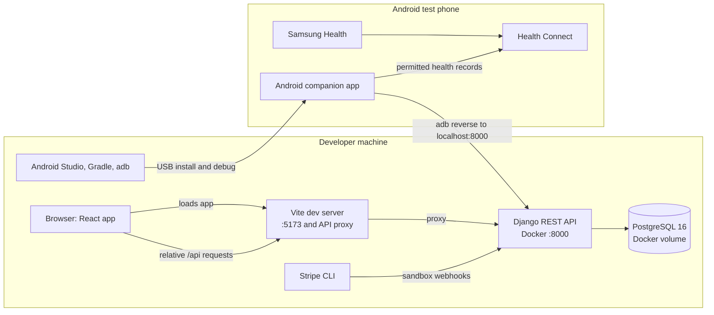
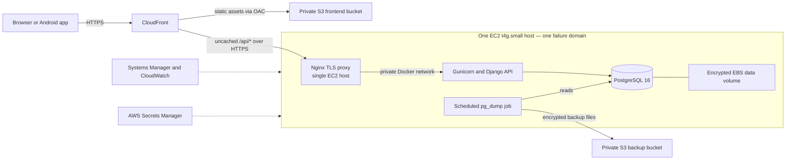
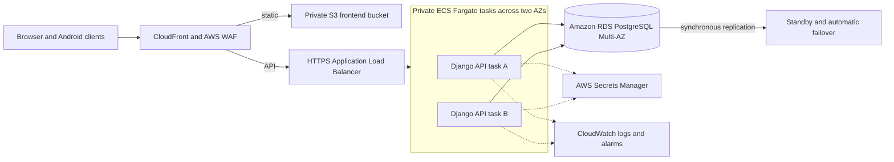

# Longevity

Longevity is a health and wellness tracking app with a React web client, Django
REST API, and Android companion app. It brings together personal metrics,
workouts, diet, recovery, subscription settings, and Health Connect sync.

## Project status

- The public AWS environment is **presentation staging**, intended for demo and
  test data—not real-user production data.
- The current staging deployment is deliberately a small, single-host setup.
  It is not highly available.
- A separate multi-AZ production architecture is documented below, but it is a
  future recommendation and is not deployed. Its cost is above the current
  $15/month AWS budget.

## Architecture

These Mermaid diagrams are compact summaries for this page. The canonical C4
model, including detailed deployment views, is
[`longevity-architecture.dsl`](reference_docs/knowledge/diagrams/longevity-architecture.dsl).
The current AWS staging snapshot and its change history are indexed in
[`current_aws/README.md`](reference_docs/knowledge/diagrams/current_aws/README.md).

### Local development



The local Compose file also defines Redis, a Celery worker, and Celery Beat as
prepared background-work infrastructure. Current product flows do not depend on
them; staging does not run those services.

### Current AWS staging



This environment is for presentation and test data. CloudFront and backups do
not remove the EC2 host as a single point of failure. See the
[`V018 current AWS diagram`](reference_docs/knowledge/diagrams/current_aws/v018-automated-backup-restore-monitoring.dsl)
for the verified backup, restore, and monitoring details.

### Future recommended production



This is a future target, not a deployment plan for the current budget. It omits
some supporting details for readability; the full recommended production view
in the canonical C4 model also includes migrations, private-task egress, and
security boundaries.

## Run locally

Prerequisites: Docker Engine with Compose, `uv`, Node.js/npm, and (for Android
development) Android Studio with the Android SDK.

Start the backend from one terminal:

```bash
cd backend
cp .env.example .env
# Replace the example-only secret and encryption values in .env.
docker compose up --build
```

See the [development setup guide](reference_docs/knowledge/18-development-environment-setup.md)
for valid local key formats and environment-variable details.

Start the frontend from another terminal:

```bash
cd frontend
npm ci
npm run dev
```

Open the local URL printed by Vite. The frontend proxies `/api` requests to the
backend on port `8000`. Keep `.env` local; never use these development settings
for a deployed environment.

## Checks

```bash
cd backend
uv sync --group dev
uv run pytest
```

```bash
cd frontend
npm ci
npm test
npm run lint
npm run build
```

For Android unit tests, run `./gradlew --no-daemon testDebugUnitTest` from
`android/`. The [development setup guide](reference_docs/knowledge/18-development-environment-setup.md)
also covers device setup; the [frontend README](frontend/README.md) describes
browser end-to-end tests.

## Repository map

- `backend/` — Django REST API, database models, migrations, and backend tests.
- `frontend/` — React + TypeScript app, browser tests, and static deployment.
- `android/` — Kotlin/Jetpack Compose companion app and Health Connect sync.
- `reference_docs/` — project decisions, operations guides, and architecture
  source diagrams.
- `.github/workflows/` — CI and staging deployment workflows.

## Staging

The presentation environment is available at [staging.syncvitals.space](https://staging.syncvitals.space).
Treat it as a demo/test environment; do not enter real health data.
