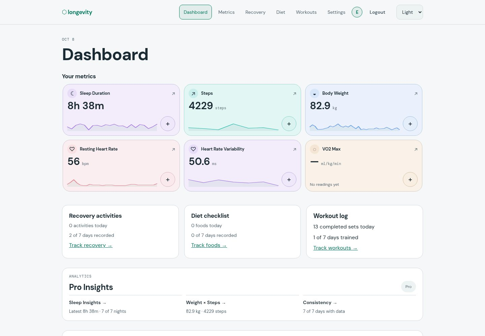
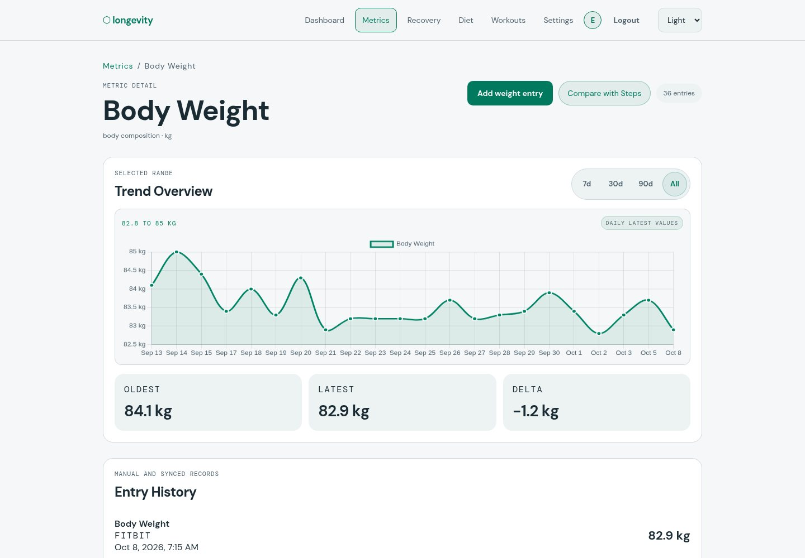
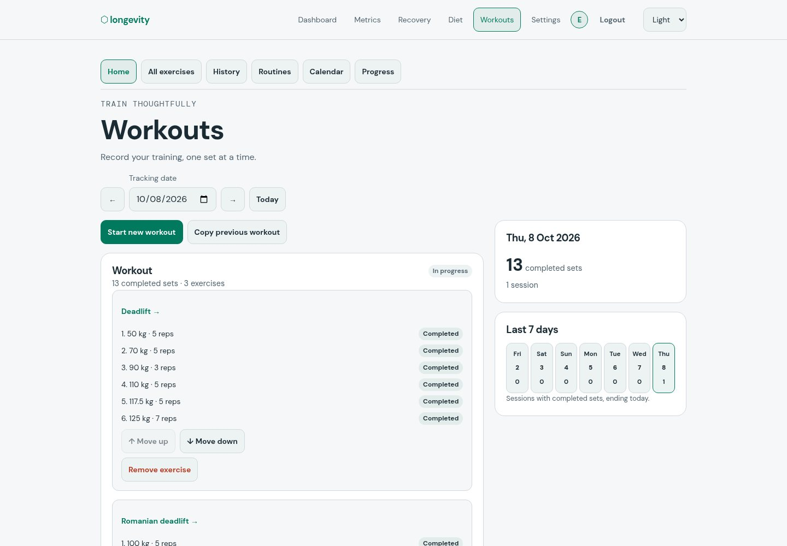
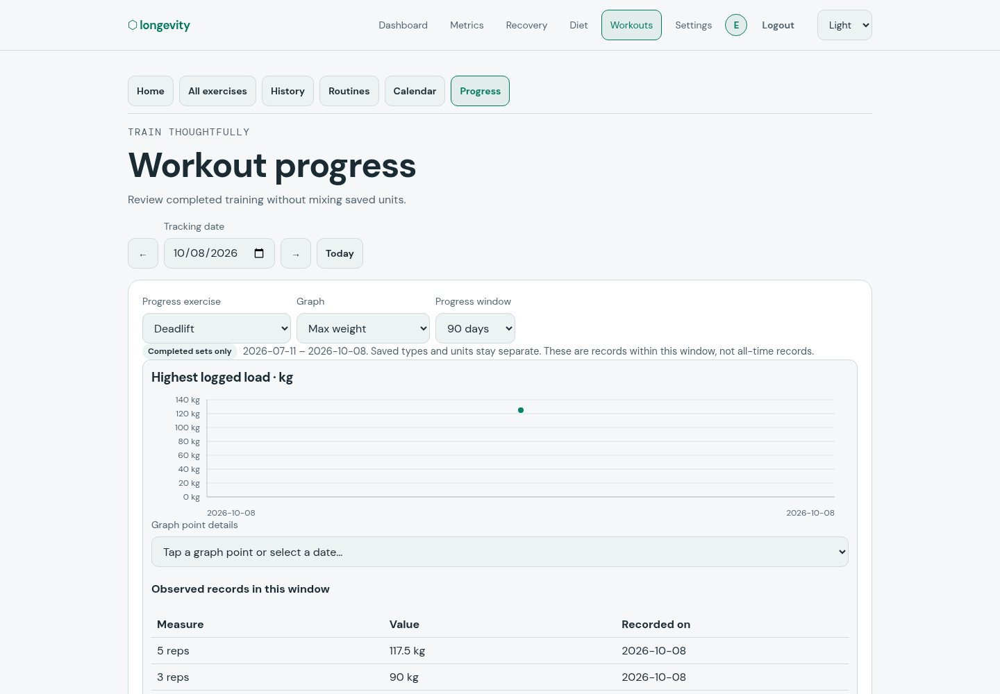
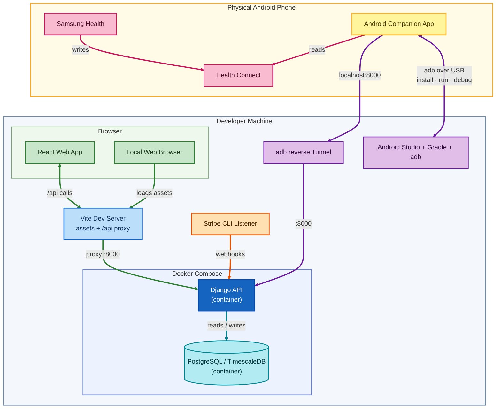
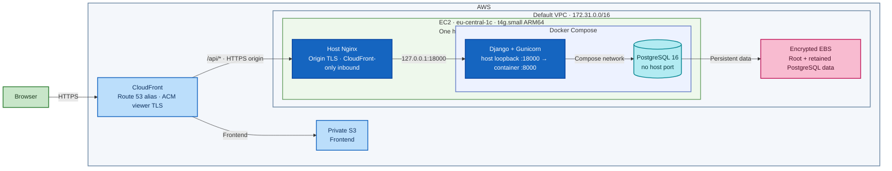
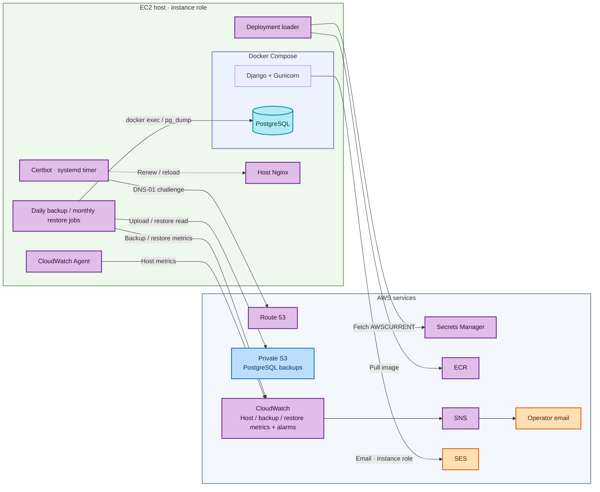
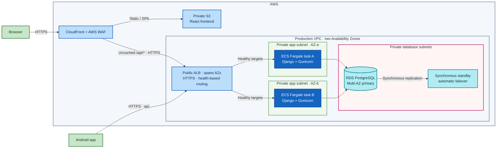
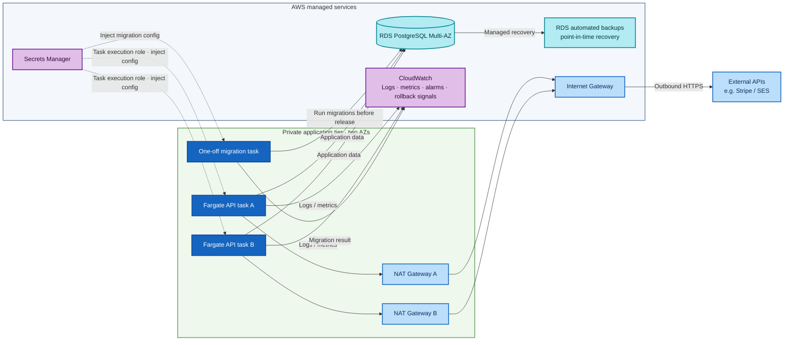

# Longevity

Longevity is a health and wellness tracking app with a React web client, Django
REST API, and Android companion app. It brings together personal metrics,
workouts, diet, recovery, subscription settings, and Health Connect sync.

## Product preview

Screenshots captured from the live staging app using its demo account. The
visible health and workout values are demo data.

<p><a href="https://staging.syncvitals.space">Open the staging app</a> (sign-in required).</p>

<table>
  <tr>
    <td width="50%" align="center">
      <a href="docs/screenshots/readme/dashboard.jpg"></a><br>
      <strong>Dashboard</strong> — a snapshot of daily health and training.
    </td>
    <td width="50%" align="center">
      <a href="docs/screenshots/readme/body-weight.jpg"></a><br>
      <strong>Metric history</strong> — review recorded values and trends.
    </td>
  </tr>
  <tr>
    <td width="50%" align="center">
      <a href="docs/screenshots/readme/workouts.jpg"></a><br>
      <strong>Workouts</strong> — log sets and review recent sessions.
    </td>
    <td width="50%" align="center">
      <a href="docs/screenshots/readme/workout-progress.jpg"></a><br>
      <strong>Workout progress</strong> — follow exercise-specific performance.
    </td>
  </tr>
</table>

## Project status

- The public AWS environment is **presentation staging**, intended for demo and
  test data—not real-user production data.
- The current staging deployment is deliberately a small, single-host setup.
  It is not highly available.
- A separate multi-AZ production architecture is documented below, but it is a
  future recommendation and is not deployed. Its cost is above the current
  $15/month AWS budget.

## Architecture

These Mermaid diagrams are compact summaries for this page. The canonical C4
model, including detailed deployment views, is
[`longevity-architecture.dsl`](reference_docs/knowledge/diagrams/longevity-architecture.dsl).
The current AWS staging snapshot and its change history are indexed in
[`current_aws/README.md`](reference_docs/knowledge/diagrams/current_aws/README.md).

### Local development

<details>
<summary>Show local development architecture</summary>


</details>

For the canonical C4 view, open [`longevity-architecture.dsl`](reference_docs/knowledge/diagrams/longevity-architecture.dsl)
in [Structurizr Playground](https://playground.structurizr.com/) and select
**Local Development** (`local-development-compact`).


### Current AWS staging

<details>
<summary>Show current AWS staging architecture</summary>

#### Request and data path



#### Host operations and supporting services


</details>

This environment is for presentation and test data. CloudFront and backups do
not remove the EC2 host as a single point of failure. The diagrams summarize
the verified V018 snapshot; see the
[`V018 current AWS diagram`](reference_docs/knowledge/diagrams/current_aws/v018-automated-backup-restore-monitoring.dsl)
for the complete deployment details and change history.

### Future recommended production

<details>
<summary>Show future recommended production architecture</summary>

#### Request path and horizontal application capacity



#### Deployment, private egress, and operations


</details>

This is a future recommendation, not deployed infrastructure or a current
provisioning plan. Two API tasks across AZs provide horizontal application
capacity and task/AZ resilience; the RDS standby provides failover, not read
scaling. Autoscaling policies and database read scaling still need design.
The canonical C4 model contains the full production deployment view and
security boundaries.

## Run locally

Prerequisites: Docker Engine with Compose, `uv`, Node.js/npm, and (for Android
development) Android Studio with the Android SDK.

Start the backend from one terminal:

```bash
cd backend
cp .env.example .env
# Replace the example-only secret and encryption values in .env.
docker compose up --build
```

See the [development setup guide](reference_docs/knowledge/18-development-environment-setup.md)
for valid local key formats and environment-variable details.

Start the frontend from another terminal:

```bash
cd frontend
npm ci
npm run dev
```

Open the local URL printed by Vite. The frontend proxies `/api` requests to the
backend on port `8000`. Keep `.env` local; never use these development settings
for a deployed environment.

## Checks

```bash
cd backend
docker compose exec web uv run pytest tests
```

```bash
cd frontend
npm ci
npm test
npm run lint
npm run build
```

For Android unit tests, run `./gradlew --no-daemon testDebugUnitTest` from
`android/`. The [development setup guide](reference_docs/knowledge/18-development-environment-setup.md)
also covers device setup; the [frontend README](frontend/README.md) describes
browser end-to-end tests.

## Repository map

- `backend/` — Django REST API, database models, migrations, and backend tests.
- `frontend/` — React + TypeScript app, browser tests, and static deployment.
- `android/` — Kotlin/Jetpack Compose companion app and Health Connect sync.
- `reference_docs/` — project decisions, operations guides, and architecture
  source diagrams.
- `.github/workflows/` — CI and staging deployment workflows.

## Staging

The presentation environment is available at [staging.syncvitals.space](https://staging.syncvitals.space).
Treat it as a demo/test environment; do not enter real health data.
