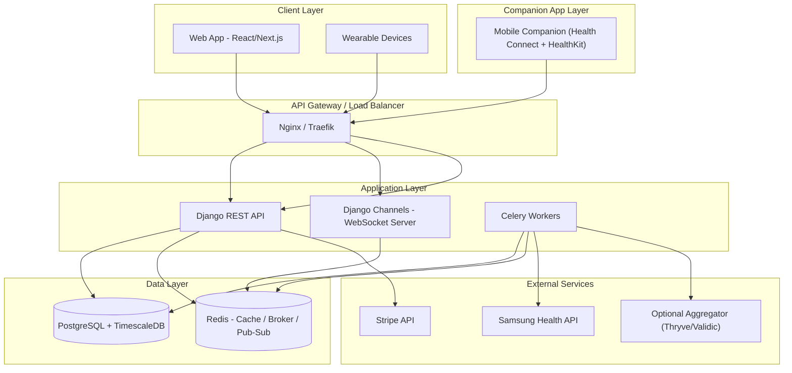
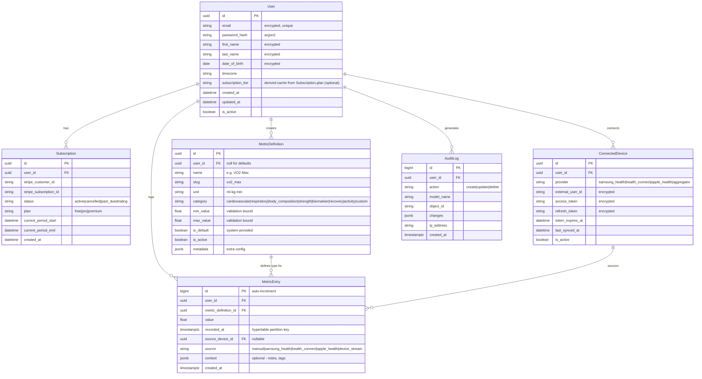
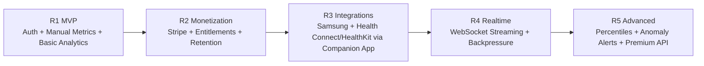

# Longevity Health Tracker — Reference & Explanations

Answers to all inline comments on the implementation plan.

---

## 1. Redis — What Does It Actually Do Here?

Redis serves **three distinct roles** in our stack. It's one service, but used for very different purposes:

| Role | What it does | Example |
|---|---|---|
| **Cache** | Stores frequently-read data in memory so we don't hit PostgreSQL every time | User's dashboard analytics, metric definitions, subscription tier |
| **Message Broker** | Acts as the middleman between Django (which *schedules* tasks) and Celery workers (which *execute* them) | Django says "sync Samsung Health data for user X" → Redis queues it → Celery worker picks it up |
| **Pub/Sub** | Real-time message passing between Django Channels instances | When a wearable streams a new heart rate reading via WebSocket, Redis broadcasts it to all connected dashboard clients for that user |

**Why not three separate services?** Because Redis handles all three well at our scale. At massive scale, you might separate the broker (switch to RabbitMQ) from the cache (keep Redis) from pub/sub (keep Redis or switch to a dedicated system). But for us, one Redis instance with logical databases is fine.

```
Django Web Request → needs user tier → checks Redis cache → cache hit? return → cache miss? query Postgres, store in Redis

Django View → calls `sync_device_data.delay(user_id)` → Celery serializes task to Redis queue → Celery worker polls Redis → picks up task → executes

WebSocket Consumer → receives HR data → publishes to Redis channel "user:123:metrics" → all subscribed consumers receive → push to dashboards
```

---

## 2. Sample TimescaleDB Data

TimescaleDB is just PostgreSQL with a time-series extension. A **hypertable** looks and feels like a normal table — you query it with regular SQL — but behind the scenes it auto-partitions by time for fast range queries.

### What the `metric_entries` hypertable looks like:

```sql
-- Creating the hypertable (one-time setup)
SELECT create_hypertable('metric_entries', 'recorded_at');

-- Sample data:
SELECT * FROM metric_entries WHERE user_id = 'a1b2c3' ORDER BY recorded_at DESC LIMIT 10;
```

| id | user_id | metric_definition_id | value | recorded_at | source_device_id | source | context |
|---|---|---|---|---|---|---|---|
| 984312 | a1b2c3 | vo2_max | 42.5 | 2026-03-05 08:30:00+01 | NULL | manual | `{"notes": "morning test"}` |
| 984311 | a1b2c3 | resting_hr | 58 | 2026-03-05 07:15:00+01 | dev_samsung_1 | samsung_health | `{}` |
| 984310 | a1b2c3 | resting_hr | 61 | 2026-03-04 07:20:00+01 | dev_samsung_1 | samsung_health | `{}` |
| 984309 | a1b2c3 | body_weight | 78.2 | 2026-03-04 06:45:00+01 | NULL | manual | `{}` |
| 984308 | a1b2c3 | sleep_duration | 7.5 | 2026-03-04 06:30:00+01 | dev_samsung_1 | samsung_health | `{"deep": 1.8, "rem": 2.1}` |
| 984307 | a1b2c3 | steps | 8432 | 2026-03-03 23:59:00+01 | dev_samsung_1 | samsung_health | `{}` |
| 984306 | a1b2c3 | spo2 | 97 | 2026-03-03 22:00:00+01 | dev_samsung_1 | device_stream | `{}` |
| 984305 | a1b2c3 | hrv_rmssd | 45 | 2026-03-03 07:10:00+01 | dev_samsung_1 | samsung_health | `{}` |
| 984304 | a1b2c3 | bp_systolic | 118 | 2026-03-02 09:00:00+01 | NULL | manual | `{"position": "seated"}` |
| 984303 | a1b2c3 | fasting_glucose | 92 | 2026-03-02 06:30:00+01 | NULL | manual | `{"fasting_hours": 12}` |

### Sample analytics query (TimescaleDB time-bucket function):

```sql
-- 7-day daily average resting heart rate
SELECT
    time_bucket('1 day', recorded_at) AS day,
    AVG(value) AS avg_hr,
    MIN(value) AS min_hr,
    MAX(value) AS max_hr
FROM metric_entries
WHERE user_id = 'a1b2c3'
  AND metric_definition_id = 'resting_hr'
  AND recorded_at > NOW() - INTERVAL '7 days'
GROUP BY day
ORDER BY day;
```

| day | avg_hr | min_hr | max_hr |
|---|---|---|---|
| 2026-02-27 | 62.0 | 59 | 65 |
| 2026-02-28 | 60.5 | 57 | 64 |
| 2026-03-01 | 59.0 | 56 | 62 |
| 2026-03-02 | 61.0 | 58 | 63 |
| 2026-03-03 | 58.0 | 55 | 61 |
| 2026-03-04 | 61.0 | 59 | 63 |
| 2026-03-05 | 58.0 | 58 | 58 |

The `time_bucket()` function is the killer feature — it's dramatically faster than `DATE_TRUNC` on millions of rows because it leverages the hypertable's chunked storage.

---

## 3. Django Channels — What Is It?

**Standard Django** uses **WSGI** (Web Server Gateway Interface): one request comes in, gets processed, response goes out. It's synchronous — the connection ends after the response. This works fine for REST APIs.

**Django Channels** extends Django to handle **ASGI** (Asynchronous Server Gateway Interface), which supports **persistent, bidirectional connections** — i.e., **WebSockets**.

### How it works:

```
                    HTTP Request (REST)
                    ┌──────────────┐
   Browser ────────►│  Django View  │──── Response ────► Browser
                    └──────────────┘
                    Connection closes


                    WebSocket (Channels)
                    ┌──────────────────┐
   Wearable ◄──────►│  WS Consumer     │◄──── persistent ────► Wearable
                    │  (like a View    │      bidirectional
                    │   but for WS)    │      connection
                    └──────────────────┘
                           │
                     Redis Channel Layer
                           │
                    ┌──────────────────┐
   Dashboard ◄─────►│  WS Consumer     │◄──── another client
                    └──────────────────┘
```

- **Consumer** = Django Channels' equivalent of a View, but for WebSocket connections
- **Channel Layer** = Redis-backed message bus that lets consumers talk to each other (e.g., wearable sends data → dashboard receives update)
- **Routing** = like URL routing, but for WebSocket paths (`ws/metrics/stream/` → `MetricStreamConsumer`)

### Why we need it:
A wearable device streaming heart rate data every second can't make a new HTTP request each time — the overhead would be massive. Instead, it opens one WebSocket connection and pushes data continuously. Django Channels handles this.

---

## 4. Celery + Redis — How Do Background Tasks Work?

### The Problem
Some operations are too slow or too unreliable to do inside an HTTP request:
- Syncing data from Samsung Health (network call, could take 5+ seconds)
- Computing analytics for 10,000 metrics entries
- Processing a Stripe webhook
- Sending an email

If you do these in the request, the user waits. If the external service is down, the request fails.

### The Solution: Celery

**Celery** is a task queue — you define tasks (Python functions), and instead of calling them directly, you *schedule* them to run in a background worker process.

**Redis** acts as the **broker** — the message queue between your web app and the workers.

```
┌─────────────────┐         ┌─────────────┐         ┌─────────────────┐
│   Django Web     │  task   │    Redis     │  poll   │  Celery Worker  │
│   (producer)     │────────►│   (broker)   │◄────────│  (consumer)     │
│                  │         │              │         │                 │
│  "sync user 123  │         │  Queue:      │         │  Picks up task, │
│   Samsung data"  │         │  [task_id:7] │         │  runs it,       │
│                  │         │  [task_id:8] │         │  stores result  │
└─────────────────┘         └─────────────┘         └─────────────────┘
```

### In code:

```python
# tasks.py
from celery import shared_task

@shared_task
def sync_device_data(user_id, device_id):
    """Runs in the background, not in the web request."""
    device = ConnectedDevice.objects.get(id=device_id)
    client = SamsungHealthClient(device.access_token)
    new_data = client.fetch_latest(since=device.last_synced_at)

    MetricEntry.objects.bulk_create([
        MetricEntry(user_id=user_id, value=d['value'], ...)
        for d in new_data
    ])
    device.last_synced_at = timezone.now()
    device.save()


# views.py — triggering it
class DeviceSyncView(APIView):
    def post(self, request, device_id):
        sync_device_data.delay(request.user.id, device_id)  # .delay() = async
        return Response({"status": "sync started"}, status=202)
```

The user gets a response in milliseconds. The actual sync happens in the background.

### Celery Beat
For **scheduled tasks** (cron-like), Celery has a built-in scheduler called **Celery Beat**:

```python
# config/celery.py
app.conf.beat_schedule = {
    'compute-daily-aggregates': {
        'task': 'apps.metrics.tasks.compute_daily_aggregates',
        'schedule': crontab(hour=2, minute=0),  # 02:00 UTC daily
    },
}
```

---

## 5. Auth Best Practices — What Does Industry Use?

### Our approach (JWT) vs alternatives:

| Approach | How it works | Used by | Best for |
|---|---|---|---|
| **JWT (our choice)** | Server issues signed tokens, client sends them in `Authorization` header. Server validates without DB lookup. | Auth0, Firebase Auth, most SPAs + mobile apps | API-first apps, mobile apps, microservices |
| **Session-based** | Server stores session in DB/Redis, client holds a cookie. Server looks up session on every request. | Django default, Rails, traditional web apps | Server-rendered apps, simple websites |
| **OAuth 2.0** | Delegation protocol — lets users log in with Google/GitHub/etc. The *provider* handles auth, you get a token. | "Login with Google", "Login with GitHub" | Social login, delegated access |
| **API Keys** | Static secret key, no user-level auth. | Stripe, OpenAI, AWS | Machine-to-machine API access |

### Important distinction: OAuth is NOT a replacement for JWT

**OAuth 2.0** is an *authorization framework* — it answers "can this app access this user's data?" It's what Samsung Health uses to let us read a user's health data.

**JWT** is a *token format* — it's how we represent "this user is logged in" in a stateless way.

In practice, you **combine them**:
- User logs in with **email + password** → we issue a **JWT**
- User also "Connects Samsung Health" → we do an **OAuth flow** → Samsung gives us an **OAuth access token** to read their health data
- Both happen in the same app. They solve different problems.

### What real companies use:

| Company | Auth approach |
|---|---|
| **Whoop** | JWT + OAuth social login (Google, Apple) |
| **Oura** | JWT + OAuth for third-party API access |
| **MyFitnessPal** | Session-based + OAuth social login |
| **Strava** | OAuth 2.0 (both for login and API access) |

### Our recommendation for Longevity Tracker:
- **JWT** for the core auth (register/login) — ✅ already in plan
- **Add OAuth social login** (Google, Apple) as a Phase 2 feature — reduces registration friction
- **OAuth 2.0** for Samsung Health integration + mobile companion ingestion for Health Connect/Apple Health — ✅ aligned with platform constraints

---

## 6. Samsung Health + Health Connect — Access & Constraints

### Samsung Health SDK: ✅ Free

- The **Samsung Health Data SDK** is free to use
- You need to register as a partner and submit your app for review
- You get access to: sleep, exercise, heart rate, blood pressure, SpO2, steps, etc.
- ⚠️ The **old** "Samsung Health SDK for Android" is deprecated as of July 2025 — use the new **Data SDK**

### Health Connect: ✅ Supported (Android, On-Device)

- Google Fit REST API is deprecated/shut down; **Health Connect** is the migration path
- Health Connect is an **on-device Android API**, not a backend cloud API
- Health Connect is **free**, but:
  - Requires justified use case (fitness/wellness qualifies)
  - Must declare data types in Play Console
  - Stricter privacy policies enforced since March 2025
  - Clinical data access (lab results, SpO2) needs "high-bar clinical justification" from January 2026

### What this means for our implementation:

```
Plan update:
- Samsung Health: Use Samsung Health Data SDK (free, partner registration required)
- Android: Use Health Connect through a companion mobile app sync flow
- iOS: Use Apple HealthKit through the same companion app sync flow
- Optional enterprise path: use a middleware service (Thryve/Validic) to aggregate providers
- Canonical enums:
  provider = samsung_health|health_connect|apple_health|aggregator
  source = manual|samsung_health|health_connect|apple_health|device_stream
```

---

## 7. Mermaid Diagram Source Code

### System Architecture Diagram



### Database Schema Diagram



---

## 8. UI/UX Design Direction

### Design Philosophy: **Dark, Clinical, Premium**

Think **Whoop meets Linear** — a dark-mode health dashboard that feels clinical and precise, not playful.

### Design References
- **Whoop** — dark backgrounds, green/teal accent colors, clean metric cards
- **Oura Ring** — soft gradients on dark, excellent data visualization
- **Linear** — ultra-clean dark UI, fast, minimal chrome
- **Arc Browser** — glassmorphism, vibrant accent colors on dark

### Color System

| Token | Value | Usage |
|---|---|---|
| `--bg-primary` | `#0A0A0F` | Page background |
| `--bg-card` | `#12121A` | Card backgrounds |
| `--bg-elevated` | `#1A1A26` | Hover states, elevated surfaces |
| `--border` | `rgba(255,255,255,0.06)` | Subtle borders |
| `--text-primary` | `#F0F0F5` | Headings, key values |
| `--text-secondary` | `#8B8B9E` | Labels, descriptions |
| `--accent-teal` | `#00D4AA` | Primary action, "good" metrics |
| `--accent-blue` | `#4C9AFF` | Links, info states |
| `--accent-red` | `#FF4D6A` | Alerts, "bad" metrics |
| `--accent-amber` | `#FFB84D` | Warnings, "caution" metrics |

### Typography
- **Font:** Inter (headings) + JetBrains Mono (metric values)
- Big, bold metric numbers — the value is the hero, not the label
- Metric labels in small, secondary-colored text above values

### Key Pages

#### Dashboard (Home)
```
┌─────────────────────────────────────────────────────┐
│  🌙 Longevity                    [Profile] [⚙️]    │
├─────────────────────────────────────────────────────┤
│                                                     │
│  ┌─────────┐  ┌─────────┐  ┌─────────┐  ┌────────┐│
│  │ 💚 58   │  │ 💙 42.5 │  │ 💛 7.5h │  │ 🔴 118││
│  │ bpm     │  │ ml/kg   │  │ sleep   │  │ mmHg   ││
│  │ Rest HR │  │ VO2 Max │  │ Duration│  │ BP Sys ││
│  │ ▼2 ↓    │  │ ▲1.5 ↑  │  │ ═ same  │  │ ▲3 ↑  ││
│  └─────────┘  └─────────┘  └─────────┘  └────────┘│
│                                                     │
│  ┌──── Heart Rate Trend (30 days) ────────────────┐ │
│  │         ╭──╮                                    │ │
│  │  ──────╯    ╰──────╮  ╭────╮                   │ │
│  │                     ╰──╯    ╰──────────         │ │
│  │  60 ─ ─ ─ ─ ─ ─ ─ ─ ─ ─ ─ ─ ─ ─ ─ ─ avg     │ │
│  │  Feb 3        Feb 13       Feb 23      Mar 5   │ │
│  └─────────────────────────────────────────────────┘ │
│                                                     │
│  Recent Entries                        [+ Log]      │
│  ───────────────────────────────────────────────    │
│  VO2 Max      42.5 ml/kg/min   manual   5 Mar     │
│  Rest HR      58 bpm           samsung  5 Mar     │
│  Sleep        7.5 hours        samsung  4 Mar     │
│  Weight       78.2 kg          manual   4 Mar     │
└─────────────────────────────────────────────────────┘
```

#### Metric Detail Page
- Full-screen chart (line/area chart, 7d/30d/90d/1y/all toggles)
- Stats card: current, average, min, max, trend direction, percentile vs population
- Entry history table below
- Color coded: green = improving toward optimal, red = moving away

#### Log Entry (Modal/Slide-over)
- Quick entry: select metric → enter value → timestamp (defaults to now) → save
- Bulk entry form for multiple metrics at once
- Clean, minimal, no unnecessary fields

### Component Patterns
- **Metric Cards** — glassmorphic cards with subtle `backdrop-filter: blur(12px)`, colored left border indicating metric status
- **Charts** — clean area charts with gradient fills, no gridlines, subtle axis labels (use Recharts or Chart.js)
- **Micro-animations** — metric values count up on load, cards fade-in staggered, trend arrows pulse gently
- **Status indicators** — colored dots (green/amber/red) based on where the value falls in the optimal range

### Responsive Approach
- Desktop: 4-column metric grid, side navigation
- Tablet: 2-column grid, collapsible nav
- Mobile: single column, bottom tab navigation, gesture-based chart interaction

---

## 9. MVP + Progressive Rollout

### 9.1 MVP Scope (Release 1, ~4 Weeks)

**In scope**
- Secure auth: register/login/refresh/logout/password reset
- Manual metric logging for default metrics
- Core metric query/filter endpoints + 7/30-day analytics
- Basic dashboard (latest values + trend charts)
- GDPR export + account deletion workflow
- Baseline ops: TLS, audit logs, backups, health checks, CI

**Out of scope**
- Stripe subscriptions and paid entitlement gates
- Device provider sync (Samsung/Health Connect/Apple Health)
- Real-time WebSocket dashboards
- Advanced analytics (percentiles/anomalies)
- Premium API access

### 9.2 Progressive Rollout Roadmap



### 9.3 Rollout Gates

| Release | Gate to move forward |
|---|---|
| **R1 -> R2** | p95 read latency < 300ms, no P0/P1 security findings |
| **R2 -> R3** | Stripe webhook reliability > 99.9%, entitlement tests green |
| **R3 -> R4** | Sync correctness validated (dedup/reconciliation), provider kill-switch tested |
| **R4 -> R5** | WS stability under load test, fallback-to-polling verified |

---

## 10. Project & System Design Critique

### 10.1 What Is Strong
- Security is treated as a first-class concern early
- TimescaleDB choice fits the dominant workload (time-window analytics)
- Clear modular app boundaries (accounts, metrics, subscriptions, devices, streaming)
- Good separation between synchronous API paths and background processing

### 10.2 Main Design Risks
- **Too much complexity too early**: subscriptions + multi-provider sync + realtime + advanced analytics in one initial push increases delivery risk
- **Provider dependency fragility**: health platform policies and SDK constraints can break integrations unexpectedly
- **Data governance burden**: deletion/export/audit requirements can dominate engineering time if not operationalized early
- **Ingestion quality risk**: cross-provider dedup and timestamp normalization are non-trivial and easy to get wrong

### 10.3 Recommended Adjustments
- Ship MVP first, keep integrations and realtime behind feature flags
- Treat `Subscription` as the only entitlement source of truth; keep any user tier field as cache-only
- Build ingestion observability before scaling providers (per-provider error rates, lag, dedup collisions)
- Define a strict metric canonicalization layer (units, timezone normalization, source precedence)
- Keep an optional aggregator path to de-risk direct provider API churn
