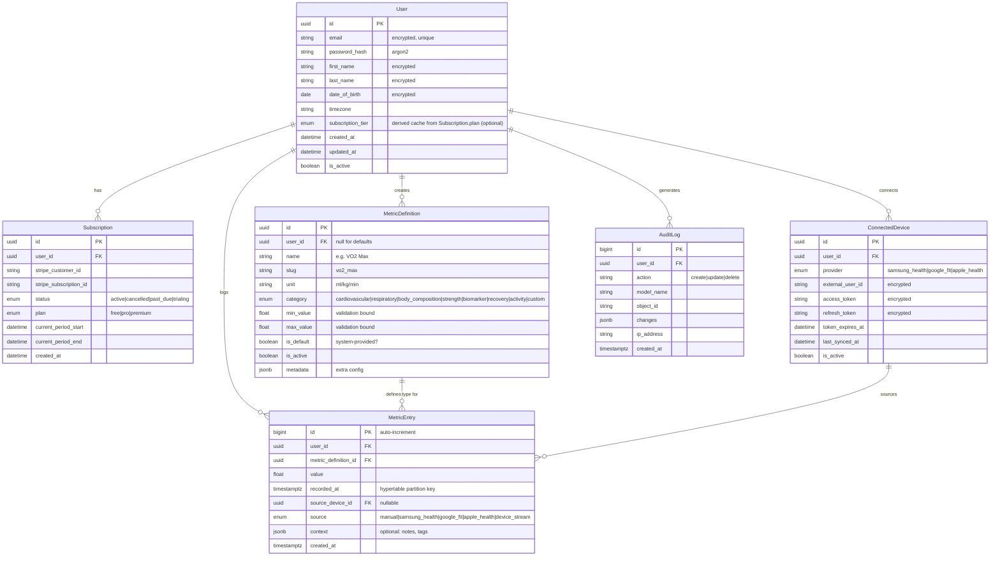

# Longevity Health Tracker — Implementation Plan

A security-first health metrics platform for tracking, visualizing, and analyzing longevity data. Users can log default and custom health metrics, connect wearables via real-time streaming, and subscribe to premium tiers for advanced analytics.

---

## 1. System Architecture

```mermaid
graph TB
    subgraph "Client Layer"
        WEB[Web App - React/Next.js]
        WEARABLE[Wearable Devices]
    end

    subgraph "API Gateway / Load Balancer"
        NGINX[Nginx / Traefik]
    end

    subgraph "Application Layer"
        DJANGO[Django REST API]
        CHANNELS[Django Channels - WebSocket Server]
        CELERY[Celery Workers]
    end

    subgraph "Data Layer"
        PG[(PostgreSQL + TimescaleDB)]
        REDIS[(Redis - Cache / Broker / Pub-Sub)]
    end

    subgraph "External Services"
        STRIPE[Stripe API]
        SAMSUNG[Samsung Health API]
        GOOGLE_FIT[Google Fit API]
        APPLE_HEALTH[Apple HealthKit (iOS bridge)]
    end

    WEB --> NGINX --> DJANGO
    WEARABLE --> NGINX --> CHANNELS
    CHANNELS --> REDIS
    DJANGO --> PG
    DJANGO --> REDIS
    CELERY --> PG
    CELERY --> REDIS
    DJANGO --> STRIPE
    CELERY --> SAMSUNG
    CELERY --> GOOGLE_FIT
    CELERY --> APPLE_HEALTH
```

**Key decisions:**
- **TimescaleDB** (PostgreSQL extension) for time-series metric storage — hypertables give automatic partitioning by time, efficient range queries, and compression. No new database to run, it's just Postgres.
- **Django Channels** for WebSocket connections from wearables / real-time dashboard updates.
- **Celery + Redis** for background sync jobs, analytics aggregation, and webhook processing.

---

## 2. Security & Data Protection *(Priority)*

> [!CAUTION]
> Health data is sensitive (potentially HIPAA/GDPR-regulated). Security must be baked into every layer, not bolted on afterwards.

### 2.1 Authentication & Authorization
| Concern | Implementation |
|---|---|
| **Password storage** | Argon2 hasher enabled via `PASSWORD_HASHERS` (PBKDF2 remains fallback for legacy hashes) |
| **Authentication** | JWT access tokens (short-lived, 15min) + HTTP-only secure refresh tokens (7 days) via `djangorestframework-simplejwt` |
| **Authorization** | Permission classes per view: `IsAuthenticated`, `IsSubscribed`, `IsOwner`. Row-level security on all metric queries |
| **Rate limiting** | `django-ratelimit` on auth endpoints (5 attempts/min login, 3/hour password reset) |
| **MFA** | Optional TOTP via `django-otp` (phase 2) |

### 2.2 Data Protection
| Concern | Implementation |
|---|---|
| **Encryption at rest** | Disk/snapshot encryption at the infrastructure layer (managed DB volume encryption). Use `pgcrypto` only for selected column-level secrets/PII |
| **Encryption in transit** | TLS 1.3 everywhere. HSTS headers. WSS for WebSocket connections |
| **Field-level encryption** | `django-encrypted-model-fields` for sensitive profile data (date of birth, medical notes) |
| **Data isolation** | All querysets scoped by `user_id` — no global metric endpoints. Middleware enforces tenant isolation |
| **Audit logging** | `django-auditlog` tracks all create/update/delete operations on user data |
| **Data export & deletion** | GDPR endpoints: `GET /api/v1/me/export/` (data portability), `DELETE /api/v1/me/` (right to erasure; hard-delete user health data, cancel Stripe, retain minimal billing records where legally required) |
| **Input validation** | Strict serializer validation. All metric values range-checked (e.g., heart rate 20–300 bpm) |

### 2.3 API Security
- CORS restricted to known domains
- CSRF protection on session-based views and cookie-auth refresh/logout endpoints
- JWT cookie strategy: `SameSite=Lax/Strict`, origin/referrer validation, and anti-CSRF token (double-submit or equivalent)
- Content-Security-Policy headers
- SQL injection protection (Django ORM — no raw queries)
- Request size limits (1MB default payload, 5MB for authenticated bulk import endpoint)
- WebSocket authentication via ticket-based auth (short-lived token in handshake, not in URL params)

---

## 3. Database Schema



**Key notes:**
- `MetricEntry` is a **TimescaleDB hypertable** partitioned by `recorded_at` — this is where 99% of storage and query load lives
- `MetricDefinition` separates system defaults (`user_id=NULL`) from user-created custom metrics
- All tokens/PII use field-level encryption
- UUIDs for externally exposed entities; high-write append-only tables (`MetricEntry`, `AuditLog`) use bigint for ingestion/query efficiency
- `Subscription` is source of truth for entitlements; `User.subscription_tier` (if kept) is read-only cache updated from Stripe/webhook events

---

## 4. API Design

### 4.1 Auth Endpoints
| Method | Endpoint | Description |
|---|---|---|
| POST | `/api/v1/auth/register/` | User registration |
| POST | `/api/v1/auth/login/` | JWT token pair |
| POST | `/api/v1/auth/refresh/` | Refresh access token |
| POST | `/api/v1/auth/logout/` | Blacklist refresh token |
| POST | `/api/v1/auth/password/reset/` | Send password reset email |
| POST | `/api/v1/auth/password/confirm/` | Confirm password reset |

### 4.2 User & Profile
| Method | Endpoint | Description |
|---|---|---|
| GET | `/api/v1/me/` | Current user profile |
| PATCH | `/api/v1/me/` | Update profile |
| GET | `/api/v1/me/export/` | GDPR data export |
| DELETE | `/api/v1/me/` | GDPR account deletion |

### 4.3 Metrics
| Method | Endpoint | Description |
|---|---|---|
| GET | `/api/v1/metrics/definitions/` | List available metrics (default + custom) |
| POST | `/api/v1/metrics/definitions/` | Create custom metric definition |
| GET | `/api/v1/metrics/entries/` | Query entries (filters: metric, date range, source) |
| POST | `/api/v1/metrics/entries/` | Log a metric entry |
| POST | `/api/v1/metrics/entries/bulk/` | Bulk import entries |
| GET | `/api/v1/metrics/analytics/` | Aggregated analytics (trends, averages, percentiles) |
| GET | `/api/v1/metrics/analytics/{metric_slug}/` | Single-metric deep analytics |

### 4.4 Subscriptions
| Method | Endpoint | Description |
|---|---|---|
| GET | `/api/v1/subscriptions/plans/` | Available plans & pricing |
| POST | `/api/v1/subscriptions/checkout/` | Create Stripe Checkout session |
| POST | `/api/v1/subscriptions/portal/` | Stripe Customer Portal link |
| POST | `/api/v1/webhooks/stripe/` | Stripe webhook receiver (signature verified) |

### 4.5 Device Integrations
| Method | Endpoint | Description |
|---|---|---|
| GET | `/api/v1/devices/` | List connected devices |
| POST | `/api/v1/devices/connect/{provider}/` | Initiate OAuth flow |
| GET | `/api/v1/devices/callback/{provider}/` | OAuth callback |
| DELETE | `/api/v1/devices/{id}/` | Disconnect device |
| POST | `/api/v1/devices/{id}/sync/` | Trigger manual sync |

### 4.6 Real-Time Streaming (WebSocket)
```
wss://host/ws/metrics/stream/
```
- **Auth**: Ticket-based (client requests a short-lived ticket via REST, includes it in WS handshake)
- **Inbound**: Wearable pushes metric data points as JSON frames
- **Outbound**: Server pushes live dashboard updates to subscribed clients
- **Backpressure**: Token-bucket rate limiter per connection (max 10 data points/sec). Server sends `SLOW_DOWN` frame if client exceeds rate. Buffer overflow → connection dropped with reconnect hint.

---

## 5. Subscription Tiers

| Feature | Free | Pro ($9/mo) | Premium ($19/mo) |
|---|---|---|---|
| Default metrics tracking | ✅ | ✅ | ✅ |
| Custom metrics | 3 max | 20 max | Unlimited |
| History retention | 90 days | 2 years | Unlimited |
| Analytics & trends | Basic (7/30 day) | Advanced (all ranges) | Advanced + export |
| Device integrations | 1 device | 3 devices | Unlimited |
| Real-time streaming | ❌ | ✅ | ✅ |
| Data export (CSV/JSON) | ❌ | ❌ | ✅ |
| API access | ❌ | ❌ | ✅ |

---

## 6. Background Processing (Celery Tasks)

| Task | Schedule | Description |
|---|---|---|
| `sync_device_data` | Every 15 min per device | Pull latest data from Samsung Health / Google Fit / Apple Health |
| `compute_daily_aggregates` | Daily 02:00 UTC | Pre-compute daily avg/min/max per metric per user |
| `compute_weekly_trends` | Weekly Monday 03:00 UTC | Compute weekly trend data for analytics |
| `enforce_retention_policy` | Daily 04:00 UTC | Delete entries beyond user's tier retention limit |
| `process_stripe_webhook` | On webhook receipt | Handle subscription changes, payment failures |
| `refresh_oauth_tokens` | Every 30 min | Refresh expiring 3rd-party OAuth tokens |
| `send_anomaly_alerts` | On new data batch | Flag unusual metric values (e.g., resting HR > 120) |

---

## 7. Caching Strategy

| Data | Cache | TTL | Invalidation |
|---|---|---|---|
| User profile & tier | Redis hash | 15 min | On profile/subscription update |
| Metric definitions (defaults) | Redis / local | 1 hour | On deploy |
| Dashboard analytics | Redis hash per user | 10 min | On new entry or daily aggregation |
| Subscription plan list | Redis | 1 hour | On Stripe webhook (price change) |
| Rate limit counters | Redis | Sliding window | Automatic |

---

## 8. Django App Structure

```
longevity/
├── manage.py
├── config/
│   ├── settings/
│   │   ├── base.py
│   │   ├── development.py
│   │   ├── production.py
│   │   └── test.py
│   ├── urls.py
│   ├── asgi.py          # Django Channels
│   ├── wsgi.py
│   └── celery.py
├── apps/
│   ├── accounts/        # User model, auth, profile, GDPR
│   │   ├── models.py
│   │   ├── serializers.py
│   │   ├── views.py
│   │   ├── urls.py
│   │   ├── permissions.py
│   │   ├── signals.py
│   │   └── tests/
│   ├── metrics/         # MetricDefinition, MetricEntry, analytics
│   │   ├── models.py
│   │   ├── serializers.py
│   │   ├── views.py
│   │   ├── urls.py
│   │   ├── services.py  # Analytics computation logic
│   │   ├── validators.py
│   │   └── tests/
│   ├── subscriptions/   # Stripe integration, plans, webhooks
│   │   ├── models.py
│   │   ├── serializers.py
│   │   ├── views.py
│   │   ├── urls.py
│   │   ├── webhooks.py
│   │   ├── services.py  # Stripe API wrapper
│   │   └── tests/
│   ├── devices/         # Third-party device integrations, OAuth
│   │   ├── models.py
│   │   ├── serializers.py
│   │   ├── views.py
│   │   ├── urls.py
│   │   ├── providers/   # samsung.py, google_fit.py, etc.
│   │   ├── services.py
│   │   └── tests/
│   └── streaming/       # WebSocket consumers, backpressure
│       ├── consumers.py
│       ├── routing.py
│       ├── middleware.py # WS ticket auth
│       ├── throttle.py  # Token-bucket rate limiter
│       └── tests/
├── common/              # Shared utilities
│   ├── encryption.py    # Field encryption helpers
│   ├── middleware.py     # Security headers, audit, tenant isolation
│   ├── permissions.py   # Shared permission classes
│   └── pagination.py
├── requirements/
│   ├── base.txt
│   ├── dev.txt
│   └── prod.txt
├── docker-compose.yml
├── Dockerfile
└── .env.example
```

---

## 9. Default Metric Definitions

Seeded via data migration:

| Metric | Unit | Category | Typical Range |
|---|---|---|---|
| Resting Heart Rate | bpm | Cardiovascular | 40–100 |
| VO2 Max | ml/kg/min | Cardiovascular | 15–85 |
| Blood Pressure (Systolic) | mmHg | Cardiovascular | 80–200 |
| Blood Pressure (Diastolic) | mmHg | Cardiovascular | 40–130 |
| HRV (RMSSD) | ms | Cardiovascular | 10–200 |
| SpO2 | % | Respiratory | 85–100 |
| Body Weight | kg | Body Composition | 30–300 |
| Body Fat % | % | Body Composition | 3–60 |
| BMI | kg/m² | Body Composition | 10–60 |
| Sleep Duration | hours | Recovery | 0–24 |
| Deep Sleep | hours | Recovery | 0–12 |
| Steps | count | Activity | 0–100,000 |
| Fasting Blood Glucose | mg/dL | Biomarker | 40–500 |

---

## 10. Implementation Phases

These phases describe the **full-spec path**. If you are shipping MVP-first, treat Section 11 as Release 1 and Section 12 as the post-MVP expansion track.

### Phase 1 — Foundation *(Weeks 1–2)*
- Django project scaffold with security settings
- Custom user model with encryption
- JWT auth (register, login, refresh, logout)
- Rate limiting on auth endpoints
- Security middleware (CORS, CSP, HSTS)
- Basic test suite

### Phase 2 — Core Metrics *(Weeks 3–4)*
- MetricDefinition model + default seed migration
- MetricEntry model + TimescaleDB hypertable
- Metrics CRUD API with row-level security
- Basic analytics endpoint (7-day, 30-day averages)
- Input validation + range checking

### Phase 3 — Subscriptions *(Week 5)*
- Stripe integration (Checkout, Customer Portal)
- Subscription model + webhook handler
- Tier-based permission enforcement
- Retention policy background task

### Phase 4 — Device Integrations *(Week 6)*
- OAuth flow for Samsung Health / Google Fit / Apple Health
- Token storage with encryption
- Periodic sync Celery task
- Data reconciliation (dedup by timestamp + source)

### Phase 5 — Real-Time Streaming *(Week 7)*
- Django Channels setup (ASGI)
- WebSocket consumer with ticket-based auth
- Token-bucket backpressure implementation
- Live dashboard data push

### Phase 6 — Analytics & Polish *(Week 8)*
- Advanced analytics (trends, percentiles, anomaly flags)
- Caching layer implementation
- GDPR endpoints (export, deletion)
- Audit logging
- Comprehensive test coverage

---

## 11. MVP Scope *(First Release)*

Target: Ship a secure, usable v1 in **4 weeks** with a narrow feature set.

### 11.1 In Scope
- Account lifecycle: register, login, refresh/logout, password reset
- Secure profile management (`/api/v1/me/`)
- Manual metric logging for seeded default metrics
- Metric querying by date range and metric type
- Basic analytics: 7-day and 30-day averages
- Basic dashboard API for latest values + simple trends
- Data export (JSON) and account deletion flow
- Production-ready baseline: TLS, audit logging, backups, health checks, CI tests

### 11.2 Out of Scope (for MVP)
- Paid plans and Stripe checkout/portal
- Device OAuth integrations and scheduled sync
- WebSocket real-time streaming
- Advanced analytics (percentiles, anomaly detection)
- Public API access for third parties
- Multi-tier retention enforcement

### 11.3 MVP Success Criteria
- User can sign up and log metrics end-to-end in under 3 minutes
- No P0/P1 security findings in pre-launch review
- p95 read latency under 300ms for core metric queries at expected MVP load
- 99.5% uptime target for first month post-launch

---

## 12. Progressive Rollout (MVP -> Full Spec)

### Stage A — Monetization + Entitlements *(2 weeks after MVP)*
- Add Stripe checkout, portal, webhooks
- Enable plan-based authorization gates (`free|pro|premium`)
- Turn on retention-policy worker
- Rollout strategy: feature flags for billing endpoints + webhook replay testing in staging

### Stage B — Power Metrics *(2 weeks)*
- Add custom metric definitions with stronger validation
- Add advanced analytics endpoints (percentiles, longer windows)
- Introduce dashboard caching and cache invalidation hooks
- Rollout strategy: beta cohort (10%) before global release

### Stage C — Device Integrations *(3 weeks)*
- Ship Samsung Health and Google Fit OAuth + scheduled sync
- Add Apple Health via iOS bridge ingestion path
- Add deduplication/reconciliation rules and sync observability dashboards
- Rollout strategy: provider-by-provider launch, kill-switch per provider

### Stage D — Real-Time + Premium APIs *(2 weeks)*
- Enable WebSocket streaming for live dashboards
- Add API access for premium users with token scopes and quotas
- Expand anomaly alerts and notification hooks
- Rollout strategy: canary by subscription tier, automatic fallback to polling

### Stage E — Hardening and Scale *(ongoing)*
- Load/perf testing for hypertables and WebSocket concurrency
- Security hardening (MFA enforcement option, key rotation runbooks)
- Compliance operations (DPIA updates, deletion/audit evidence)
- Cost controls and SLO-driven autoscaling refinements
