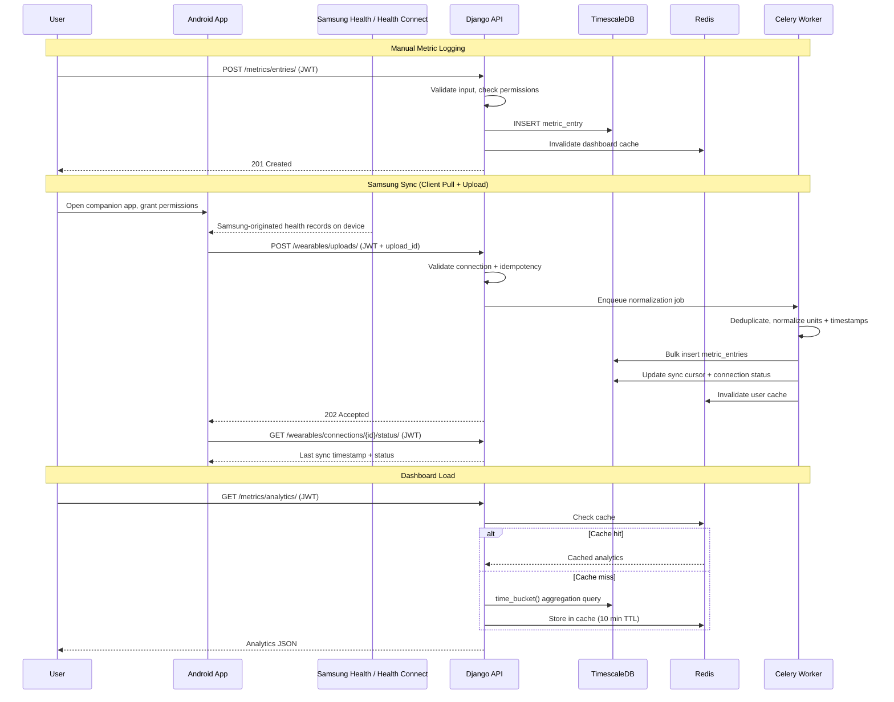
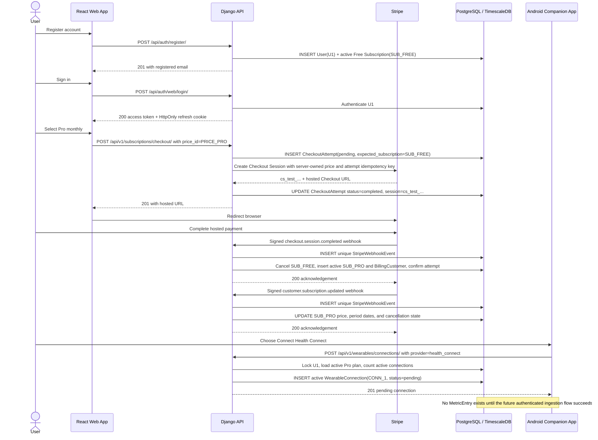
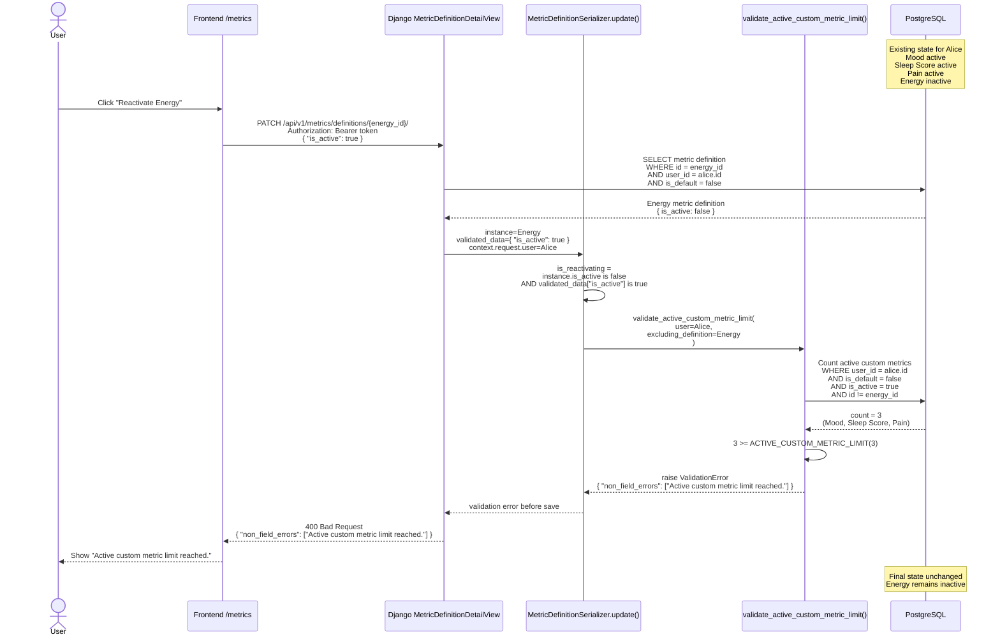

### 1.8 Data Flow

## Use When
- Load this when you need checks data flow examples.

## Source
- Derived from `reference_docs/knowledge/planning.md` sections 1.8.




## Free to Pro to Health Connect Data-State Timeline

Use this timeline when reasoning about which durable rows change as a newly registered Free user purchases Pro monthly and then registers Health Connect.

Example identifiers:

```text
U1         = user UUID
PLAN_FREE  = Free SubscriptionPlan UUID
PLAN_PRO   = Pro SubscriptionPlan UUID
PRICE_PRO  = Pro monthly SubscriptionPrice UUID
SUB_FREE   = original Free Subscription UUID
SUB_PRO    = replacement Pro Subscription UUID
ATTEMPT_1  = CheckoutAttempt UUID
CONN_1     = WearableConnection UUID
```

| Step | Event | Rows inserted | Rows updated | Resulting state |
|---:|---|---|---|---|
| 0 | Product configuration exists | `SubscriptionPlan(free)`, `SubscriptionPlan(pro)`, and active Pro monthly/yearly `SubscriptionPrice` rows | — | Free permits zero wearable connections; Pro permits one Health Connect connection |
| 1 | User registers | `User(U1)` and `Subscription(SUB_FREE, plan=free, status=active, price=NULL)` | — | `SUB_FREE` is the user's only current subscription |
| 2 | Django creates a Stripe Checkout Session | `CheckoutAttempt(ATTEMPT_1, price=PRICE_PRO, expected_subscription=SUB_FREE, status=pending)` | `ATTEMPT_1` becomes `completed` and stores `cs_test_...` after Stripe returns a hosted URL | Free remains active; no entitlement changes based on the browser redirect |
| 3 | Verified `checkout.session.completed` arrives | `StripeWebhookEvent(evt_checkout_...)`, `BillingCustomer(U1, cus_test_...)`, and `Subscription(SUB_PRO, plan=pro, price=PRICE_PRO, status=active, provider_subscription_id=sub_test_...)` | `SUB_FREE` becomes `cancelled`; `ATTEMPT_1` becomes `confirmed` | Pro becomes the only current subscription; Free remains as history |
| 4 | Verified `customer.subscription.updated` arrives | `StripeWebhookEvent(evt_subscription_...)` | `SUB_PRO` receives recognized price/plan data, current-period dates, and normalized cancellation state | Local billing dates and price match Stripe |
| 5 | User registers Health Connect | `WearableConnection(CONN_1, user=U1, provider=health_connect, status=pending, is_active=true)` | — | Active wearable usage becomes `1 / 1`; registration does not yet claim a successful sync |
| 6 | First upload receipt — implemented | `SyncRun(connection=CONN_1, upload_id=UPLOAD_1, status=received)` | — | The first request returns `201`; retrying `(CONN_1, UPLOAD_1)` returns the same receipt with `200` |
| 7 | First normalized sample ingestion — isolated happy path implemented; endpoint wiring planned | Wearable-sourced `MetricEntry` rows | `SyncRun` stores its payload hash, reaches `succeeded`, and records the imported count; `CONN_1` becomes `connected` and receives `last_synced_at` | The service writes one validated new batch atomically; retry comparison and duplicate-record skipping remain next |

Important final-state properties:

- `Subscription` contains two rows: historical cancelled Free and current active Pro.
- `BillingCustomer` is the authoritative local mapping from `U1` to Stripe `cus_test_...`.
- `StripeWebhookEvent` is the provider-event idempotency ledger.
- `WearableConnection.status=pending` means registration succeeded but no trusted ingestion has proven the bridge works yet.
- Connecting Health Connect alone creates no `MetricEntry` rows.
- The `SyncRun` receipt model, database idempotency constraint, receipt-only upload endpoint, and isolated synchronous-ingestion happy path are implemented. The endpoint still rejects entries until retry comparison and duplicate-record handling make the full path safe.

## Free to Pro to Health Connect Sequence

The sequence shows runtime ordering; the timeline above remains the clearer source for row-level state changes.



## Metric Definition Include-Inactive Read Flow

Use this flow when reasoning about the `/metrics` catalog and the archived custom metrics UI.

Active-only reads:
- Frontend calls `useMetricDefinitionsQuery({})`.
- TanStack Query stores the response under `['metric-definitions', {}]`.
- API helper calls `GET /api/v1/metrics/definitions/`.
- Backend returns active system defaults plus the authenticated user's active custom metrics.

Archived-management reads:
- Frontend calls `useMetricDefinitionsQuery({ includeInactive: true })`.
- TanStack Query stores the response under `['metric-definitions', { includeInactive: true }]`, separate from the active-only cache.
- API helper maps camelCase to the public API query string and calls `GET /api/v1/metrics/definitions/?include_inactive=true`.
- Django routes the request to `MetricDefinitionListView`.
- DRF checks `IsAuthenticated`; unauthenticated callers receive `401`.
- `MetricDefinitionListView.get_queryset()` sees `include_inactive=true` and returns active system defaults plus all custom metrics owned by `request.user`.
- The queryset intentionally excludes inactive system defaults and all custom metrics owned by other users.
- `MetricDefinitionSerializer` returns `is_active` so the frontend can split active metrics from archived custom metrics.

Conceptual backend filter for `include_inactive=true`:

```sql
WHERE (user_id IS NULL AND is_active = true)
   OR user_id = current_user_id
ORDER BY category, name
```

Conceptual frontend split after the response:

```ts
const activeDefinitions = metricDefinitions.filter((definition) => (
  definition.is_active
))

const archivedCustomDefinitions = metricDefinitions.filter((definition) => (
  !definition.is_active && !definition.is_default
))
```

Security boundaries:
- Other users' custom metrics are never returned, even if inactive metrics are requested.
- Inactive default metrics are hidden from clients.
- Inactive custom metrics can be managed/reactivated, but cannot be used for new metric-entry creation.

Current frontend behavior:
- `/metrics` keeps active definitions in the normal available-metrics list.
- Active rows link to `/metrics/$slug`.
- Archived custom definitions are rendered in a separate bottom section when the user enables `Show deactivated custom metrics`.
- Archived rows are visually muted, show an `Archived` marker, and intentionally do not link to metric detail routes.
- Reactivating an archived metric PATCHes the user's custom metric definition back to `is_active=true`, then TanStack Query invalidates metric-definition and metric-entry caches.

## Custom Metric Reactivation Limit Flow

Use this flow when reasoning about the active custom metric entitlement check during archived custom metric reactivation.


