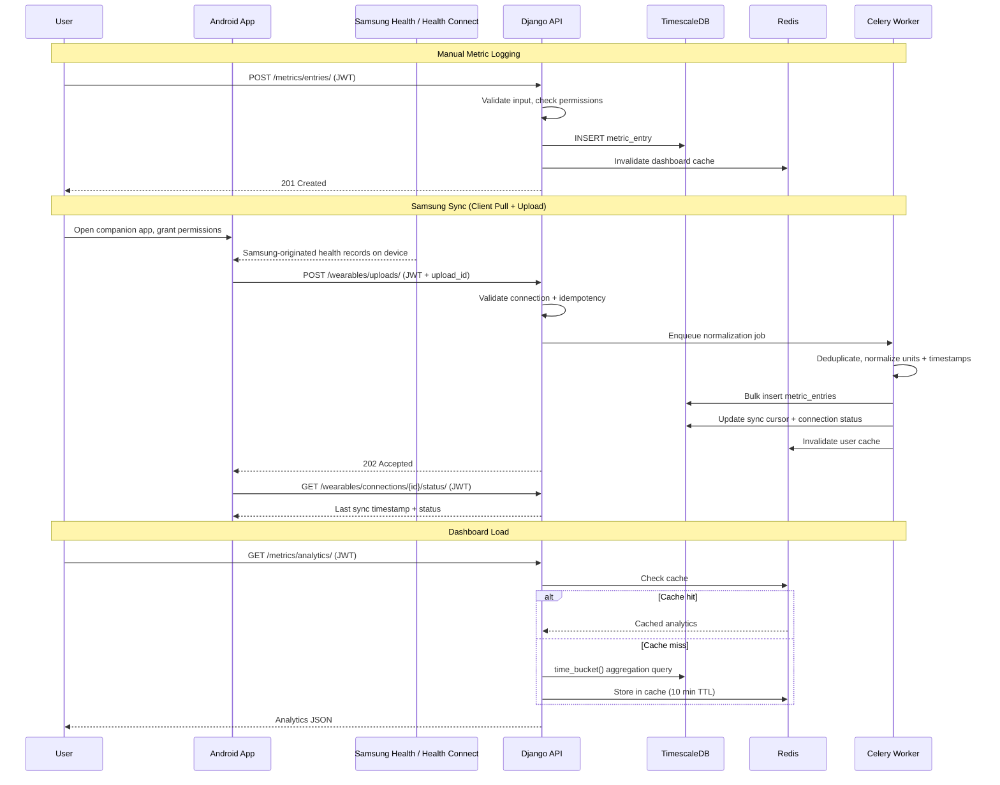

### 1.8 Data Flow

## Use When
- Load this when you need checks data flow examples.

## Source
- Derived from `reference_docs/knowledge/planning.md` sections 1.8.

```mermaid
sequenceDiagram
    participant U as User
    participant A as Android App
    participant H as Samsung Health / Health Connect
    participant API as Django API
    participant DB as TimescaleDB
    participant R as Redis
    participant C as Celery Worker

    Note over U,C: Manual Metric Logging
    U->>API: POST /metrics/entries/ (JWT)
    API->>API: Validate input, check permissions
    API->>DB: INSERT metric_entry
    API->>R: Invalidate dashboard cache
    API-->>U: 201 Created

    Note over U,C: Samsung Sync (Client Pull + Upload)
    U->>A: Open companion app, grant permissions
    H-->>A: Samsung-originated health records on device
    A->>API: POST /wearables/uploads/ (JWT + upload_id)
    API->>API: Validate connection + idempotency
    API->>C: Enqueue normalization job
    C->>C: Deduplicate, normalize units + timestamps
    C->>DB: Bulk insert metric_entries
    C->>DB: Update sync cursor + connection status
    C->>R: Invalidate user cache
    API-->>A: 202 Accepted
    A->>API: GET /wearables/connections/{id}/status/ (JWT)
    API-->>A: Last sync timestamp + status

    Note over U,C: Dashboard Load
    U->>API: GET /metrics/analytics/ (JWT)
    API->>R: Check cache
    alt Cache hit
        R-->>API: Cached analytics
    else Cache miss
        API->>DB: time_bucket() aggregation query
        API->>R: Store in cache (10 min TTL)
    end
    API-->>U: Analytics JSON
```
