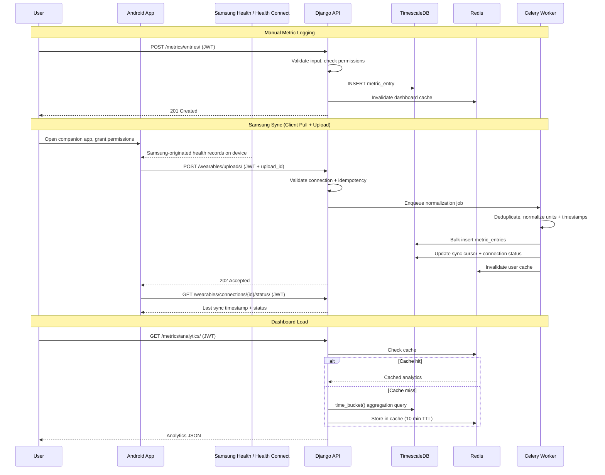
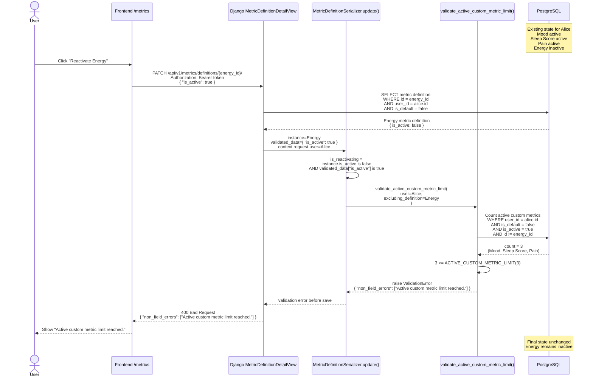

### 1.8 Data Flow

## Use When
- Load this when you need checks data flow examples.

## Source
- Derived from `reference_docs/knowledge/planning.md` sections 1.8.




## Metric Definition Include-Inactive Read Flow

Use this flow when reasoning about the `/metrics` catalog and the archived custom metrics UI.

Active-only reads:
- Frontend calls `useMetricDefinitionsQuery({})`.
- TanStack Query stores the response under `['metric-definitions', {}]`.
- API helper calls `GET /api/v1/metrics/definitions/`.
- Backend returns active system defaults plus the authenticated user's active custom metrics.

Archived-management reads:
- Frontend calls `useMetricDefinitionsQuery({ includeInactive: true })`.
- TanStack Query stores the response under `['metric-definitions', { includeInactive: true }]`, separate from the active-only cache.
- API helper maps camelCase to the public API query string and calls `GET /api/v1/metrics/definitions/?include_inactive=true`.
- Django routes the request to `MetricDefinitionListView`.
- DRF checks `IsAuthenticated`; unauthenticated callers receive `401`.
- `MetricDefinitionListView.get_queryset()` sees `include_inactive=true` and returns active system defaults plus all custom metrics owned by `request.user`.
- The queryset intentionally excludes inactive system defaults and all custom metrics owned by other users.
- `MetricDefinitionSerializer` returns `is_active` so the frontend can split active metrics from archived custom metrics.

Conceptual backend filter for `include_inactive=true`:

```sql
WHERE (user_id IS NULL AND is_active = true)
   OR user_id = current_user_id
ORDER BY category, name
```

Conceptual frontend split after the response:

```ts
const activeDefinitions = metricDefinitions.filter((definition) => (
  definition.is_active
))

const archivedCustomDefinitions = metricDefinitions.filter((definition) => (
  !definition.is_active && !definition.is_default
))
```

Security boundaries:
- Other users' custom metrics are never returned, even if inactive metrics are requested.
- Inactive default metrics are hidden from clients.
- Inactive custom metrics can be managed/reactivated, but cannot be used for new metric-entry creation.

Current frontend behavior:
- `/metrics` keeps active definitions in the normal available-metrics list.
- Active rows link to `/metrics/$slug`.
- Archived custom definitions are rendered in a separate bottom section when the user enables `Show deactivated custom metrics`.
- Archived rows are visually muted, show an `Archived` marker, and intentionally do not link to metric detail routes.
- Reactivating an archived metric PATCHes the user's custom metric definition back to `is_active=true`, then TanStack Query invalidates metric-definition and metric-entry caches.

## Custom Metric Reactivation Limit Flow

Use this flow when reasoning about the active custom metric entitlement check during archived custom metric reactivation.


