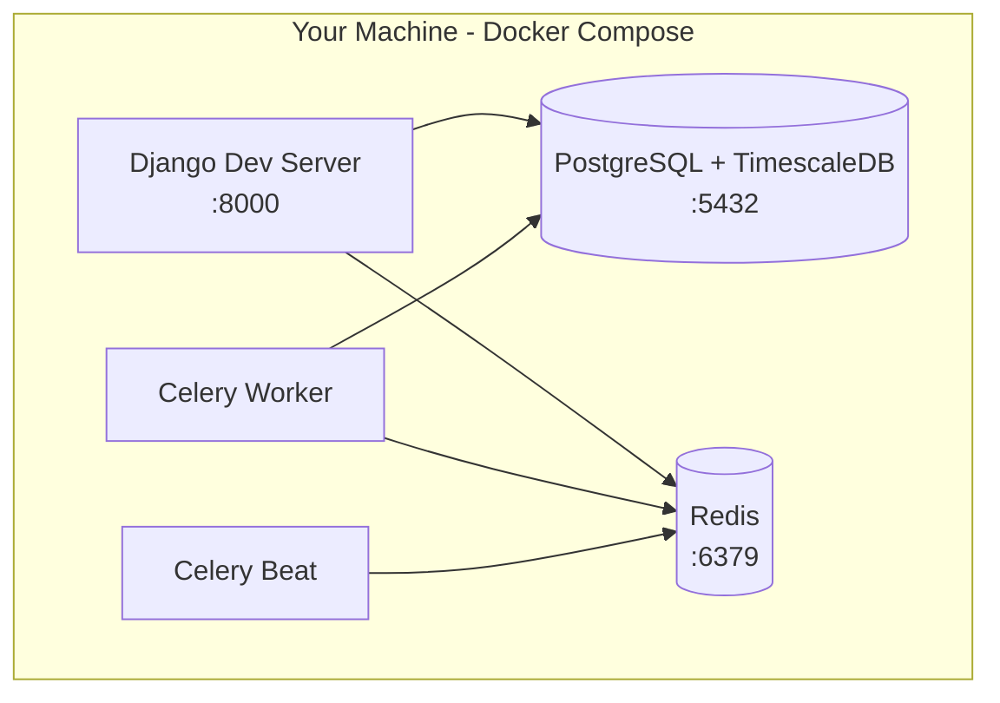

## Use When
- Load this when we are working on the local development architecture.

## Source
- Derived from `reference_docs/knowledge/planning.md` sections 1.9.

#### Local Development Architecture
