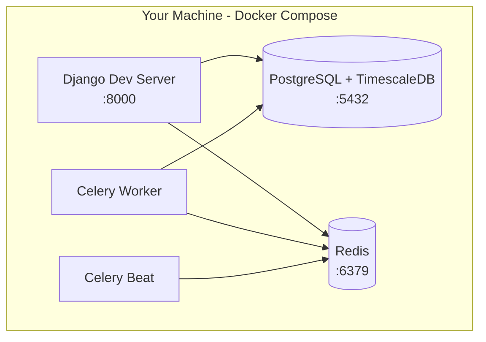

## Use When
- Load this when we are working on the local development architecture.

## Source
- Derived from `reference_docs/knowledge/planning.md` sections 1.9.

#### Local Development Architecture

This diagram shows the **current backend local runtime** used to build the manual-entry foundation phase.

Samsung Health sync is intentionally **not** represented here. The MVP sync path requires an Android companion app and on-device health data access, so this diagram stays backend-only until that work begins.

**Scope notes**
- This is the local backend runtime, not the full Samsung-sync development environment.
- In the Samsung-sync MVP, data is uploaded from an Android companion app; the backend does not call a Samsung cloud API directly.
- When R2/R3 work begins, document the Android emulator/device setup separately instead of overloading this diagram.
