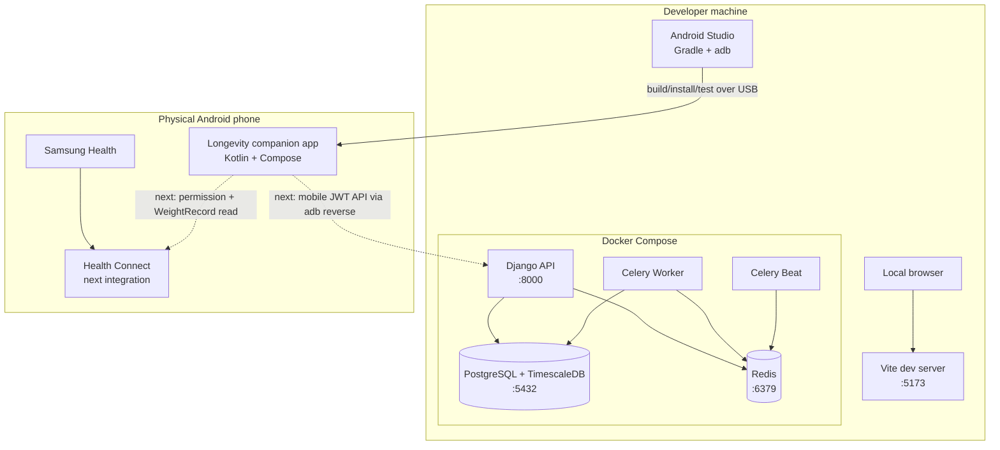

## Use When
- Load this when we are working on the local development architecture.

## Source
- Derived from `reference_docs/knowledge/planning.md` sections 1.9.

#### Local Development Architecture

This diagram shows the current browser/backend runtime plus the newly implemented Android development loop.

The Android companion project now exists and is installed/tested on a physical phone through Android Studio, Gradle, and `adb`. Its Compose login UI is local-only at this checkpoint: it does not yet call Django or read Health Connect. The dotted edges below are the next vertical slice, not implemented traffic.

Redis, Celery Worker, Celery Beat, and TimescaleDB are present in the local runtime, but they are mostly prepared infrastructure at the current project stage. The implemented auth, manual metrics, Settings, Stripe Checkout, Stripe Portal, and Stripe webhook flows run synchronously inside Django. Celery becomes important when wearable sync, backfills, retries, analytics precomputation, and export/delete jobs are implemented. TimescaleDB becomes important when metric volume and range/aggregate queries justify hypertables, continuous aggregates, retention, or compression policies.

**Scope notes**
- The physical phone and Android test runtime are now part of local development.
- The phone is not a second Git repository; `android/` belongs to the root Longevity repository.
- Gradle builds/tests the Android application, while `adb` installs APKs, starts instrumented tests, and later reverses the development API port.
- Android Studio Compose previews and JVM tests do not require a phone. Instrumented Compose tests require an awake, unlocked connected device; a locked/dozing phone can produce “No compose hierarchies found.”
- PostgreSQL is required now; TimescaleDB-specific features are planned leverage rather than active core behavior.
- Redis/Celery/Beat are running-capable locally, but current product behavior does not depend on meaningful asynchronous jobs yet.
- In the Samsung-sync MVP, data is uploaded from an Android companion app; the backend does not call a Samsung cloud API directly.
- The Android-to-Django and Android-to-Health-Connect edges remain next-step behavior.
