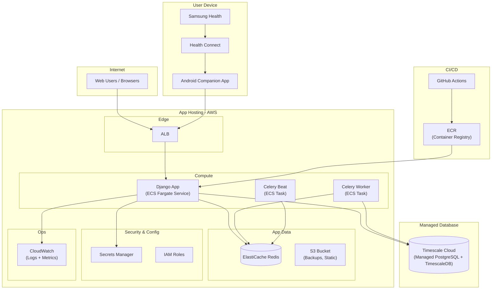

#### Pragmatic MVP Cloud Architecture (Target)

## Use When
- Load this when we are working on the Pragmatic MVP Cloud Architecture.

## Source
- Derived from `reference_docs/knowledge/planning.md` sections 1.9.

**MVP notes**
- Samsung sync is client-initiated: Samsung Health data is read on device, then uploaded by the Android companion app.
- No Samsung cloud webhook or provider-hosted link flow is assumed in MVP.
- Celery handles ingestion normalization, deduplication, retries, and repair tasks after uploads hit Django.
