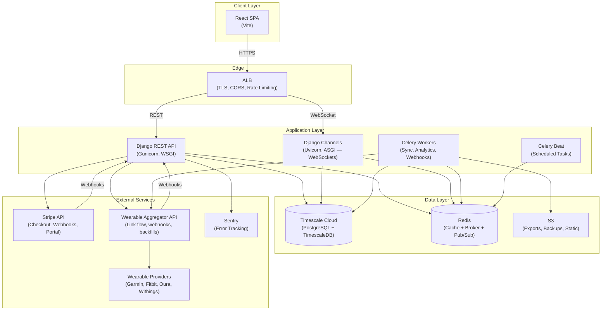

#### Full Requirements Architecture (Target — All Features)

## Use When
- Load this when you need to work on implementing Full Requirements Architecture .

## Source
- Derived from `reference_docs/knowledge/planning.md` sections 1.9.

This is the architecture when all releases (R1–R5) are complete: auth, metrics, subscriptions, wearable integrations, real-time streaming, analytics — everything running in production.

**How traffic flows:**
- **REST requests** (login, log metric, fetch analytics) → ALB → Django (Gunicorn/WSGI)
- **WebSocket connections** (live dashboard updates) → ALB → Django Channels (Uvicorn/ASGI) → Redis Pub/Sub → connected dashboards
- **Background work** (wearable backfills, analytics computation, Stripe webhooks, GDPR exports) → Celery Workers ← Redis broker
- **Scheduled jobs** (nightly aggregates, token refresh) → Celery Beat → Redis → Workers
- **External calls** → Celery Workers connect to the wearable aggregator + Stripe