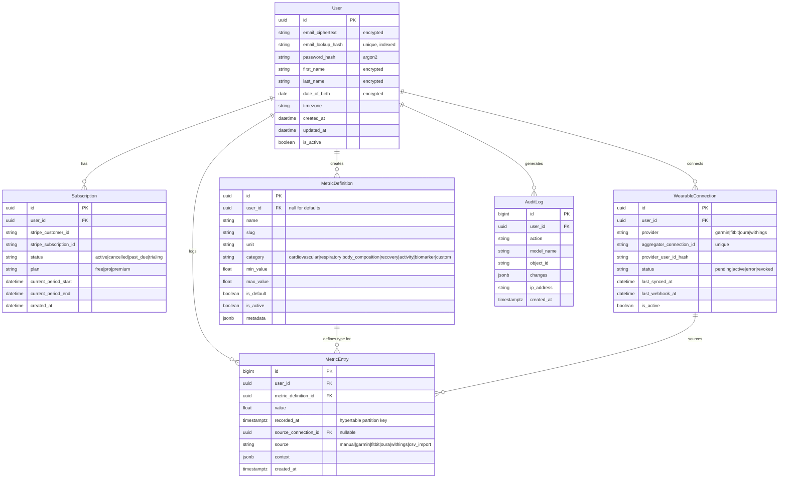

### ERD

## Use When
- Load this when you need the entity relationship diagram, the entities and their relationships in our database. When you need to review database design and Sample Data Across All Tables.

## Source
- Derived from `reference_docs/knowledge/planning.md` sections 1.11 and 2.2.

### 2.2 Database Design

 Key decisions:
- `MetricEntry` = TimescaleDB hypertable, partitioned by `recorded_at`
- UUIDs for all PKs (no sequential ID exposure)
- PII encrypted at field level; email lookup via `email_lookup_hash`
- `Subscription` is the single source of truth for entitlements

#### What is `recorded_at`?

`recorded_at` is a **field on our MetricEntry entity** — it's the timestamp of *when the health measurement was taken* (not when it was inserted into the DB; that's `created_at`). It's a `timestamptz` column in PostgreSQL, stored as UTC.

TimescaleDB uses `recorded_at` as the **hypertable partition key** — meaning it automatically splits the `metric_entries` table into time-based chunks behind the scenes (e.g., one chunk per week). This makes time-range queries ("give me all heart rate entries from the last 30 days") dramatically faster because Postgres only scans the relevant chunks, not the entire table.

`recorded_at` is *our* field. TimescaleDB just uses it for partitioning.

#### Why MetricDefinition AND MetricEntry? (Not just normalization)

You could put everything in one table: `{user_id, metric_name, unit, min, max, value, timestamp}`. But that would mean:
- Every single data point repeats the name, unit, min/max — wasting storage across millions of rows
- Changing a metric's validation range means updating millions of rows
- Custom metrics require schema changes or magic strings

Splitting into MetricDefinition (the *template*) + MetricEntry (the *data*) gives us:
1. **Storage efficiency**: MetricEntry is lean — just `value`, `recorded_at`, and FKs
2. **Validation rules in one place**: Change min/max on the definition, applies to all future entries
3. **Custom metrics without schema changes**: Just `INSERT` a new MetricDefinition row
4. **Queryability**: "Get all cardiovascular metrics" = join on definition's category

#### What does "MetricEntry sources WearableConnection" mean?

The `source_connection_id` FK on MetricEntry answers: **"Where did this data point come from?"**

- A manual entry (user typed it in): `source_connection_id = NULL`, `source = 'manual'`
- An auto-synced entry from Garmin: `source_connection_id = 'uuid-of-garmin-connection'`, `source = 'garmin'`

This lets us show provenance ("this reading came from your Garmin connection"), filter by source, and detect duplicates across sync jobs.

#### Sample Data Across All Tables

**Users:**
| id | email_lookup_hash | email_ciphertext | first_name | timezone | is_active |
|---|---|---|---|---|---|
| `a1b2c3d4-...` | `hmac(alice@example.com)` | `alice@enc...` | `Alice (enc)` | `Europe/Berlin` | true |
| `e5f6g7h8-...` | `hmac(bob@example.com)` | `bob@enc...` | `Bob (enc)` | `America/New_York` | true |

**MetricDefinitions (system defaults, `user_id = NULL`):**
| id | user_id | name | slug | unit | category | min | max | is_default |
|---|---|---|---|---|---|---|---|---|
| `def-001` | NULL | Resting Heart Rate | `resting_hr` | bpm | cardiovascular | 30 | 220 | true |
| `def-002` | NULL | VO2 Max | `vo2_max` | ml/kg/min | cardiovascular | 10 | 90 | true |
| `def-003` | NULL | Sleep Duration | `sleep_duration` | hours | recovery | 0 | 24 | true |
| `def-004` | NULL | Body Weight | `body_weight` | kg | body_composition | 20 | 300 | true |
| `def-005` | NULL | Blood Pressure (Systolic) | `bp_systolic` | mmHg | cardiovascular | 60 | 250 | true |
| `def-custom` | `a1b2c3d4-...` | Cold Plunge Duration | `cold_plunge` | minutes | recovery | 0 | 60 | false |

**WearableConnections:**
| id | user_id | provider | last_synced_at | is_active |
|---|---|---|---|---|
| `conn-001` | `a1b2c3d4-...` | garmin | 2026-03-06 07:00 UTC | true |
| `conn-002` | `e5f6g7h8-...` | oura | 2026-03-05 22:30 UTC | true |

**MetricEntries (the actual data points):**
| id | user_id | metric_definition_id | value | recorded_at | source_connection_id | source |
|---|---|---|---|---|---|---|
| 1 | `a1b2c3d4-...` | `def-001` (Resting HR) | 58 | 2026-03-06 07:15 UTC | `conn-001` | garmin |
| 2 | `a1b2c3d4-...` | `def-002` (VO2 Max) | 42.5 | 2026-03-06 08:30 UTC | NULL | manual |
| 3 | `a1b2c3d4-...` | `def-003` (Sleep) | 7.5 | 2026-03-06 06:30 UTC | `conn-001` | garmin |
| 4 | `a1b2c3d4-...` | `def-custom` (Cold Plunge) | 3.5 | 2026-03-06 09:00 UTC | NULL | manual |
| 5 | `e5f6g7h8-...` | `def-001` (Resting HR) | 65 | 2026-03-05 22:00 UTC | `conn-002` | oura |

Notice row 1: Alice's resting HR of 58 bpm was *auto-synced* from her Garmin connection (`source_connection_id = conn-001`). Row 2: her VO2 Max was *manually entered* (`source_connection_id = NULL`). Row 4: her custom "Cold Plunge" metric uses a definition she created herself.

**Subscriptions:**
| id | user_id | plan | status | current_period_end |
|---|---|---|---|---|
| `sub-001` | `a1b2c3d4-...` | pro | active | 2026-04-06 |
| `sub-002` | `e5f6g7h8-...` | free | active | NULL |

**AuditLog:**
| id | user_id | action | model_name | changes |
|---|---|---|---|---|
| 1 | `a1b2c3d4-...` | create | MetricEntry | `{"value": 42.5, "metric": "vo2_max"}` |
| 2 | `a1b2c3d4-...` | update | User | `{"timezone": ["UTC", "Europe/Berlin"]}` |