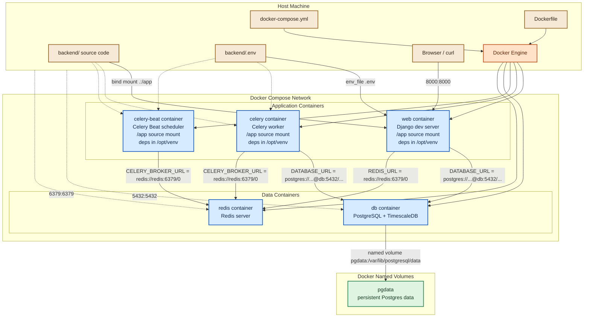

## Current Local Docker Runtime

## Use When
- Load this when you need to understand how the current backend local environment is wired, where each component runs, what lives in Docker versus on the host machine, how `backend/Dockerfile` and `backend/docker-compose.yml` work, or how ports, bind mounts, and named volumes behave.

## Source
- Derived from the current repository implementation in `backend/Dockerfile`, `backend/docker-compose.yml`, and `backend/config/settings/base.py`.

### What Exists Right Now

The backend local setup currently runs with Docker Compose from `backend/docker-compose.yml`.

Services:
- `web`: Django development server container
- `web-e2e`: Django E2E server container, enabled only with the `e2e` Compose profile
- `celery`: Celery worker container
- `celery-beat`: Celery Beat scheduler container
- `db`: TimescaleDB / PostgreSQL container
- `db-e2e`: isolated TimescaleDB / PostgreSQL container for browser E2E, enabled only with the `e2e` Compose profile
- `redis`: Redis container

Named volumes:
- `pgdata`: persistent PostgreSQL data
- `pgdata_e2e`: persistent E2E PostgreSQL data, safe to reset without touching normal dev data

### Runtime Model

- You start the stack from the host machine by running `docker compose up --build` inside `backend/`.
- `docker compose up -d --force-recreate` recreates containers but does not rebuild
  their images. After changing `pyproject.toml` or `uv.lock`, use
  `docker compose up -d --build web celery celery-beat` so every Python service
  receives the updated `/opt/venv`.
- Docker Compose creates an isolated network for the services.
- Inside that Docker network, service names become hostnames:
  - Django connects to PostgreSQL at `db:5432`
  - E2E Django connects to PostgreSQL at `db-e2e:5432`
  - Django connects to Redis at `redis:6379`
  - Celery worker connects to Redis at `redis:6379`
  - Celery Beat connects to Redis at `redis:6379`
- Ports are published from containers to the host:
  - `8000:8000` = host `localhost:8000` -> container `web:8000`
  - `8001:8000` = host `localhost:8001` -> container `web-e2e:8000`
  - `5432:5432` = host `localhost:5432` -> container `db:5432`
  - `5433:5432` = host `localhost:5433` -> container `db-e2e:5432`
  - `6379:6379` = host `localhost:6379` -> container `redis:6379`
- Browser E2E resets are intentionally scoped to the `web-e2e` runtime:
  - `POST /api/testing/reset/` runs only when `config.settings.e2e` enables `ENABLE_E2E_TESTING_API`
  - the reset flushes `db-e2e/longevity_e2e`, not the normal `db/longevity` development database
  - because a flush removes migration seed rows too, the reset then restores required system defaults such as metric definitions

### Image vs Container vs Volume vs Bind Mount

- **Image**: a built package/template. `backend/Dockerfile` is used to build the application image consumed by `web`, `celery`, and `celery-beat`.
- **Container**: a running instance created from an image. `web`, `celery`, `celery-beat`, `db`, and `redis` are containers.
- **Named volume**: Docker-managed persistent storage outside the container filesystem. `pgdata` is a named volume.
- **Bind mount**: a direct mapping from a host path into a container path. `.:/app` is a bind mount.

### Port Mapping and "Exposed"

When we say the Django app is **exposed to the host on port `8000`**, we mean:
- Django listens on port `8000` inside the `web` container
- Docker maps that internal container port to port `8000` on your local machine
- your host browser or `curl` can access the app at `http://127.0.0.1:8000`

In Compose, that is this line:

```yaml
ports:
  - "8000:8000"
```

Read it as:
- left side = host port
- right side = container port

### What Lives In Docker vs On The Host

Inside Docker:
- Django process (`web`)
- Celery worker process (`celery`)
- Celery Beat process (`celery-beat`)
- PostgreSQL / TimescaleDB process (`db`)
- Redis process (`redis`)
- Container filesystem at `/app`
- Python dependencies baked into the image and installed in `/opt/venv`
- PostgreSQL data stored in the named volume `pgdata`

On the host machine:
- Source code in `backend/`
- `backend/.env`
- Docker Compose file
- Dockerfile
- The Docker engine itself
- Published ports:
  - `localhost:8000` -> Django container
  - `localhost:5432` -> PostgreSQL container
  - `localhost:6379` -> Redis container

### Bind Mount Behavior

The application services mount the host `backend/` directory into the container at `/app`:

```yaml
volumes:
  - .:/app
```

That means:
- Editing code on the host changes the code the container sees immediately
- The Django development server can reload on file changes
- For development, the files used at runtime come from your host machine through the bind mount
- `web`, `celery`, and `celery-beat` all see the same source tree at `/app`

`/app` is simply a path inside the container filesystem.

In practice:
- your host path `/home/sevi/longevity/backend`
- is mounted into container path `/app`
- so yes, inside the running `web` container, `/app` shows the same project files as your local `backend/` folder

### Python Environment Location

The `web` image installs Python dependencies at build time into `/opt/venv`.

This means:
- the container does **not** rely on a runtime-created `.venv` under `/app`
- your host `/home/sevi/longevity/backend/.venv` is separate from Docker
- the source-code bind mount `.:/app` does not overwrite the container's installed dependencies, because those dependencies live outside `/app`

Why this is better:
- dependencies are baked into the image
- container startup is simpler
- the bind mount is used only for source code, not for the Python environment

### Named Volume for PostgreSQL Data

The `db` service has:

```yaml
volumes:
  - pgdata:/var/lib/postgresql/data
```

This means:
- PostgreSQL writes its database files inside the container at `/var/lib/postgresql/data`
- Docker stores that data in a named volume called `pgdata`
- yes, the data is stored on your local machine
- but no, it is not stored in your project folder as normal files you edit directly

It lives in Docker-managed storage, typically somewhere under Docker's own data directory, not under `backend/`.

Why we do this:
- container filesystems are disposable
- volumes preserve the database even if the `db` container is deleted and recreated

### Dockerfile Purpose

`backend/Dockerfile` builds the image used by the application services.

What it does:
1. Starts from a base image that already includes `uv`
2. Sets `/app` as the working directory
3. Sets Python-related environment flags for cleaner container behavior
4. Configures `uv` to create the project environment at `/opt/venv`
5. Copies dependency files (`pyproject.toml`, `uv.lock`)
6. Installs Python dependencies with `uv sync --frozen`
7. Adds `/opt/venv/bin` to `PATH`
6. Copies the backend project into the image
8. Defines the default command to run Django

In Compose:
- `web` overrides the default command to run migrations and then `runserver`
- `celery` runs `celery -A config worker -l info`
- `celery-beat` runs `celery -A config beat -l info`

The key build-time line is:

```dockerfile
COPY . .
```

That means:
- copy the Docker build context into the image working directory `/app`
- because Compose builds with `context: .` from inside `backend/`, the `.` here means the backend folder contents

Important distinction:
- **build time**: `COPY . .` copies project files into the image
- **run time for development**: `.:/app` bind-mounts your host files over `/app`

So yes, the files get copied into the image during build, but for local development the bind mount effectively takes precedence while the container is running. That is why we say the project code is not relied on as a permanent copy inside the running dev container.

### docker-compose.yml Purpose

`backend/docker-compose.yml` defines the local multi-container environment.

What it does:
- Builds the `web` image from `backend/Dockerfile`
- Builds the `celery` and `celery-beat` application images from the same Dockerfile
- Starts PostgreSQL/TimescaleDB
- Starts Redis
- Starts a Celery worker
- Starts Celery Beat
- Wires service startup ordering
- Loads environment variables from `backend/.env`
- Mounts the project source code into the application containers
- Publishes container ports to the host machine

### How Compose, Env Vars, and Django Fit Together

Relationship between Compose, env vars, and services:
- Compose reads `backend/.env` and injects those values into the `web` container through `env_file`
- Compose also injects the same env vars into `celery` and `celery-beat`
- the `db` service separately reads `POSTGRES_DB`, `POSTGRES_USER`, and `POSTGRES_PASSWORD` through Compose variable substitution
- Django and Celery then read `DATABASE_URL`, `REDIS_URL`, and `CELERY_BROKER_URL` from the environment inside the application containers
- Docker itself does **not** choose the Django database; Django chooses it based on the env vars Docker injected

Example:
- `DATABASE_URL=postgres://postgres:postgres@db:5432/longevity`
- Django reads that value
- `dj_database_url.config(...)` parses it
- Django configures PostgreSQL as the active database connection
- SQLite is not used, because `DATABASE_URL` is present and overrides the SQLite default

The fallback to SQLite exists only if `DATABASE_URL` is missing.

### Important Constraint

Once `DATABASE_URL` points to `db`, Django should be run through Docker Compose, not directly on the host with:

```bash
uv run python manage.py runserver
```

Reason:
- `db` is a Docker Compose hostname, not a hostname your host OS knows how to resolve

### Current Product Usage of Celery, Redis, and TimescaleDB

The local runtime includes Redis, a Celery worker, Celery Beat, and a TimescaleDB-flavored PostgreSQL container, but not all of that infrastructure is carrying core product load yet.

Required for the current local product flows:
- Django API
- PostgreSQL-compatible database
- React frontend
- Stripe CLI only when manually testing Stripe webhooks against localhost

Prepared infrastructure that is present but not yet central to product behavior:
- Redis
- Celery worker
- Celery Beat
- TimescaleDB-specific features

Current implemented flows run synchronously inside Django request/response or webhook handling:
- authentication
- metric definition reads/writes
- manual metric entry reads/writes
- custom metric entitlement checks
- Stripe Checkout creation
- Stripe Customer Portal creation
- Stripe webhook processing
- subscription cancellation, renewal, and downgrade reconciliation

Celery and Celery Beat are kept because they are the right next infrastructure for:
- wearable sync jobs
- provider retry/backoff work
- backfills
- analytics precomputation
- periodic maintenance
- account export/delete jobs

TimescaleDB is kept because health metrics are time-series data and future wearable sync will increase write volume and range-query pressure. Until `MetricEntry` is converted to a hypertable or the app adds Timescale-specific indexes, continuous aggregates, retention, or compression policies, the database is effectively being used as normal PostgreSQL.

Practical interpretation:
- PostgreSQL is required now.
- TimescaleDB-specific capabilities are planned leverage.
- Redis/Celery/Beat are prepared infrastructure for the wearable-sync and analytics phases.

### Mermaid Diagram

Current local runtime with color coding and port mappings:


