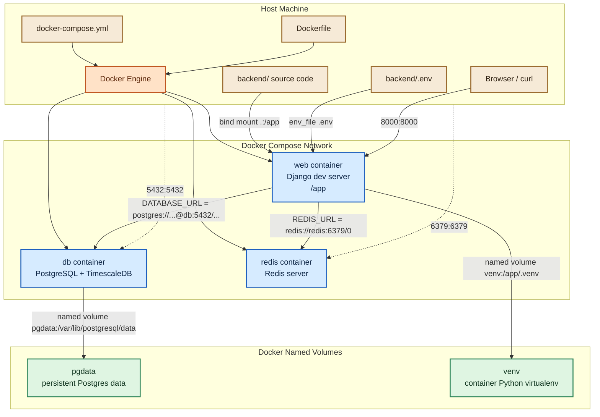

## Current Local Docker Runtime

## Use When
- Load this when you need to understand how the current backend local environment is wired, where each component runs, what lives in Docker versus on the host machine, how `backend/Dockerfile` and `backend/docker-compose.yml` work, or how ports, bind mounts, and named volumes behave.

## Source
- Derived from the current repository implementation in `backend/Dockerfile`, `backend/docker-compose.yml`, and `backend/config/settings/base.py`.

### What Exists Right Now

The backend local setup currently runs with Docker Compose from `backend/docker-compose.yml`.

Services:
- `web`: Django development server container
- `db`: TimescaleDB / PostgreSQL container
- `redis`: Redis container

Named volumes:
- `pgdata`: persistent PostgreSQL data
- `venv`: persistent Python virtual environment inside the `web` container

### Runtime Model

- You start the stack from the host machine by running `docker compose up --build` inside `backend/`.
- Docker Compose creates an isolated network for the services.
- Inside that Docker network, service names become hostnames:
  - Django connects to PostgreSQL at `db:5432`
  - Django connects to Redis at `redis:6379`
- Ports are published from containers to the host:
  - `8000:8000` = host `localhost:8000` -> container `web:8000`
  - `5432:5432` = host `localhost:5432` -> container `db:5432`
  - `6379:6379` = host `localhost:6379` -> container `redis:6379`

### Image vs Container vs Volume vs Bind Mount

- **Image**: a built package/template. `backend/Dockerfile` produces the `web` image.
- **Container**: a running instance created from an image. `web`, `db`, and `redis` are containers.
- **Named volume**: Docker-managed persistent storage outside the container filesystem. `pgdata` and `venv` are named volumes.
- **Bind mount**: a direct mapping from a host path into a container path. `.:/app` is a bind mount.

### Port Mapping and "Exposed"

When we say the Django app is **exposed to the host on port `8000`**, we mean:
- Django listens on port `8000` inside the `web` container
- Docker maps that internal container port to port `8000` on your local machine
- your host browser or `curl` can access the app at `http://127.0.0.1:8000`

In Compose, that is this line:

```yaml
ports:
  - "8000:8000"
```

Read it as:
- left side = host port
- right side = container port

### What Lives In Docker vs On The Host

Inside Docker:
- Django process (`web`)
- PostgreSQL / TimescaleDB process (`db`)
- Redis process (`redis`)
- Container filesystem at `/app`
- Python virtual environment stored in the named volume `venv`
- PostgreSQL data stored in the named volume `pgdata`

On the host machine:
- Source code in `backend/`
- `backend/.env`
- Docker Compose file
- Dockerfile
- The Docker engine itself
- Published ports:
  - `localhost:8000` -> Django container
  - `localhost:5432` -> PostgreSQL container
  - `localhost:6379` -> Redis container

### Bind Mount Behavior

The `web` service mounts the host `backend/` directory into the container at `/app`:

```yaml
volumes:
  - .:/app
```

That means:
- Editing code on the host changes the code the container sees immediately
- The Django development server can reload on file changes
- For development, the files used at runtime come from your host machine through the bind mount

`/app` is simply a path inside the container filesystem.

In practice:
- your host path `/home/sevi/longevity/backend`
- is mounted into container path `/app`
- so yes, inside the running `web` container, `/app` shows the same project files as your local `backend/` folder

### Named Volume for Python Environment

The `web` service also has:

```yaml
volumes:
  - venv:/app/.venv
```

This means:
- inside the container, `/app/.venv` is backed by a Docker named volume called `venv`
- it is **not** the same thing as your local `/home/sevi/longevity/backend/.venv`
- it is **not** synced with your local `.venv`

Reason:
- the code is shared from the host with `.:/app`
- but the Python environment inside Docker should stay Docker-specific
- container-installed packages may differ from host-installed packages
- keeping them separate avoids corrupting one environment with the other

The named volume `venv` lives on your local machine, but not as a normal folder in the project tree. Docker stores it in Docker-managed storage.

### Named Volume for PostgreSQL Data

The `db` service has:

```yaml
volumes:
  - pgdata:/var/lib/postgresql/data
```

This means:
- PostgreSQL writes its database files inside the container at `/var/lib/postgresql/data`
- Docker stores that data in a named volume called `pgdata`
- yes, the data is stored on your local machine
- but no, it is not stored in your project folder as normal files you edit directly

It lives in Docker-managed storage, typically somewhere under Docker's own data directory, not under `backend/`.

Why we do this:
- container filesystems are disposable
- volumes preserve the database even if the `db` container is deleted and recreated

### Dockerfile Purpose

`backend/Dockerfile` builds the image used by the `web` service.

What it does:
1. Starts from a base image that already includes `uv`
2. Sets `/app` as the working directory
3. Sets Python-related environment flags for cleaner container behavior
4. Copies dependency files (`pyproject.toml`, `uv.lock`)
5. Installs Python dependencies with `uv sync --frozen`
6. Copies the backend project into the image
7. Defines the default command to run Django

The key build-time line is:

```dockerfile
COPY . .
```

That means:
- copy the Docker build context into the image working directory `/app`
- because Compose builds with `context: .` from inside `backend/`, the `.` here means the backend folder contents

Important distinction:
- **build time**: `COPY . .` copies project files into the image
- **run time for development**: `.:/app` bind-mounts your host files over `/app`

So yes, the files get copied into the image during build, but for local development the bind mount effectively takes precedence while the container is running. That is why we say the project code is not relied on as a permanent copy inside the running dev container.

### docker-compose.yml Purpose

`backend/docker-compose.yml` defines the local multi-container environment.

What it does:
- Builds the `web` image from `backend/Dockerfile`
- Starts PostgreSQL/TimescaleDB
- Starts Redis
- Wires service startup ordering
- Loads environment variables from `backend/.env`
- Mounts the project source code into the Django container
- Publishes container ports to the host machine

### How Compose, Env Vars, and Django Fit Together

Relationship between Compose, env vars, and services:
- Compose reads `backend/.env` and injects those values into the `web` container through `env_file`
- the `db` service separately reads `POSTGRES_DB`, `POSTGRES_USER`, and `POSTGRES_PASSWORD` through Compose variable substitution
- Django then reads `DATABASE_URL` and `REDIS_URL` from the environment inside the `web` container
- Docker itself does **not** choose the Django database; Django chooses it based on the env vars Docker injected

Example:
- `DATABASE_URL=postgres://postgres:postgres@db:5432/longevity`
- Django reads that value
- `dj_database_url.config(...)` parses it
- Django configures PostgreSQL as the active database connection
- SQLite is not used, because `DATABASE_URL` is present and overrides the SQLite default

The fallback to SQLite exists only if `DATABASE_URL` is missing.

### Important Constraint

Once `DATABASE_URL` points to `db`, Django should be run through Docker Compose, not directly on the host with:

```bash
uv run python manage.py runserver
```

Reason:
- `db` is a Docker Compose hostname, not a hostname your host OS knows how to resolve

### Current Gaps

The local-dev architecture is partially implemented, not complete yet.

Already present:
- Django in Docker
- PostgreSQL/TimescaleDB in Docker
- Redis in Docker
- `backend/.env` convention
- Health endpoint

Still missing:
- Celery worker
- Celery Beat
- `.dockerignore`
- Cleanup of repeated `uv sync` during container startup
- Domain apps (`accounts`, `metrics`)

### Mermaid Diagram

Current local runtime with color coding and port mappings:


