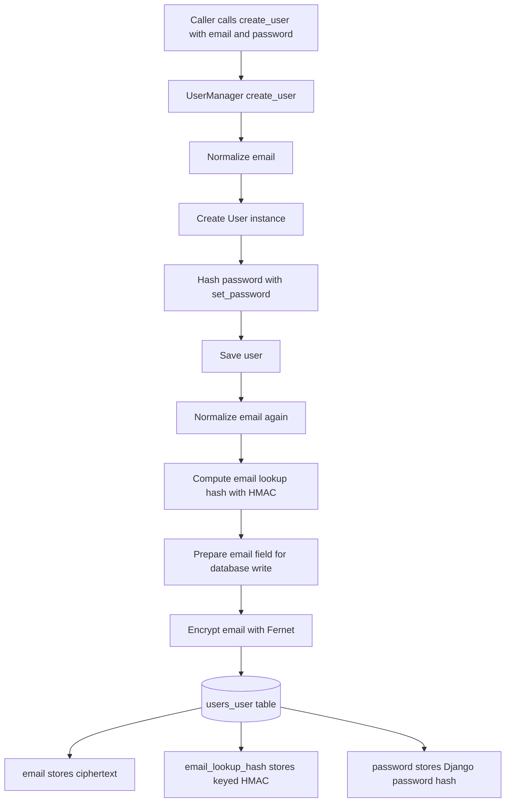
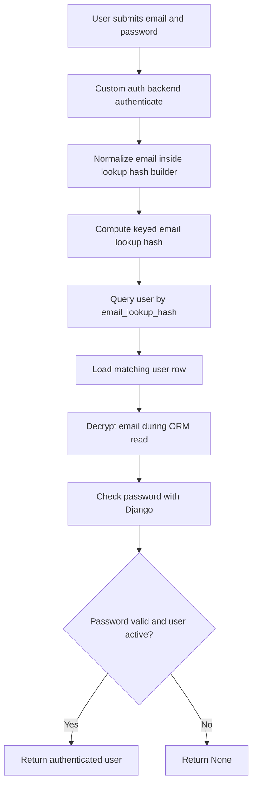

### 2.4 Auth Strategy

## Use When
- Load this when you need the high-level auth strategy, token model, email storage approach, social login scope, wearable auth flow, or auth rate-limiting rules.

## Source
- Derived from `reference_docs/knowledge/planning.md` section 2.4.

- **JWT** (short-lived access 15 min + HTTP-only refresh 7 days)
- **Email storage** = encrypted ciphertext + `email_lookup_hash` for uniqueness / lookup
- **OAuth social login** (Google, Apple) after MVP
- **Samsung sync auth** = Android companion app uses our JWT and asks for Samsung Health / Health Connect permissions on device
- **Future cloud-provider sync auth** = hosted link flow + signed webhooks through an aggregator or direct provider OAuth where appropriate
- **Rate limiting** on auth endpoints (5 login attempts/min)

### Django Auth Foundation

- Use Django's built-in auth framework for the user model integration, password hashing, permissions, admin compatibility, and authentication plumbing.
- Django's default auth transport is session-based authentication via cookies.
- We do not reimplement password hashing or core identity primitives ourselves. Product-specific auth behavior sits on top of Django's auth system.

### Sessions vs JWT

- The main difference is where authenticated state lives.
- **Sessions**: the server stores login state and the client sends a session cookie that points to that server-side state.
- **JWT**: the client sends a signed token on each request and the server validates the token instead of first loading a server-side session record.
- This is mostly an application-shape decision, not a blanket statement that one option is always more secure.

### Why This Project Uses JWT

- The product is API-first and needs to support both a React frontend and an Android client.
- JWT fits multi-client API access better than Django sessions.
- Django sessions still remain appropriate for Django admin because admin is server-rendered and works naturally with the built-in session flow.

### Recommended Token Model

- **Access token**: short-lived JWT, target 15 minutes, sent in the `Authorization: Bearer <token>` header.
- **Refresh token**: longer-lived JWT, target 7 days, used only to mint new access tokens.
- **Web client**: store the refresh token in an `HttpOnly`, `Secure` cookie; keep the access token short-lived and send it in the authorization header.
- **Android client**: store tokens in secure platform storage, not plain local storage equivalents.

### Security Notes

- Sessions are often simpler to reason about for classic server-rendered apps because the server owns invalidation directly.
- JWT can be equally secure, but only with careful implementation: short access-token lifetime, protected refresh-token storage, and refresh rotation / blacklist strategy when stronger logout semantics are required.
- For web clients, avoid storing long-lived JWTs in JavaScript-readable storage.
- For this project, use JWT for product APIs and Django sessions for admin rather than forcing one mechanism onto every surface.
- JWT signing strength still depends on key quality. For HS256-based signing, test and runtime keys should be sufficiently long and not treated as throwaway short strings.

### Encrypted Email Storage

- User email is stored encrypted at rest instead of plaintext.
- Login lookup and uniqueness should rely on a normalized-email lookup hash, not plaintext email queries.
- The lookup value should be a keyed HMAC of the normalized email, not a plain unsalted hash.
- The encrypted email column is for confidentiality at rest; the lookup hash is for stable exact-match queries.
- Because encrypted email is not the database lookup field, authentication should use a custom backend that resolves users by `email_lookup_hash`.
- At the model/API level, `email` still remains the user-facing identifier and `USERNAME_FIELD`.
- Use a real Fernet key for `PII_ENCRYPTION_KEY`; do not derive one ad hoc from `SECRET_KEY`.
- Use a separate dedicated `EMAIL_LOOKUP_KEY` for the keyed lookup hash.
- Missing crypto keys should fail fast instead of silently falling back to broad defaults.
- Django's `auth.W004` warning about a non-unique `USERNAME_FIELD` is expected in this design because authentication is delegated to the custom backend using `email_lookup_hash`.
- Field behavior should follow this pattern:
  - encrypt on database write
  - decrypt on ORM read
- When verifying this behavior in tests, inspect the raw database column value rather than relying only on ORM reads, because ORM field conversion may return the decrypted application value.

### Current Create and Login Flows

### API Layering for Auth Endpoints

For auth endpoints, keep responsibilities split cleanly:
- **Model**: database and domain contract
  - defines what a `User` is in the system
  - owns persistence behavior such as encrypted email storage and lookup-hash synchronization
- **Serializer**: API input/output contract
  - defines which fields an endpoint accepts or returns
  - validates request data
  - can create the domain object for the endpoint use case
- **View**: HTTP orchestration layer
  - receives the request
  - passes request data to the serializer
  - returns the HTTP response with the right status code

For the register endpoint:
- use DRF `@api_view(["POST"])`
- parse request payloads through `request.data`
- keep validation and object creation in the serializer instead of manually growing view logic

For the login endpoint:
- use DRF `@api_view(["POST"])`
- validate request fields through a dedicated `LoginSerializer`
- authenticate with Django `authenticate(...)` so the custom email-lookup backend remains the source of truth
- mint JWTs through `RefreshToken.for_user(user)` from `djangorestframework-simplejwt` instead of hand-rolling token logic

### Current Login API Behavior

- `POST /api/auth/login/`
- request body: `email`, `password`
- success response: `200` with `access` and `refresh`
- invalid credentials response: `400` with `{"detail": "Invalid credentials."}`
- missing required fields response: `400` with field errors from the serializer

### Current Refresh API Behavior

- `POST /api/auth/refresh/`
- request body: `refresh`
- success response: `200` with a new `access` token
- use SimpleJWT's built-in `TokenRefreshView` instead of custom refresh logic
- avoid keeping a parallel custom `refresh_view` wrapper unless refresh behavior is intentionally being customized
- a hand-written wrapper around `TokenRefreshSerializer` is functionally just a thin reimplementation of the built-in view and adds maintenance noise without improving security

Current boundary:
- keep login custom because the app authenticates by email through the custom Django backend
- keep refresh on the library default path until there is a real reason to customize claims, rotation, blacklist behavior, or transport

### Current Protected `me` Endpoint Behavior

- `GET /api/auth/me/`
- request header: `Authorization: Bearer <access-token>`
- success response: `200` with the authenticated user's email
- unauthenticated response: `401`

How `/api/auth/me/` is protected:
- `@api_view` makes the endpoint run through DRF request handling
- DRF uses `REST_FRAMEWORK["DEFAULT_AUTHENTICATION_CLASSES"]`
- `JWTAuthentication` reads and validates the bearer access token
- on success, DRF sets `request.user`
- the view returns data from `request.user`
- both happy-path and unauthenticated behavior are covered by tests

### Current MVP Logout State

- logout is not implemented yet
- current JWT behavior is stateless on the access-token side
- that means a previously issued access token remains valid until expiry unless a stronger revocation design is added

Two viable logout models:
- minimal logout: client deletes stored access and refresh tokens
- stronger logout: enable refresh-token rotation and blacklist/revocation so refresh tokens can be invalidated server-side

MVP recommendation:
- for the backend slice, keep login, refresh, and `me` first
- choose logout policy explicitly before implementing it
- if the product needs stronger logout semantics, use SimpleJWT's rotation/blacklist path rather than inventing custom revocation logic

### HttpOnly Cookie Role

- `HttpOnly` cookies matter mainly for web-client refresh-token storage
- the main idea is:
  - keep the short-lived access token in the authorization header
  - keep the longer-lived refresh token in an `HttpOnly`, `Secure` cookie
- this reduces JavaScript access to the long-lived token and lowers XSS exposure for refresh-token theft

Current project state:
- tokens are currently returned in the JSON response body
- cookie transport has not been implemented yet
- this is acceptable for the current backend auth slice, but web-token storage policy still needs an explicit decision before frontend integration hardens

### Chosen Hardened Token Policy

Chosen direction for the product auth flow:
- access token:
  - short-lived JWT
  - sent in `Authorization: Bearer <token>`
  - web client should keep it in memory, not persistent browser storage
  - Android client should keep it in secure platform storage
- refresh token:
  - web client should receive it in an `HttpOnly`, `Secure` cookie
  - Android client should keep it in secure platform storage
  - frontend JavaScript should not read the refresh token on web
- refresh behavior:
  - enable refresh-token rotation
  - enable blacklist/revocation
  - when a refresh succeeds, issue a new refresh token and invalidate the old one
  - logout should revoke the current refresh token server-side

Why this policy was chosen:
- it gives stronger logout semantics than client-only token deletion
- it reduces XSS exposure for the long-lived refresh token on web
- it limits replay value of old refresh tokens
- it stays close to SimpleJWT's intended extension points instead of inventing custom token machinery

Security implications:
- cookie-based refresh/logout flows need explicit CSRF handling
- access-token expiry should stay short because access tokens remain stateless until expiry
- web and Android token transport are intentionally different because their threat models and storage primitives differ

### Serialization and Deserialization

- **Deserialization**: taking incoming external data such as JSON and turning it into validated Python-native data that the application can use.
- **Serialization**: taking Python objects or domain data and turning them into external response data such as JSON.

Roughly:
- JSON -> Python data = deserialization
- Python data -> JSON = serialization

In DRF, deserialization usually includes validation, and serialization usually includes shaping the response into the API contract, not just raw type conversion.

In this project:
- register request body -> serializer validation -> validated data = deserialization
- created user -> response payload such as `{"email": "alice@example.com"}` = serialization

The important design rule is:
- models are not the API contract
- serializers define the API contract for each endpoint
