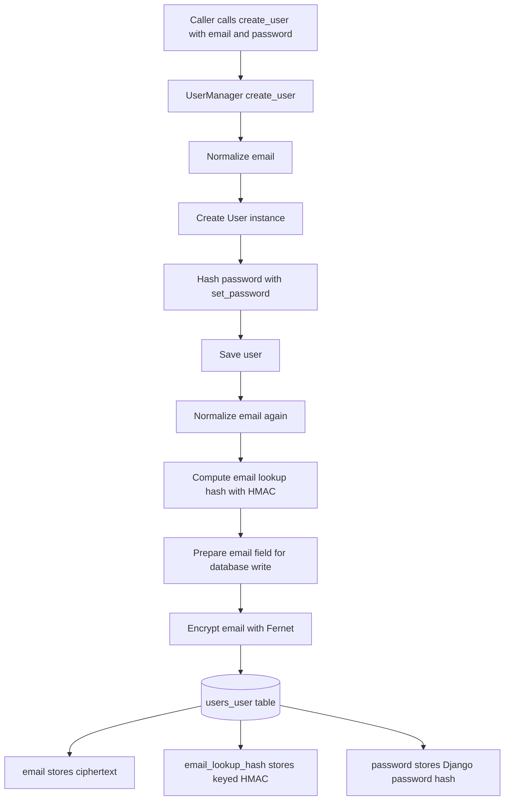
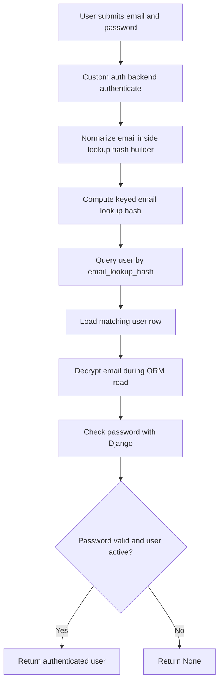
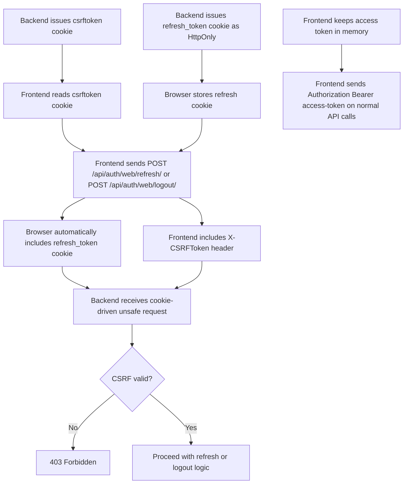

### 2.4 Auth Strategy

## Use When
- Load this when you need the high-level auth strategy, token model, email storage approach, social login scope, wearable auth flow, or auth rate-limiting rules.

## Source
- Derived from `reference_docs/knowledge/planning.md` section 2.4.

- **JWT** (short-lived access 15 min + HTTP-only refresh 7 days)
- **Email storage** = encrypted ciphertext + `email_lookup_hash` for uniqueness / lookup
- **OAuth social login** (Google, Apple) after MVP
- **Samsung sync auth** = Android companion app uses our JWT and asks for Samsung Health / Health Connect permissions on device
- **Future cloud-provider sync auth** = hosted link flow + signed webhooks through an aggregator or direct provider OAuth where appropriate
- **Rate limiting** on auth endpoints (5 login attempts/min)

### Django Auth Foundation

- Use Django's built-in auth framework for the user model integration, password hashing, permissions, admin compatibility, and authentication plumbing.
- Django's default auth transport is session-based authentication via cookies.
- We do not reimplement password hashing or core identity primitives ourselves. Product-specific auth behavior sits on top of Django's auth system.

### Sessions vs JWT

- The main difference is where authenticated state lives.
- **Sessions**: the server stores login state and the client sends a session cookie that points to that server-side state.
- **JWT**: the client sends a signed token on each request and the server validates the token instead of first loading a server-side session record.
- This is mostly an application-shape decision, not a blanket statement that one option is always more secure.

### Why This Project Uses JWT

- The product is API-first and needs to support both a React frontend and an Android client.
- JWT fits multi-client API access better than Django sessions.
- Django sessions still remain appropriate for Django admin because admin is server-rendered and works naturally with the built-in session flow.

### Recommended Token Model

- **Access token**: short-lived JWT, target 15 minutes, sent in the `Authorization: Bearer <token>` header.
- **Refresh token**: longer-lived JWT, target 7 days, used only to mint new access tokens.
- **Web client**: store the refresh token in an `HttpOnly`, `Secure` cookie; keep the access token short-lived and send it in the authorization header.
- **Android client**: store tokens in secure platform storage, not plain local storage equivalents.

### Security Notes

- Sessions are often simpler to reason about for classic server-rendered apps because the server owns invalidation directly.
- JWT can be equally secure, but only with careful implementation: short access-token lifetime, protected refresh-token storage, and refresh rotation / blacklist strategy when stronger logout semantics are required.
- For web clients, avoid storing long-lived JWTs in JavaScript-readable storage.
- For this project, use JWT for product APIs and Django sessions for admin rather than forcing one mechanism onto every surface.
- JWT signing strength still depends on key quality. For HS256-based signing, test and runtime keys should be sufficiently long and not treated as throwaway short strings.

### Encrypted Email Storage

- User email is stored encrypted at rest instead of plaintext.
- Login lookup and uniqueness should rely on a normalized-email lookup hash, not plaintext email queries.
- The lookup value should be a keyed HMAC of the normalized email, not a plain unsalted hash.
- The encrypted email column is for confidentiality at rest; the lookup hash is for stable exact-match queries.
- Because encrypted email is not the database lookup field, authentication should use a custom backend that resolves users by `email_lookup_hash`.
- At the model/API level, `email` still remains the user-facing identifier and `USERNAME_FIELD`.
- Use a real Fernet key for `PII_ENCRYPTION_KEY`; do not derive one ad hoc from `SECRET_KEY`.
- Use a separate dedicated `EMAIL_LOOKUP_KEY` for the keyed lookup hash.
- Missing crypto keys should fail fast instead of silently falling back to broad defaults.
- Django's `auth.W004` warning about a non-unique `USERNAME_FIELD` is expected in this design because authentication is delegated to the custom backend using `email_lookup_hash`.
- Field behavior should follow this pattern:
  - encrypt on database write
  - decrypt on ORM read
- When verifying this behavior in tests, inspect the raw database column value rather than relying only on ORM reads, because ORM field conversion may return the decrypted application value.

### Current Create and Login Flows

### API Layering for Auth Endpoints

For auth endpoints, keep responsibilities split cleanly:
- **Model**: database and domain contract
  - defines what a `User` is in the system
  - owns persistence behavior such as encrypted email storage and lookup-hash synchronization
- **Serializer**: API input/output contract
  - defines which fields an endpoint accepts or returns
  - validates request data
  - can create the domain object for the endpoint use case
- **View**: HTTP orchestration layer
  - receives the request
  - passes request data to the serializer
  - returns the HTTP response with the right status code

For the register endpoint:
- use DRF `@api_view(["POST"])`
- parse request payloads through `request.data`
- keep validation in the serializer and delegate domain creation to `create_user_with_subscription()`
- create the user and active free subscription in one database transaction
- fail the complete registration if the active default free plan is unavailable or subscription creation fails

For the login endpoint:
- use DRF `@api_view(["POST"])`
- validate request fields through a dedicated `LoginSerializer`
- authenticate with Django `authenticate(...)` so the custom email-lookup backend remains the source of truth
- mint JWTs through `RefreshToken.for_user(user)` from `djangorestframework-simplejwt` instead of hand-rolling token logic

### Current Mobile Login API Behavior

- `POST /api/auth/mobile/login/`
- request body: `email`, `password`
- success response: `200` with `access` and `refresh`
- invalid credentials response: `400` with `{"detail": "Invalid credentials."}`
- missing required fields response: `400` with field errors from the serializer

### Current Web Login API Behavior

- `POST /api/auth/web/login/`
- request body: `email`, `password`
- success response: `200` with `access`
- backend also sets the `refresh_token` cookie
- invalid credentials response: `400` with `{"detail": "Invalid credentials."}`
- missing required fields response: `400` with field errors from the serializer

### Current Mobile Refresh API Behavior

- `POST /api/auth/mobile/refresh/`
- request supplies `refresh` in the JSON body
- success response: `200` with a new `access` token
- with rotation enabled, refresh may also issue a new refresh token in the JSON response body
- missing refresh token response: `400`
- invalid refresh token response: `401`
- mobile refresh uses a custom wrapper view because the project now owns the transport contract split
- the custom view should still delegate token mechanics to SimpleJWT's `TokenRefreshSerializer`
- with rotation enabled, the new refresh token is generated inside `TokenRefreshSerializer` during validation; the custom view only transports the rotated token back to the client in the JSON response

### Current Web Refresh API Behavior

- `POST /api/auth/web/refresh/`
- refresh token is read only from the `refresh_token` cookie
- request must also supply a valid CSRF token
- success response: `200` with a new `access` token
- with rotation enabled, refresh may also issue a new refresh token and the backend updates the refresh cookie
- missing refresh token response: `400`
- invalid refresh token response: `401`
- failed CSRF response: `403`

Current boundary:
- keep login custom because the app authenticates by email through the custom Django backend
- keep refresh on the library default path until there is a real reason to customize claims, rotation, blacklist behavior, or transport

### Current Frontend Web Session Bootstrap

The frontend now has a small bootstrap helper for restoring a browser session from the hardened web-token transport:

- `frontend/src/features/auth/auth-bootstrap.ts`
- helper name: `restoreWebSession()`

Current frontend-to-backend bootstrap flow:
1. frontend calls `GET /api/auth/csrf/`
2. backend sets the `csrftoken` cookie
3. frontend reads the `csrftoken` cookie value
4. frontend calls `POST /api/auth/web/refresh/`
5. browser includes cookies automatically because the request uses `credentials: 'include'`
6. request includes:
   - `refresh_token` cookie automatically from the browser cookie jar
   - `csrftoken` cookie automatically from the browser cookie jar
   - `X-CSRFToken` header explicitly from frontend JavaScript
7. backend validates CSRF and the refresh token
8. backend returns a new `access` token in JSON
9. frontend stores that access token in the in-memory session layer

Important distinction:
- frontend JavaScript reads the CSRF cookie
- frontend JavaScript does **not** read the `refresh_token` cookie
- the refresh token stays in the `HttpOnly` cookie and is sent automatically by the browser

Current limitation:
- this bootstrap helper is now implemented and tested
- it is not yet wired into app startup, so full-page reload auth restoration is not complete yet

### Current Protected `me` Endpoint Behavior

- `GET /api/auth/me/`
- request header: `Authorization: Bearer <access-token>`
- success response: `200` with the authenticated user's email
- unauthenticated response: `401`

How `/api/auth/me/` is protected:
- `@api_view` makes the endpoint run through DRF request handling
- DRF uses `REST_FRAMEWORK["DEFAULT_AUTHENTICATION_CLASSES"]`
- `JWTAuthentication` reads and validates the bearer access token
- on success, DRF sets `request.user`
- the view returns data from `request.user`
- both happy-path and unauthenticated behavior are covered by tests

### Current MVP Logout State

- logout is implemented for refresh-token revocation
- current JWT behavior is still stateless on the access-token side
- that means a previously issued access token remains valid until expiry unless a stronger access-token revocation design is added

Two viable logout models:
- minimal logout: client deletes stored access and refresh tokens
- stronger logout: enable refresh-token rotation and blacklist/revocation so refresh tokens can be invalidated server-side

MVP recommendation:
- for the backend slice, keep login, refresh, and `me` first
- choose logout policy explicitly before implementing it
- if the product needs stronger logout semantics, use SimpleJWT's rotation/blacklist path rather than inventing custom revocation logic

Current mobile logout behavior:
- `POST /api/auth/mobile/logout/`
- request supplies `refresh` in the JSON body
- backend blacklists the submitted refresh token using SimpleJWT's blacklist support
- response is `204 No Content`
- if `refresh` is missing, response is `400` with a field error
- if `refresh` is malformed or invalid, response is `400`
- after logout, that same refresh token can no longer be used at `/api/auth/mobile/refresh/`
- logout currently revokes refresh capability, not already-issued access tokens

Current web logout behavior:
- `POST /api/auth/web/logout/`
- refresh token is read only from the `refresh_token` cookie
- request must also supply a valid CSRF token
- backend blacklists the cookie refresh token using SimpleJWT's blacklist support
- response is `204 No Content`
- on successful logout, the backend clears the `refresh_token` cookie
- missing refresh token response: `400`
- invalid refresh token response: `400`
- failed CSRF response: `403`

Current frontend web logout helper:
- `frontend/src/features/auth/auth-logout-api.ts`
- helper name: `logoutWeb()`
- current frontend-to-backend flow:
  - read `csrftoken` from `document.cookie`
  - `POST /api/auth/web/logout/`
  - send `credentials: 'include'` so browser cookies are included
  - send `X-CSRFToken`
  - on success, clear the in-memory access token
- current failure behavior:
  - preserve backend `detail` when available
  - otherwise fall back to `Logout failed`

Important boundary:
- frontend JavaScript still does not read the `refresh_token` cookie directly
- browser cookie transport carries the refresh token for the logout request

### HttpOnly Cookie Role

- `HttpOnly` cookies matter mainly for web-client refresh-token storage
- the main idea is:
  - keep the short-lived access token in the authorization header
  - keep the longer-lived refresh token in an `HttpOnly`, `Secure` cookie
- this reduces JavaScript access to the long-lived token and lowers XSS exposure for refresh-token theft

Current project state:
- tokens are currently returned in the JSON response body
- cookie transport has not been implemented yet
- this is acceptable for the current backend auth slice, but web-token storage policy still needs an explicit decision before frontend integration hardens

### Chosen Hardened Token Policy

Chosen direction for the product auth flow:
- access token:
  - short-lived JWT
  - sent in `Authorization: Bearer <token>`
  - web client should keep it in memory, not persistent browser storage
  - Android client should keep it in secure platform storage
- refresh token:
  - web client should receive it in an `HttpOnly`, `Secure` cookie
  - Android client should keep it in secure platform storage
  - frontend JavaScript should not read the refresh token on web
- refresh behavior:
  - enable refresh-token rotation
  - enable blacklist/revocation
  - when a refresh succeeds, issue a new refresh token and invalidate the old one
  - logout should revoke the current refresh token server-side

Why this policy was chosen:
- it gives stronger logout semantics than client-only token deletion
- it reduces XSS exposure for the long-lived refresh token on web
- it limits replay value of old refresh tokens
- it stays close to SimpleJWT's intended extension points instead of inventing custom token machinery

Security implications:
- cookie-based refresh/logout flows need explicit CSRF handling
- access-token expiry should stay short because access tokens remain stateless until expiry
- web and Android token transport are intentionally different because their threat models and storage primitives differ
- a simple `@csrf_protect` attempt did not produce the expected behavior on the DRF function-based refresh endpoint, so CSRF enforcement is applied explicitly inside the custom refresh view for the cookie-driven path

### Web Token Transport Contract

For the web client, the intended contract is:
- login response returns the short-lived `access` token in the response body
- login also sets the long-lived refresh token in an `HttpOnly`, `Secure` cookie
- frontend JavaScript should use the `access` token for the `Authorization` header
- frontend JavaScript should not read the refresh token directly
- refresh endpoint should read the refresh token from the cookie on the web path
- logout endpoint should revoke the refresh token currently held in the cookie on the web path

Cookie-related expectations:
- use `HttpOnly`
- use `Secure`
- choose `SameSite` deliberately based on the final frontend deployment topology
- clear the refresh cookie on logout

Chosen contract split:
- web and Android use the same Django backend service
- web auth transport and mobile auth transport are intentionally different
- web refresh/logout should be cookie-only and CSRF-protected
- mobile refresh/logout should use explicit token submission, not browser cookies
- do not keep one endpoint supporting both transport models indefinitely
- prefer explicit web endpoints and explicit mobile/API endpoints when the contracts diverge

Current split implementation:
- `/api/auth/web/login/` is now a dedicated web login endpoint
- it returns only the short-lived `access` token in JSON
- it sets the long-lived refresh token only in the `refresh_token` cookie
- `/api/auth/mobile/login/` is now a dedicated mobile login endpoint
- it returns `access` and `refresh` in JSON for non-browser clients
- `/api/auth/web/refresh/` is now a dedicated web refresh endpoint
- `/api/auth/web/logout/` is now a dedicated web logout endpoint
- it is cookie-only and CSRF-protected
- it does not accept refresh tokens from the JSON body
- `/api/auth/mobile/refresh/` and `/api/auth/mobile/logout/` are explicit body-token endpoints for non-browser clients such as Android
- the older generic `/api/auth/login/`, `/api/auth/refresh/`, and `/api/auth/logout/` paths have been removed to avoid transport ambiguity

Practical difference between web and mobile:
- web refresh/logout rely on the browser cookie transport for the refresh token
- web refresh/logout also require the frontend to send `X-CSRFToken`
- mobile refresh/logout do not rely on browser cookies or CSRF
- mobile clients send the refresh token explicitly in the JSON body

Current implementation gap:
- web login now sets a `refresh_token` cookie and keeps the refresh token out of the JSON body
- mobile login still returns refresh tokens in JSON by design for non-browser clients
- the backend auth foundation is green across register, login, refresh, logout, and `me`
- frontend CSRF bootstrap now exists through `/api/auth/csrf/`
- the remaining auth transport decision is whether register should also be split explicitly by client type or stay shared

Deferred user-backend scope:
- password reset is not implemented yet
- profile update and account deletion flows are not implemented yet
- email verification is not implemented; add it later only if the product or abuse profile justifies it
- richer user-profile domain behavior beyond auth basics is still deferred
- this means the current backend user slice should be treated as an auth foundation, not a complete user-account system

Current proven SPA browser path:
- frontend can call `GET /api/auth/csrf/` to bootstrap the CSRF cookie
- login sets the `refresh_token` cookie
- cookie-based refresh succeeds when the browser supplies the refresh cookie and the frontend supplies `X-CSRFToken`
- cookie-based logout succeeds when the browser supplies the refresh cookie and the frontend supplies `X-CSRFToken`

### Cookie vs Token

- a token is a credential value, usually represented as a string
- a cookie is a browser storage/transport mechanism for a name/value pair plus attributes such as `HttpOnly`, `Secure`, and `SameSite`
- a JWT access token is a string
- a JWT refresh token is a string
- a Django CSRF token is also a string
- a cookie can carry one of those token strings, but the cookie itself is not the token

Examples:
- `Authorization: Bearer <access-token>` uses a token directly in an HTTP header
- `Set-Cookie: refresh_token=<jwt>; HttpOnly; Secure; SameSite=Lax` stores a token inside a cookie

### SPA CSRF Flow

For the hardened web flow:
- the access token stays in frontend memory and is sent in the `Authorization` header
- the refresh token lives in an `HttpOnly` cookie and is sent automatically by the browser
- the CSRF token is a separate cookie value that frontend JavaScript can read
- frontend sends that CSRF token back in the `X-CSRFToken` header on cookie-driven unsafe requests

Why this split exists:
- the refresh token should not be readable by frontend JavaScript
- the CSRF token must be readable so the frontend can echo it back
- a secret cookie by itself is not enough because browsers send cookies automatically on requests

SPA bootstrap role:
- the frontend is a single-page app and does not rely on Django-rendered HTML forms for CSRF setup
- that means the frontend needs an explicit startup step to obtain the CSRF cookie
- `GET /api/auth/csrf/` exists for that bootstrap purpose
- the endpoint uses Django's CSRF cookie machinery so later cookie-based refresh/logout requests can include `X-CSRFToken`

Current browser flow:

### Serialization and Deserialization

- **Deserialization**: taking incoming external data such as JSON and turning it into validated Python-native data that the application can use.
- **Serialization**: taking Python objects or domain data and turning them into external response data such as JSON.

Roughly:
- JSON -> Python data = deserialization
- Python data -> JSON = serialization

In DRF, deserialization usually includes validation, and serialization usually includes shaping the response into the API contract, not just raw type conversion.

In this project:
- register request body -> serializer validation -> validated data = deserialization
- created user -> response payload such as `{"email": "alice@example.com"}` = serialization

The important design rule is:
- models are not the API contract
- serializers define the API contract for each endpoint

### JWT Representation and Validation Notes

- a JWT is not a Python object on the wire; it is a compact token string with three dot-separated parts
- in application code, SimpleJWT exposes helper classes such as `RefreshToken`
- `str(refresh_token_object)` produces the actual JWT string sent in HTTP requests or responses
- `RefreshToken.for_user(user)` creates the token helper object; the client ultimately receives token strings

In this project:
- login uses SimpleJWT helper objects in Python
- clients send and receive JWT strings over HTTP
- low-level token work such as signing, signature verification, expiry checking, claim parsing, and blacklist checks is handled by SimpleJWT / PyJWT rather than custom code

### Stateless vs Stateful Token Behavior

- access tokens are currently stateless
  - the server validates them from their signed contents and expiry
  - the server does not need a persistent per-access-token record to accept them
  - that is why an already-issued access token usually remains valid until expiration
- refresh tokens are effectively stateful for revocation in the current hardened setup
  - outstanding/blacklist records exist in the backend
  - that is why a refresh token can be revoked server-side

This is the practical consequence:
- logout blacklists the refresh token
- the same refresh token can no longer be used to mint new access tokens
- already-issued access tokens are not revoked immediately and remain usable until their short expiry window ends

Stateful session contrast:
- classic Django session auth is stateful because the server stores session state directly
- deleting the session record invalidates access immediately
