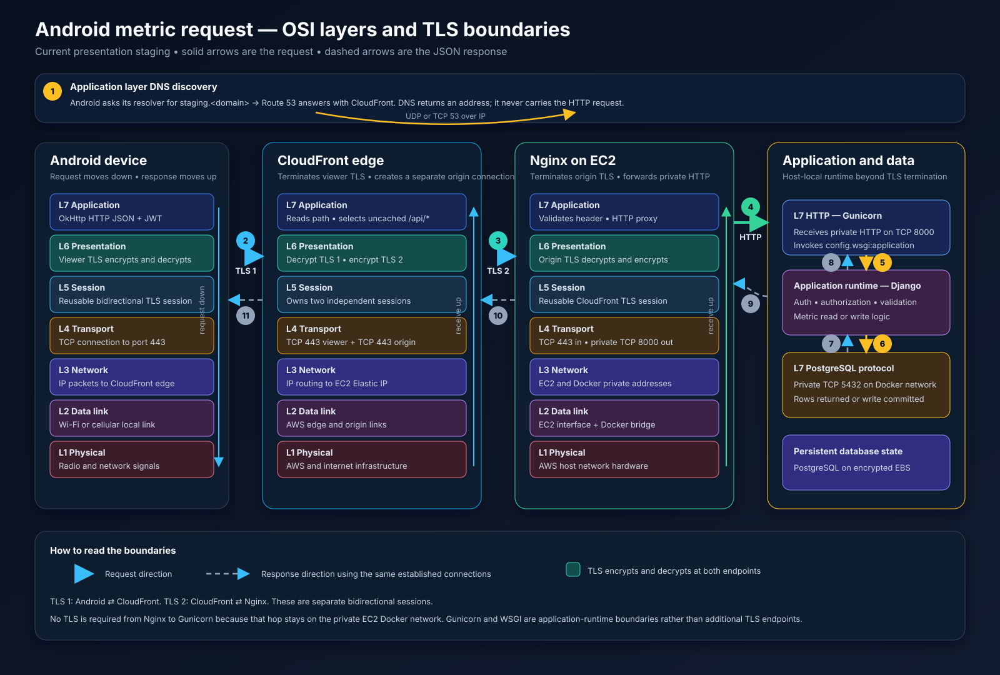

## 10. C4 Deployment Diagram

## Use When
- Load this when you need the current low-cost presentation-staging placement,
  the recommended resilient production placement, or a clearly marked historical
  deployment view for comparison.

## Source
- Derived from `reference_docs/knowledge/06-pragmatic-mvp-cloud-architecture.md` and the Structurizr DSL source of truth.

### Source of Truth

The deployment model is maintained in Structurizr DSL:

- [longevity-architecture.dsl](/home/sevi/longevity/reference_docs/knowledge/diagrams/longevity-architecture.dsl)

Validate it with Structurizr's current consolidated image:

```bash
cd reference_docs/knowledge/diagrams
docker run --rm \
  -v "$PWD:/usr/local/structurizr:ro" \
  structurizr/structurizr \
  validate -workspace /usr/local/structurizr/longevity-architecture.dsl
```

Do not use `structurizr/cli:latest`. That deprecated image currently prints a
migration warning and exits successfully without parsing the workspace, which
can create false confidence around invalid DSL.

### Deployment View Status

The workspace keeps current, recommended, and historical cloud models as
separate deployment environments. The label is part of both the environment
name and the view description so exported diagrams remain distinguishable.

| View key | Status | Meaning |
|---|---|---|
| `current-presentation-staging` | **CURRENT** | Full provisioning source of truth for the agreed low-cost presentation environment |
| `current-presentation-staging-compact` | **CURRENT / COMPACT** | Small request-and-data-path view of the same current staging environment |
| `recommended-production` | **RECOMMENDED PRODUCTION** | Resilient production architecture recommendation; not the current staging bill of materials |
| `recommended-production-compact` | **RECOMMENDED PRODUCTION / COMPACT** | Small request-and-data-path view of the same production recommendation |
| `approved-initial-staging` | **LEGACY / SUPERSEDED** | Former ALB, NAT Gateway, one-private-EC2, and Timescale Cloud staging decision |
| `approved-initial-staging-compact` | **LEGACY / SUPERSEDED** | Compact form of the former approved staging decision |
| `mvp-staging-ec2-deployment` | **LEGACY / SUPERSEDED** | Former two-private-EC2 and ALB staging proposal |
| `mvp-staging-aws-infrastructure` | **LEGACY / SUPERSEDED** | Detailed network form of the former two-target proposal |
| `post-mvp-fargate-deployment` | **LEGACY / SUPERSEDED** | Former broad Fargate, Redis, Celery, and Timescale Cloud target |

Legacy views are retained for architectural history and comparison. They do not
authorize provisioning and must not be mistaken for the current staging target.

### Numbered Android Metric Request View

Use dynamic view `staging-android-metrics-request` for the ordered request and
response flow. Structurizr numbers these interactions from 1 through 11:

```text
1    Android -> Public DNS
2    Android -> CloudFront             viewer TLS terminates
3    CloudFront -> Nginx               separate origin TLS terminates
4    Nginx -> Gunicorn                 private HTTP
5    Gunicorn -> Django Metrics        WSGI invocation
6    Django Metrics -> PostgreSQL      read or write
7    PostgreSQL -> Django Metrics      rows or commit result
8    Django Metrics -> Gunicorn        JSON response construction
9    Gunicorn -> Nginx                 private HTTP response
10   Nginx -> CloudFront               encrypted origin response
11   CloudFront -> Android             encrypted viewer response
```

The view is scoped to the Django API so it can combine external systems,
staging gateway containers, the Gunicorn and Metrics components, and the
database. CloudFront and Nginx are explicitly tagged `StagingOnly` logical C4
containers for this ordered view; the deployment views remain authoritative
for their physical AWS placement. Response steps reuse the two established
bidirectional TLS connections rather than performing a new TLS handshake at
each arrow.

### Additional Numbered Staging Dynamic Views

The same logical staging gateways support four additional ordered C4 views:

| View key | Steps | Purpose |
|---|---:|---|
| `staging-browser-page-load` | 11 | Browser deep link, SPA rewrite, private-S3 `index.html`, hashed assets, and React route rendering |
| `staging-browser-metric-write` | 12 | Authenticated React metric-entry POST through both TLS boundaries and back as JSON |
| `staging-stripe-webhook` | 11 | Signed Stripe event through CloudFront/Nginx, signature verification, idempotent reconciliation, and acknowledgment |
| `staging-api-deployment` | 14 | One runtime snapshot, migration-first gate, API replacement, PostgreSQL readiness, and operator result |

#### Browser page load

```text
1     User enters /metrics/resting_hr
2     Browser resolves staging.<domain>
3     Browser requests the route from CloudFront
4-5   CloudFront fetches /index.html from private S3 on a cache miss
6     CloudFront returns index.html
7-10  Browser obtains the referenced immutable JS/CSS assets
11    React and TanStack Router render the requested page
```

S3 interactions represent an origin cache miss. When CloudFront already has a
fresh object, it returns that cached object and skips the corresponding S3
steps. API data is a separate request represented by the metric-write/read
flows; loading `index.html` does not itself read PostgreSQL.

#### Browser metric write

```text
1      User submits a metric value
2      React POSTs /api/v1/metrics/entries/ to CloudFront
3      CloudFront forwards through origin TLS to Nginx
4      Nginx forwards private HTTP to Gunicorn
5      Gunicorn invokes Django Metrics through WSGI
6-7    Django commits and receives the MetricEntry from PostgreSQL
8-11   The JSON response returns through Gunicorn, Nginx, and CloudFront
12     TanStack Query invalidates caches and React renders saved state
```

#### Stripe webhook

```text
1      Stripe resolves the configured staging webhook hostname
2      Stripe POSTs the signed event to CloudFront
3      CloudFront forwards the untouched body and signature header
4      Nginx proxies private HTTP to Gunicorn
5      Django verifies the Stripe signature before trusting the payload
6-7    PostgreSQL records the unique event and reconciles state atomically
8-11   A safe acknowledgment returns to Stripe through both TLS sessions
```

#### Migration-first API deployment

```text
1      Operator starts the controlled deployment
2-3    Loader retrieves, validates, and freezes one Secrets Manager snapshot
4      Deployment starts the one-off migration container
5-7    Migration commits successfully and reports success
8      Only now does deployment replace/start the Gunicorn API container
9-12   Readiness proves Django can execute SELECT 1 in PostgreSQL
13-14  Healthy status returns to deployment tooling and then the operator
```

If secret retrieval, contract validation, or migration fails, the sequence
stops before step 8 and the old API remains running. After successful migration,
single-container replacement can cause the explicitly accepted brief staging
maintenance interruption.

### OSI-Layer Companion for the Same Flow



The OSI model explains the network work inside the C4 interactions. It is a
conceptual teaching model: the real implementation uses the TCP/IP stack, and
TLS is commonly placed at OSI layer 6 even though it runs above TCP and below
HTTP rather than fitting perfectly into one OSI layer.

| OSI layer | What it means in this staging request |
|---|---|
| **7 — Application** | DNS resolves hostnames; OkHttp sends HTTP JSON; CloudFront selects `/api/*`; Nginx proxies HTTP; Gunicorn invokes Django through WSGI; Django uses the PostgreSQL protocol |
| **6 — Presentation** | TLS encrypts/decrypts the viewer connection at Android/CloudFront and the separate origin connection at CloudFront/Nginx; JSON has UTF-8/application-level representation |
| **5 — Session** | Existing TLS/TCP connections can carry multiple requests and responses; a response does not perform a second handshake merely because direction reverses |
| **4 — Transport** | TCP 443 carries both HTTPS connections; private TCP 8000 carries Nginx-to-Gunicorn HTTP; TCP 5432 carries Django-to-PostgreSQL traffic; DNS normally starts with UDP 53 and can use TCP |
| **3 — Network** | IP routes packets between the phone, CloudFront edge, EC2 Elastic IP, and private Docker addresses |
| **2 — Data link** | Wi-Fi/cellular access, Ethernet inside provider/AWS networks, and the EC2 Docker bridge carry frames over each local link |
| **1 — Physical** | Radio, electrical, and optical signals carry bits across the phone network, internet, and AWS infrastructure |

#### Request: encapsulate, transmit, terminate, and re-encapsulate

```text
Android
  L7  constructs HTTP GET/POST /api/v1/metrics/... with JSON/JWT
  L6  encrypts the HTTP message with viewer TLS
  L4  splits the encrypted bytes into TCP segments for port 443
  L3  places the segments into IP packets addressed to CloudFront
  L2  frames packets for the phone's current local network link
  L1  transmits bits
       |
       v
CloudFront
  L1-L4 receive and reconstruct the viewer connection
  L6    decrypts viewer TLS: TLS connection 1 terminates here
  L7    reads the HTTP path and selects the uncached /api/* behavior
  L7    constructs the origin HTTP request and adds the secret header
  L6    encrypts it with a different origin TLS session
  L4-L1 transmit it toward EC2 port 443
       |
       v
Nginx on EC2
  L1-L4 receive and reconstruct the origin connection
  L6    decrypts origin TLS: TLS connection 2 terminates here
  L7    validates the origin header and HTTP request
  L7/L4 proxies HTTP over private TCP 8000; no TLS on this host-local hop
       |
       v
Gunicorn -> Django -> PostgreSQL
  Gunicorn invokes Django through WSGI above the network stack
  Django authenticates, authorizes, validates, and runs metric logic at L7
  Django uses the PostgreSQL application protocol over private TCP 5432
```

CloudFront's origin lookup also performs DNS resolution for
`origin-staging.<domain>` before it can establish the second TCP/TLS connection.
That is separate from the phone's initial resolution of `staging.<domain>`.

#### Response: the same connections in reverse

```text
PostgreSQL -> Django       PostgreSQL result over the database connection
Django -> Gunicorn        JSON HTTP response through WSGI
Gunicorn -> Nginx         plain HTTP over private TCP 8000
Nginx -> CloudFront       encrypted using existing TLS connection 2
CloudFront -> Android     encrypted using existing TLS connection 1
```

At each TLS endpoint, the receiving side decrypts incoming application bytes
and encrypts outgoing application bytes. “TLS terminates” does not mean that a
response creates or terminates another TLS connection; it describes which two
endpoints own each bidirectional encrypted session.

#### `current-presentation-staging`

This is the current manually provisioned presentation-staging target:

- `staging.<domain>` aliases to one CloudFront distribution
- private S3 stores the Vite/React build behind Origin Access Control
- the default behavior caches static assets and handles SPA routes
- uncached `/api/*` requests go to `origin-staging.<domain>`
- an Elastic IP maps that origin hostname to one public `t4g.small` EC2 host
- the EC2 security group accepts TCP 443 only from CloudFront's managed
  origin-facing prefix list; TCP 22, 8000, and 5432 remain closed
- CloudFront adds a secret origin header that Nginx must validate
- Nginx terminates the CloudFront-to-origin TLS connection using an automated
  Let's Encrypt DNS-01 certificate
- Nginx proxies through the private Docker network to Gunicorn, which invokes
  Django through WSGI
- the same EC2 host runs a plain PostgreSQL 16 container; TimescaleDB is deferred
  until measured query needs justify a tested migration
- encrypted gp3 EBS persists PostgreSQL data and certificate state
- a scheduled backup container runs `pg_dump` and uploads encrypted logical
  backups to a separate private S3 bucket
- the staging runtime loader retrieves one Secrets Manager JSON snapshot and
  injects the same validated snapshot into the migration and API containers
- Systems Manager provides administration without public SSH
- CloudWatch receives application, migration, backup, infrastructure, and
  certificate-expiry signals
- migrations run in a one-off container before API replacement
- ALB, NAT Gateway, Timescale Cloud, Redis, Celery Worker, and Celery Beat are
  intentionally absent

The host is a deliberate single point of failure and API replacement can cause
brief downtime. Those are accepted presentation-environment tradeoffs, not
production availability claims.

#### `current-presentation-staging-compact`

This view retains only the important request and persistence path:

```text
Browser or Android
    -> CloudFront
       -> private S3 for React
       -> Nginx for /api/*
          -> Gunicorn / Django
             -> PostgreSQL 16 on encrypted EBS
```

It omits DNS, certificates, security groups, migrations, runtime loading,
Systems Manager, CloudWatch, backup execution, Stripe, and uptime monitoring.
Those remain in the full current view.

#### `recommended-production`

This is the recommended architecture after real production availability and
recovery requirements justify the cost:

- CloudFront, AWS WAF, private S3, and the same-origin browser `/api/*` contract
- ACM viewer certificate in `us-east-1`
- regional ACM-backed HTTPS ALB in `eu-central-1`
- two private ECS Fargate Gunicorn/Django tasks across two Availability Zones
- ALB readiness checks and IP target routing
- one-off Fargate migration task using the same immutable image
- private Amazon RDS PostgreSQL Multi-AZ with synchronous standby, automatic
  failover, encrypted backups, and point-in-time recovery
- separate ALB, API-task, and database security groups
- zonal NAT Gateways for private-task outbound access
- Secrets Manager task injection and CloudWatch deployment rollback signals
- no Nginx because the ALB owns production TLS termination and proxying
- no Redis, Celery Worker, or Celery Beat until measured workloads require them

#### `recommended-production-compact`

```text
Browser
    -> CloudFront / WAF
       -> private S3
       -> HTTPS ALB
          -> healthy Fargate task A or B
             -> RDS PostgreSQL Multi-AZ
```

Android, Stripe webhooks, and uptime monitoring use `api.<domain>` and reach the
same ALB directly.

#### Retained legacy views

The five legacy keys preserve the previously discussed ALB/NAT/Timescale Cloud
staging options and the older Fargate/Redis/Celery target. Their element names
and relationships remain available for comparison. Each deployment environment
and view description is explicitly prefixed `[LEGACY / SUPERSEDED]`.

All runtime views intentionally omit GitHub Actions, ECR, and broader CI/CD
mechanics. C4 deployment views describe runtime placement; delivery automation
belongs in delivery architecture. The one-off migration container/task remains
because it executes the application image against persistent state as part of
safe promotion.

### Android View Mapping

Use `current-presentation-staging` to see the physical hosted route:

```text
Android staging container instance
    → staging.<domain>
    → CloudFront /api/* behavior
    → HTTPS Nginx on EC2
    → Gunicorn / Django container
    → PostgreSQL 16 container on the same EC2 host
```

The Android container is a peer client of the React container; it never routes
through React or accesses the database directly. Samsung Health and Health
Connect remain on the physical phone.

Use these dynamic views for application-level behavior that intentionally
abstracts away DNS, ALB, and EC2 placement:

- `staging-android-metrics-request` (does include the current staging gateways
  specifically to explain DNS, TLS termination, and response order)
- `staging-browser-page-load`
- `staging-browser-metric-write`
- `staging-stripe-webhook`
- `staging-api-deployment`
- `mobile-auth-login`
- `mobile-auth-refresh-retry`
- `wearable-connection-register`
- `mobile-manual-weight-sync-coordinator` (legacy key; live behavior is Weight plus Steps)
- `mobile-periodic-weight-sync` (legacy key; live behavior is Weight plus Steps)

The deployment view answers where network traffic runs. The dynamic views
answer which Android and Django responsibilities collaborate during each flow.

### Reading the Public Edge

DNS discovery and request transport are separate. Route 53 answers where a
hostname points; it does not receive or proxy the HTTP request. In current
presentation staging, Route 53 resolves `staging.<domain>` to CloudFront. Browser,
Android, Stripe webhook, and uptime-monitoring traffic enters through that
CloudFront endpoint. `origin-staging.<domain>` exists for CloudFront's custom
origin lookup, not as an unrestricted public API endpoint.

`AWS Global Edge` contains the logical CloudFront distribution endpoint, its
static and `/api/*` behaviors, SPA rewrite, and viewer-certificate boundary.
CloudFront is not the frontend origin: private S3 in `eu-central-1` is the static
origin. Nginx on the EC2 host is the current API origin. The `us-east-1` ACM
resource supplies the CloudFront viewer certificate; Let's Encrypt supplies the
separate Nginx origin certificate through automated Route 53 DNS-01 validation.

CloudFront sends default/static paths to private S3 and uncached `/api/*` paths
to Nginx over HTTPS. Nginx validates the secret origin header and proxies to
Gunicorn/Django over the private Docker network. In recommended production, the
API origin changes from Nginx to the ALB and Android/Stripe/monitoring use the
dedicated `api.<domain>` ALB hostname.

### Current Deployment Modeling Rule

Use the deployment view for:
- where software runs
- what infrastructure or managed services it depends on
- how runtime nodes are arranged

Do not overload it with:
- implementation module details
- request-by-request flow behavior
- CI/CD delivery steps

The deployment views do show the one-off migration container/task because it
executes the application image against persistent data and is part of safe
runtime promotion, not because the full CI/CD pipeline belongs in C4. On EC2 it
is a temporary Docker Compose run; on Fargate it is a temporary ECS task.
