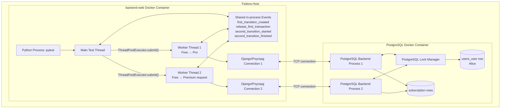
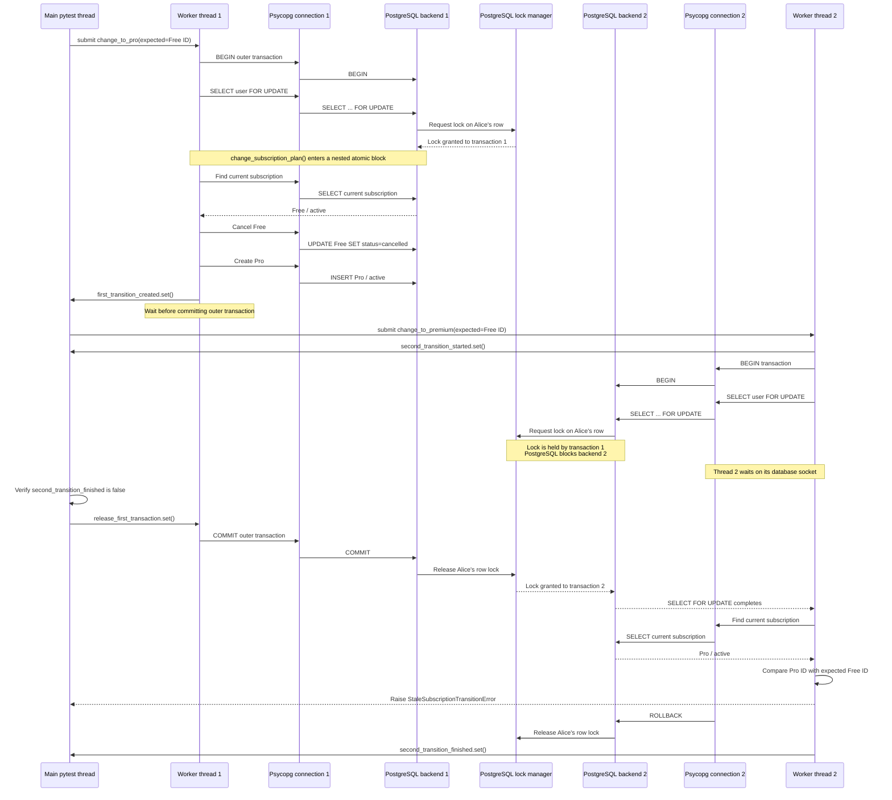

# Subscription Transition Concurrency

## Use When
- Load this when you need to understand concurrent subscription transitions, PostgreSQL row locks, Django transactions, or the subscription concurrency test.
- Use this before changing `change_subscription_plan()` or `tests/test_subscription_concurrency.py`.

## Purpose

The concurrency test proves that two plan-transition requests for the same user cannot modify subscription state at exactly the same time.

The requests are serialized:

1. The first transition locks the user's database row.
2. It cancels the current subscription and creates its replacement.
3. The second transition waits in PostgreSQL.
4. The first transaction commits and releases the lock.
5. The second transition acquires the lock and reads the newly committed state.
6. It detects that the subscription observed by its caller is no longer current.
7. It raises `StaleSubscriptionTransitionError` without changing subscription state.

The test does **not** update a `SubscriptionPlan` row. Plans such as Free, Pro, and Premium remain shared definitions. It updates the user's subscription history:

```text
Initial:
Free       active

After transaction 1 commits:
Free       cancelled
Pro        active

After transaction 2 is rejected:
Free       cancelled
Pro        active
Premium    not created
```

Only the first transition succeeds. Both workers pass the Free subscription ID
they originally observed. After waiting for the lock, the second worker finds
that Pro is current instead, so its stale transition is rejected.

## Runtime Structure

The two workers run as OS threads inside one Python/pytest process. PostgreSQL runs in a separate Docker container and handles each thread's database connection independently.



## Execution Sequence



## Thread And Process Levels

1. `pytest` runs as one Python process inside the backend container.
2. The main pytest thread executes the test function.
3. `ThreadPoolExecutor(max_workers=2)` creates two worker threads in that process.
4. `Event` objects are shared-memory synchronization primitives inside the Python process.
5. Each worker calls `close_old_connections()` so Django establishes a thread-local database connection.
6. Each Psycopg connection is a separate TCP connection to PostgreSQL.
7. PostgreSQL normally assigns a separate backend process to each client connection.
8. Thread one’s PostgreSQL process obtains the user-row lock.
9. Thread two’s PostgreSQL process waits in PostgreSQL’s lock manager.
10. While waiting on database I/O, Python can run the main thread and other worker.
11. Committing transaction one releases the row lock.
12. PostgreSQL wakes transaction two, which reads the newly committed Pro subscription.
13. The service compares Pro's ID with the expected Free ID and rejects the stale request.

## Guarantees And Limits

The row lock and conditional unique constraint guarantee:

- transitions for one user execute sequentially;
- a transition only replaces the exact subscription state its caller observed;
- only one current subscription remains;
- each replaced subscription is preserved as cancelled history;
- different users can transition concurrently because they lock different user rows.

The row lock alone only serializes transitions. Stale-transition protection is
provided by `expected_subscription_id`, which is checked after acquiring the
lock. Therefore, competing requests based on the same current subscription
cannot both succeed.

The current implementation is a service contract, not yet a public HTTP
endpoint. A future plan-change endpoint should map
`StaleSubscriptionTransitionError` to `409 Conflict`.

Stripe webhook processing will additionally need event idempotency and provider
event-order checks. The expected subscription ID protects local state
transitions but does not by itself prove that a Stripe event is new or unique.
