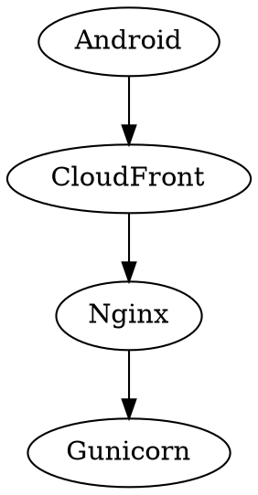

# Diagramming Approach: C4, Graphviz, Mermaid, PlantUML, and SVG

## Use When

- Load this when choosing how to model or render architecture, request flows,
  dependency graphs, UML, ERDs, or custom technical illustrations.
- Load this when distinguishing a modelling method from a diagram source
  language, layout engine, or image format.
- Load this when maintaining the custom staging OSI diagram.

## The Categories Are Different

C4, Graphviz, and SVG are not direct competitors:

- **C4** is a method and vocabulary for modelling software architecture.
- **Structurizr DSL** is the repository's text-based C4 modelling source.
- **Graphviz, Mermaid, and PlantUML** turn textual descriptions into diagrams.
- **SVG, PNG, and PDF** are rendered output formats.

An architecture method can be expressed through a source language, rendered by
a tool, and exported as an image. For example:

```text
C4 architecture method
    -> Structurizr DSL source
    -> Structurizr renderer or exporter
    -> SVG or PNG output
```

## How the Staging OSI Graphic Was Generated

The graphical OSI representation is maintained as a directly authored SVG:

- source and rendered artifact:
  `reference_docs/knowledge/diagrams/staging-android-osi-flow.svg`
- embedded explanation:
  `reference_docs/knowledge/36-c4-deployment-diagram.md`

The SVG uses ordinary vector primitives:

```xml
<rect .../>   <!-- cards and OSI layers -->
<text .../>   <!-- labels -->
<path .../>   <!-- connections -->
<marker .../> <!-- arrowheads -->
```

It also contains its gradients, colors, typography, accessibility title and
description, exact element positions, request arrows, response arrows, and step
numbers. No image-generation model, Mermaid, Graphviz, or drawing application
produced it.

The verification workflow was:

1. Author the SVG source.
2. Embed it in the Markdown document.
3. Rasterize a disposable preview with ImageMagick:

   ```bash
   magick \
     reference_docs/knowledge/diagrams/staging-android-osi-flow.svg \
     /tmp/staging-android-osi-flow.png
   ```

4. Inspect the actual PNG rendering for clipping, overlap, hierarchy, and
   legibility.
5. Correct the clipped Android subtitle.
6. Render and visually inspect it again.

Graphviz was considered first, but its `dot` executable was not installed in
the development environment. Direct SVG was also a better fit for this specific
diagram because the OSI stacks, TLS boundaries, legends, and numbered arrows
needed deliberate positioning.

## Tool Roles and Tradeoffs

### C4 with Structurizr DSL

Use C4 to answer:

- Who uses the system?
- Which software systems and containers exist?
- Where are containers deployed?
- Which components collaborate?
- In what order does an architectural use case execute?

Structurizr DSL is the canonical source for C4 in this repository. It provides
architecture semantics, stable identifiers, relationship validation, and
context, container, component, dynamic, and deployment views.

Use it for architecture rather than drawing disconnected boxes manually.

Official reference: <https://docs.structurizr.com/dsl>

### Graphviz

Graphviz uses the DOT language to define nodes and edges, then automatically
chooses positions and routes connections:



Use it for:

- large dependency graphs;
- directed service or module relationships;
- call graphs and build graphs;
- diagrams where automatic layout matters more than exact composition.

Graphviz provides several layout engines and can export SVG, PNG, PDF, and
other formats. Its downside is that a highly art-directed layout can require
fighting or heavily configuring the automatic engine.

Official reference: <https://graphviz.org/documentation/>

Do not add Graphviz to the project merely for one diagram. Add it when repeated
automatically laid-out dependency or relationship diagrams justify another
tooling dependency.

### Mermaid

Mermaid is useful for concise diagrams embedded directly in Markdown:


Use it for:

- small flowcharts;
- sequence and state diagrams;
- ERDs;
- documentation where native Markdown rendering is valuable.

Its tradeoffs are parser/version differences between renderers, limited exact
positioning, and increasing fragility as diagrams become dense. It is not a
replacement for the repository's validated Structurizr architecture model.

Official reference: <https://mermaid.js.org/intro/>

### PlantUML

PlantUML is strong for established UML notation, particularly sequence, class,
state, activity, and component diagrams. It uses textual source and automatic
rendering. C4-PlantUML also exists, but introducing a second C4 source language
would fragment this repository's architecture source of truth.

Use PlantUML only when a real UML-heavy need is not adequately served by the
existing Structurizr and Mermaid workflow.

Official reference: <https://plantuml.com/>

### SVG

SVG is a vector image format, not an architecture model or automatic layout
tool.

Use direct SVG for:

- precise custom teaching diagrams;
- unusual layered or annotated layouts;
- visuals requiring exact styling and positioning;
- browser- and Markdown-renderable scalable output.

Advantages:

- resolution-independent output;
- complete styling and layout control;
- no client-side diagram runtime;
- embedded accessibility metadata;
- direct browser and Markdown rendering.

Tradeoffs:

- verbose source;
- manual positioning;
- relationships are not semantically validated;
- complex hand-authored diagrams require careful visual regression checks.

### Manual Drawing Tools

Figma, Excalidraw, and draw.io are useful for collaborative exploration,
workshops, presentations, and early sketches. They are weaker as the canonical
architecture source because changes are harder to diff and the model usually
cannot validate architectural relationships.

## Repository Decision Matrix

| Need | Default choice |
|---|---|
| Software architecture source of truth | C4 with Structurizr DSL |
| Ordered interaction between architecture elements | Structurizr dynamic view |
| Runtime and infrastructure placement | Structurizr deployment view |
| Small Markdown-native behavior flow | Mermaid |
| Database relationships | Mermaid ERD or the existing maintained ERD documents |
| Large automatically arranged dependency graph | Graphviz DOT, when repeated need justifies installation |
| UML-heavy sequence, class, or state model | PlantUML, only when existing tools are insufficient |
| Precise custom explanatory visual | SVG |
| Collaborative sketch or presentation | Figma, Excalidraw, or draw.io |
| Final scalable image output | SVG |

## Current Repository Policy

Use the smallest combination that preserves both meaning and maintainability:

```text
Architecture truth
    -> Structurizr DSL and C4

Architecture request ordering
    -> Structurizr dynamic views

Behavioral flows and ERDs
    -> Mermaid while syntax and layout remain manageable

Large automatically arranged graphs
    -> Graphviz when repeated use justifies installing it

Special teaching and presentation diagrams
    -> SVG with a rendered visual-inspection pass
```

For the staging request material specifically:

- `reference_docs/knowledge/diagrams/longevity-architecture.dsl` owns the C4
  architecture and numbered `staging-android-metrics-request` dynamic view.
- `reference_docs/knowledge/diagrams/staging-android-osi-flow.svg` owns the
  custom OSI teaching visualization.
- `reference_docs/knowledge/36-c4-deployment-diagram.md` connects and explains
  both views.
