# Android Companion App End-to-End Flow

## Use When

- You need the complete Android lifecycle from application launch through authentication, Health Connect registration, Weight and Steps synchronization, token refresh, and logout.
- You need to distinguish explicit plan-cooled foreground sync from subscription-enabled WorkManager sync.
- You need to see which responsibilities belong to Compose, Android domain services, Health Connect, Django, and PostgreSQL.

This is a behavioral flow diagram. Structurizr DSL remains the source of truth for C4 architecture views.

## Current Flow

```mermaid
flowchart TD
    START([Launch Longevity]) --> RESTORE["LoginViewModel asks AuthRepository<br/>to restore the encrypted JWT pair"]
    RESTORE --> SESSION{"Readable local<br/>session exists?"}

    SESSION -->|No| FORM["Show login form<br/>User enters email and password"]
    FORM --> LOGIN["HttpAuthRepository<br/>POST /api/auth/mobile/login/"]
    LOGIN --> DJANGO_LOGIN["Django validates credentials<br/>and issues access + refresh JWTs"]
    DJANGO_LOGIN --> LOGIN_OK{"Login successful?"}
    LOGIN_OK -->|No| SAFE_LOGIN_ERROR["Show safe login error<br/>Never log credentials or tokens"]
    SAFE_LOGIN_ERROR --> FORM
    LOGIN_OK -->|Yes| STORE["Encrypt JWTs with Android Keystore<br/>Store ciphertext in private preferences"]
    STORE --> AUTHENTICATED
    SESSION -->|Yes| AUTHENTICATED["Authenticated Android screen"]
    AUTHENTICATED --> POLICY_REQUEST["HttpSyncPolicyRepository<br/>GET /api/v1/subscriptions/current/"]
    POLICY_REQUEST --> POLICY_READY["SyncPolicyViewModel exposes<br/>automatic_sync_enabled + sync_interval_minutes"]

    subgraph CONNECTION["Health Connect connection"]
        AUTHENTICATED --> CONNECT_ACTION["User chooses Connect Health Connect"]
        CONNECT_ACTION --> SDK_CHECK["Check Health Connect SDK availability<br/>and both READ_WEIGHT + READ_STEPS grants"]
        SDK_CHECK --> SDK_READY{"Available and<br/>permission granted?"}
        SDK_READY -->|Unavailable| CONNECT_RECOVERY["Show unsupported, update-required,<br/>or retryable-unavailable state"]
        SDK_READY -->|Permission needed| PERMISSION["MainActivity launches official<br/>Health Connect permission contract"]
        PERMISSION --> PERMISSION_RESULT{"User grants both<br/>metric permissions?"}
        PERMISSION_RESULT -->|No| CONNECT_RECOVERY
        PERMISSION_RESULT -->|Yes| RESOLVE_CONNECTION
        SDK_READY -->|Yes| RESOLVE_CONNECTION["WearableConnectionRepository<br/>GET /api/v1/wearables/connections/"]
        RESOLVE_CONNECTION --> CONNECTION_EXISTS{"Active health_connect<br/>connection exists?"}
        CONNECTION_EXISTS -->|Yes| READY["Ready with caller-owned connection_id"]
        CONNECTION_EXISTS -->|No| REGISTER["POST /api/v1/wearables/connections/<br/>provider = health_connect"]
        REGISTER --> ENTITLEMENT["Django authenticates caller,<br/>enforces plan limit, and creates/reactivates connection"]
        ENTITLEMENT --> REGISTERED{"Accepted?"}
        REGISTERED -->|No| CONNECT_RECOVERY
        REGISTERED -->|Yes| READY
        READY --> BACKGROUND_CHECK["Check background-read feature<br/>and existing additional-access grant"]
        BACKGROUND_CHECK --> BACKGROUND_ACCESS{"Background access state?"}
        BACKGROUND_ACCESS -->|Granted| BACKGROUND_READY["Background capability ready"]
        BACKGROUND_ACCESS -->|Unsupported| BACKGROUND_UNAVAILABLE["Keep manual sync available<br/>Hide background action"]
        BACKGROUND_ACCESS -->|Permission required| BACKGROUND_ACTION["Show Allow background sync"]
        BACKGROUND_ACTION -->|User taps| BACKGROUND_PERMISSION["Launch official background-read<br/>permission contract in foreground"]
        BACKGROUND_PERMISSION --> BACKGROUND_RESULT{"User grants<br/>additional access?"}
        BACKGROUND_RESULT -->|Yes| BACKGROUND_READY
        BACKGROUND_RESULT -->|No| BACKGROUND_ACTION
    end

    subgraph EXPLICIT_SYNC["Implemented plan-cooled foreground metric sync"]
        READY --> MANUAL_GATE{"Latest successful sync plus<br/>plan cooldown has elapsed?"}
        POLICY_READY -. "Supplies plan cooldown" .-> MANUAL_GATE
        MANUAL_GATE -->|No| COOLDOWN["Disable Sync now<br/>Show next available local time"]
        COOLDOWN --> MANUAL_GATE
        MANUAL_GATE -->|Yes| SYNC_ACTION["User chooses Sync now"]
        SYNC_ACTION --> INITIAL_VM["InitialWeightSyncViewModel<br/>prevents overlapping visible syncs"]
        INITIAL_VM --> ALL_METRICS["AllMetricsSyncRunner<br/>runs Weight, then Steps"]
        ALL_METRICS --> COORDINATOR["Metric-specific coordinators"]
        COORDINATOR --> INCREMENTAL_PLANNER["Weight + Steps incremental planners<br/>use 24-hour cursor overlap<br/>or 30-day first-run fallback"]
        INCREMENTAL_PLANNER --> HC_READ["AndroidHealthConnectAccess<br/>reads every WeightRecord + StepsRecord page"]
        SAMSUNG["Samsung Health"] -->|Writes on-device records| HEALTH_CONNECT["Health Connect"]
        HEALTH_CONNECT -->|Returns permitted records| HC_READ
        HC_READ --> FILTER["Keep Samsung-originated samples<br/>Sort and batch at most 100 entries"]
        FILTER --> UPLOAD_ID["Generate one retry-stable upload_id<br/>for each batch attempt"]
        UPLOAD_ID --> UPLOAD["HttpWearableUploadRepository<br/>POST /api/v1/wearables/uploads/"]
        UPLOAD --> AUTH_CLIENT["AuthenticatedApiClient<br/>adds stored Bearer access token"]
        AUTH_CLIENT --> DJANGO_AUTH["Django checks the Bearer access token"]
        DJANGO_AUTH --> API_RESPONSE
        API_RESPONSE -->|No| INGEST["Django validates ownership,<br/>payload bounds, hash, and idempotency"]
        INGEST --> DATABASE[("PostgreSQL<br/>WearableConnection + SyncRun + MetricEntry")]
        DATABASE --> RECEIPT["Return 201 new receipt,<br/>200 exact retry, or safe conflict/rejection"]
        RECEIPT --> RESULT["Coordinator returns Completed,<br/>NoData, or Interrupted"]
        RESULT --> SYNC_UI["Compose shows safe aggregate<br/>imported/updated/skipped or recovery state"]
        RESULT -. "Completed or valid NoData" .-> MANUAL_COOLDOWN["Persist successful cursor<br/>Start plan cooldown"]
        DATABASE --> WEB["React web app later reads the same<br/>MetricEntry rows through Django"]
    end

    subgraph REFRESH["On-demand access-token refresh for product API calls"]
        API_RESPONSE{"Protected request<br/>returns 401?"}
        API_RESPONSE -->|Yes| REFRESH_LOCK["Mutex coordinates refresh<br/>and rereads token storage"]
        REFRESH_LOCK --> ALREADY_ROTATED{"Another request already<br/>replaced the access token?"}
        ALREADY_ROTATED -->|Yes| RETRY_REQUEST["Retry original request once<br/>with replacement access token"]
        ALREADY_ROTATED -->|No| REFRESH_REQUEST["POST /api/auth/mobile/refresh/<br/>with stored refresh token"]
        REFRESH_REQUEST --> REFRESH_OK{"Refresh accepted?"}
        REFRESH_OK -->|Yes| REPLACE_TOKENS["Store replacement access token<br/>and rotated refresh token when supplied"]
        REPLACE_TOKENS --> RETRY_REQUEST
        RETRY_REQUEST --> DJANGO_AUTH
        REFRESH_OK -->|No session| SESSION_EXPIRED["Clear rejected session<br/>and require login"]
        REFRESH_OK -->|Temporary failure| RETRYABLE_API_ERROR["Keep session and return<br/>retryable unavailable outcome"]
    end

    subgraph BACKGROUND["Implemented periodic incremental metric sync"]
        BACKGROUND_READY --> AUTO_DECISION{"Current policy enables<br/>automatic sync?"}
        POLICY_READY -. "Supplies automatic policy + interval" .-> AUTO_DECISION
        AUTO_DECISION -->|No / Free| CANCEL_STALE["Cancel tagged periodic work<br/>Do not request background permission"]
        AUTO_DECISION -->|Yes / Pro| SCHEDULE["WorkManagerWeightSyncScheduler<br/>enqueues unique work for connection_id<br/>UPDATE · network required · server interval"]
        SCHEDULE --> WORKER["IncrementalWeightSyncWorker<br/>validates connection_id"]
        WORKER --> WORKER_POLICY["SubscriptionAwareWeightSyncRunner<br/>fetches current policy again"]
        WORKER_POLICY --> WORKER_ALLOWED{"Automatic sync<br/>still enabled?"}
        WORKER_ALLOWED -->|No| STOP_WORK["Stop before reading Health Connect"]
        WORKER_ALLOWED -->|Yes| INCREMENTAL_RUNNER["Injected IncrementalWeightSyncRunner"]
        INCREMENTAL_RUNNER --> CURSOR["Load per-connection cursor<br/>use 24-hour overlap or 30-day fallback"]
        CURSOR --> HC_READ
        RESULT -. "When the incremental runner owns this attempt" .-> CURSOR_DECISION{"Completed or<br/>valid NoData?"}
        CURSOR_DECISION -. Yes .-> CURSOR_ADVANCE["Persist the pre-read watermark"]
        CURSOR_DECISION -. Interrupted .-> KEEP_CURSOR["Leave the previous cursor unchanged"]
        CURSOR_ADVANCE --> WORK_RESULT["Worker maps the returned domain result:<br/>success, retry, or failure"]
        KEEP_CURSOR --> WORK_RESULT
    end

    subgraph DISCONNECT["Health Connect disconnect"]
        READY --> DISCONNECT_ACTION["User chooses Disconnect Health Connect"]
        DISCONNECT_ACTION --> DISCONNECT_REQUEST["Authenticated repository<br/>DELETE /api/v1/wearables/connections/{id}/"]
        DISCONNECT_REQUEST --> DJANGO_DISCONNECT["Django owner-scopes and soft-disconnects<br/>the durable connection row"]
        DJANGO_DISCONNECT --> DISCONNECT_RESULT{"Confirmed disconnected<br/>or stale already inactive?"}
        DISCONNECT_RESULT -->|No / temporary failure| DISCONNECT_RETRY["Keep Ready state, unique work, and cursor<br/>Show safe retry message"]
        DISCONNECT_RETRY --> READY
        DISCONNECT_RESULT -->|Yes| CANCEL_CONNECTION_WORK["Cancel only this connection's<br/>unique WorkManager request"]
        CANCEL_CONNECTION_WORK --> REMOVE_CONNECTION_CURSOR["Remove only this connection's<br/>device-local sync cursor"]
        REMOVE_CONNECTION_CURSOR --> DISCONNECTED["Show Not connected<br/>Plan slot is available again"]
        DISCONNECTED --> CONNECT_ACTION
    end

    subgraph LOGOUT["Logout"]
        AUTHENTICATED --> LOGOUT_ACTION["User chooses Logout"]
        LOGOUT_ACTION --> REVOKE["POST /api/auth/mobile/logout/<br/>with stored refresh token"]
        REVOKE --> LOGOUT_OK{"Server revocation<br/>successful?"}
        LOGOUT_OK -->|Yes| CLEAR["Delete encrypted local JWT pair<br/>Reset wearable ViewModels and cancel visible sync"]
        CLEAR --> FORM
        LOGOUT_OK -->|No| LOGOUT_RETRY["Retain session so revocation<br/>can be retried honestly"]
        LOGOUT_RETRY --> AUTHENTICATED
        CLEAR --> CANCEL_WORK["Cancel every metric-sync request<br/>through the stable WorkManager tag"]
    end

    classDef implemented fill:#dcfce7,stroke:#15803d,color:#14532d;
    classDef decision fill:#dbeafe,stroke:#1d4ed8,color:#1e3a8a;
    classDef external fill:#f3f4f6,stroke:#4b5563,color:#111827;
    classDef storage fill:#ede9fe,stroke:#7c3aed,color:#4c1d95;
    classDef planned fill:#fef3c7,stroke:#b45309,color:#78350f,stroke-dasharray:5 5;
    classDef recovery fill:#fee2e2,stroke:#dc2626,color:#7f1d1d;

    class START,RESTORE,FORM,LOGIN,DJANGO_LOGIN,STORE,AUTHENTICATED,POLICY_REQUEST,POLICY_READY,CONNECT_ACTION,SDK_CHECK,PERMISSION,RESOLVE_CONNECTION,REGISTER,ENTITLEMENT,READY,BACKGROUND_CHECK,BACKGROUND_READY,BACKGROUND_UNAVAILABLE,BACKGROUND_ACTION,BACKGROUND_PERMISSION,SCHEDULE,SYNC_ACTION,INITIAL_VM,ALL_METRICS,COORDINATOR,INCREMENTAL_PLANNER,HC_READ,FILTER,UPLOAD_ID,UPLOAD,AUTH_CLIENT,DJANGO_AUTH,INGEST,RECEIPT,RESULT,SYNC_UI,MANUAL_COOLDOWN,WEB,REFRESH_LOCK,RETRY_REQUEST,REFRESH_REQUEST,REPLACE_TOKENS,WORKER,WORKER_POLICY,INCREMENTAL_RUNNER,CURSOR,WORK_RESULT,CURSOR_ADVANCE,KEEP_CURSOR,CANCEL_STALE,STOP_WORK,DISCONNECT_ACTION,DISCONNECT_REQUEST,DJANGO_DISCONNECT,CANCEL_CONNECTION_WORK,REMOVE_CONNECTION_CURSOR,DISCONNECTED,LOGOUT_ACTION,REVOKE,CLEAR,CANCEL_WORK implemented;
    class SESSION,LOGIN_OK,SDK_READY,PERMISSION_RESULT,CONNECTION_EXISTS,REGISTERED,BACKGROUND_ACCESS,BACKGROUND_RESULT,MANUAL_GATE,AUTO_DECISION,WORKER_ALLOWED,API_RESPONSE,ALREADY_ROTATED,REFRESH_OK,CURSOR_DECISION,DISCONNECT_RESULT,LOGOUT_OK decision;
    class SAMSUNG,HEALTH_CONNECT external;
    class DATABASE storage;
    class SAFE_LOGIN_ERROR,CONNECT_RECOVERY,SESSION_EXPIRED,RETRYABLE_API_ERROR,DISCONNECT_RETRY,LOGOUT_RETRY recovery;
```

## Important Boundaries

- Passwords are used only for login and are never persisted by the Android app.
- Access and refresh JWTs are encrypted through Android Keystore before durable storage.
- Refresh happens only after a protected API request receives `401`; ordinary app startup reuses a readable local session without rotating it.
- Weight permission is requested before backend connection registration, so denial does not consume a plan slot. Background permission is separate and optional after the connection is ready.
- The Android app reads Health Connect. Django and Celery cannot directly access on-device records.
- `SyncRun` records an upload attempt; `MetricEntry` remains the canonical metric store.
- Foreground sync uses the incremental cursor with a 30-day first-run fallback. The official client disables its action until the server-owned cooldown has elapsed, including after a successful no-data run.
- Background feature detection and foreground permission consent are implemented. Only an automatically enabled plan may expose the permission action and schedule one unique, network-constrained periodic weight job at the server-provided valid interval.
- Every background execution fetches current policy again, so stale work after a downgrade stops before Health Connect access.
- Startup session checking preserves durable work. Confirmed logout cancels all tagged weight work. Confirmed connection disconnect cancels only its unique work and removes only its cursor; temporary server failure preserves both for retry.
