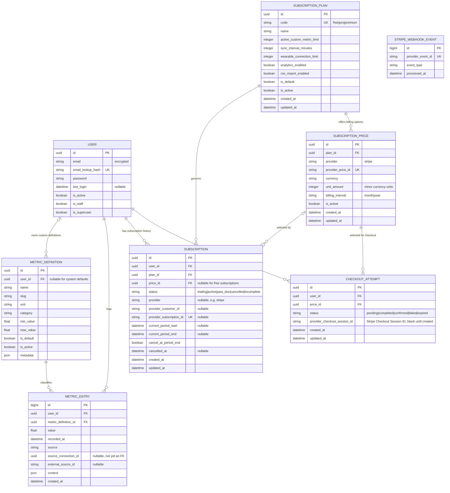

# Current Domain And Subscription ERD

## Use When
- Load this when you need the currently implemented domain and subscription tables.
- Use the target-state ERD separately for planned Stripe, wearable-sync, and audit tables.

## Scope
- `User`, `MetricDefinition`, `MetricEntry`, `SubscriptionPlan`, `SubscriptionPrice`, `Subscription`, `CheckoutAttempt`, and `StripeWebhookEvent` are implemented domain tables.
- Registration creates an explicit active free subscription, and metric limits resolve through the current subscription's plan.
- Django framework tables such as auth groups, permissions, sessions, admin logs, and JWT token blacklist tables are intentionally omitted.

## Constraints And Notes
- Default metric slugs are globally unique where `MetricDefinition.user_id IS NULL`.
- Custom metric slugs are unique per `(user_id, slug)`.
- `MetricEntry.metric_definition_id` uses `PROTECT` so definitions with history are not deleted accidentally.
- `MetricDefinition.user_id` is nullable because system defaults are shared by every user.
- `MetricEntry.user_id` is required because metric data is always owned by exactly one user.
- Migration `subscriptions.0003` seeds one shared active default `free` plan.
- User registration atomically creates one active `Subscription` linked to that plan.
- A conditional unique constraint permits at most one current subscription per user.
- Current statuses are `trialing`, `active`, `past_due`, and `incomplete`; `cancelled` rows are historical.
- Metric usage and enforcement read `active_custom_metric_limit` from the current plan.
- A plan can have multiple active prices for different currencies or billing intervals.
- A conditional unique constraint allows only one active price per `(plan, provider, currency, billing_interval)`.
- `SubscriptionPrice.unit_amount` must be greater than zero.
- `Subscription.price_id` is nullable for free subscriptions and references the exact billing option selected by a paid subscription.
- Application validation requires `Subscription.price.plan_id == Subscription.plan_id`.
- `CheckoutAttempt` represents one user action to start Stripe Checkout for one selected active paid price.
- `CheckoutAttempt.id` is the per-attempt Stripe idempotency key; do not use broad deterministic keys like `(user_id, price_id)` for production retries.
- `CheckoutAttempt.provider_checkout_session_id` stores Stripe's Checkout Session ID, such as `cs_test_...`, after Stripe creates the session. It lets webhook processing and support/debugging link a local attempt to the provider-side Checkout Session.
- `CheckoutAttempt.completed` means the provider Checkout Session was created; `CheckoutAttempt.confirmed` means a verified `checkout.session.completed` webhook reconciled it and changed the local subscription.
- Webhook confirmation requires both the local `CheckoutAttempt.id` from Stripe metadata and the stored `provider_checkout_session_id` to match the event's Checkout Session ID.
- `StripeWebhookEvent.provider_event_id` is unique so duplicate Stripe webhook deliveries cannot reapply a subscription transition.
