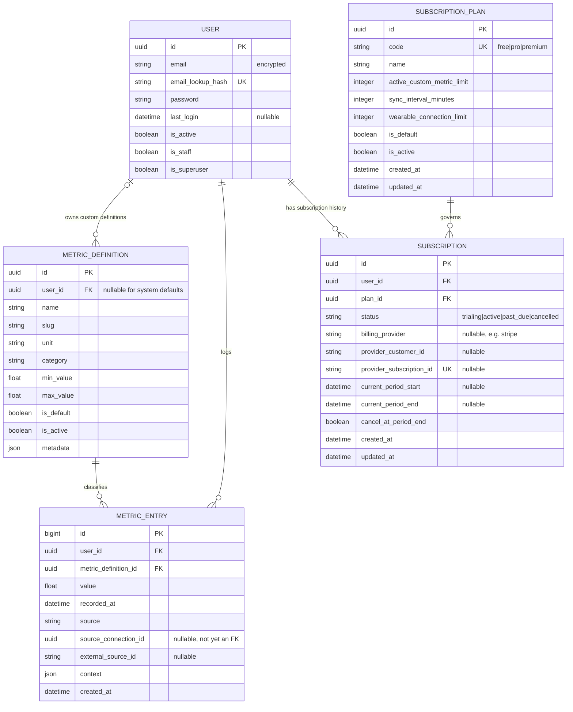

# Current Database Plus Subscription Plan ERD

## Use When
- Load this when you need the implemented domain tables plus the next planned subscription/entitlement slice.
- Use this before implementing subscription models so current tables are not confused with planned tables.

## Scope
- `User`, `MetricDefinition`, and `MetricEntry` are implemented domain tables.
- `SubscriptionPlan` and `Subscription` are the next planned entitlement tables.
- Django framework tables such as auth groups, permissions, sessions, admin logs, and JWT token blacklist tables are intentionally omitted.

## Constraints And Notes
- Default metric slugs are globally unique where `MetricDefinition.user_id IS NULL`.
- Custom metric slugs are unique per `(user_id, slug)`.
- `MetricEntry.metric_definition_id` uses `PROTECT` so definitions with history are not deleted accidentally.
- `MetricDefinition.user_id` is nullable because system defaults are shared by every user.
- `MetricEntry.user_id` is required because metric data is always owned by exactly one user.
- Users without an active paid subscription should resolve to the default free plan.
