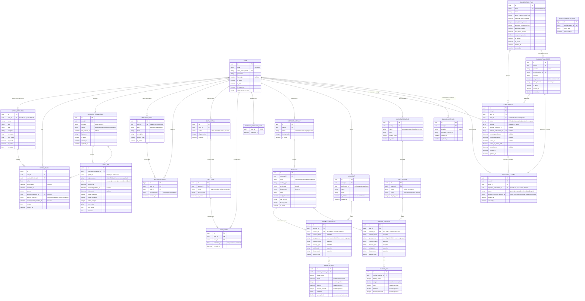

# Current Domain And Subscription ERD

## Use When
- Load this when you need the currently implemented domain and subscription tables.
- Use the target-state ERD separately for planned Stripe, wearable-sync, and audit tables.

## Scope
- Workout backend migrations add six tables to the prior 16-table checkpoint:
  `WorkoutCatalogState`, `ExerciseCategory`, `Exercise`, `Workout`,
  `WorkoutExercise`, `WorkoutSet` (22 domain model tables). `workouts.0004` adds
  `WorkoutRoutine`, `RoutineDay`, `RoutineExercise`, `RoutineSet`, making **26**.
  Basic frontend/routines are implemented locally; advanced planning/analysis
  remain pending. See [Workout tracking](../47-workout-tracking.md).
- The 2026-10-01 pre-workout checkpoint had 16 tables, including `DietSection`, `DietFood` and `DietEntry`. See [Diet before/after comparison](diet-erd-comparison.md) with the three additions green; ownership/archive rules are in [Diet tracking](../46-diet-tracking.md).
- `User`, `MetricDefinition`, `MetricEntry`, `WearableConnection`, `SyncRun`, `SubscriptionPlan`, `SubscriptionPrice`, `BillingCustomer`, `Subscription`, `CheckoutAttempt`, `StripeWebhookEvent`, `RecoveryTool`, and `RecoveryEntry` are implemented domain tables.
- See [recovery before/after ERD comparison](recovery-erd-comparison.md) for model-derived field maps, with the two new recovery tables highlighted green.
- Registration creates an explicit active free subscription, and metric limits resolve through the current subscription's plan.
- Django framework tables such as auth groups, permissions, sessions, admin logs, and JWT token blacklist tables are intentionally omitted.

```mermaid
erDiagram
    %% IMPLEMENTED DOMAIN TABLES

    USER o|--o{ METRIC_DEFINITION : "owns custom definitions"
    USER ||--o{ METRIC_ENTRY : logs
    USER ||--o{ WEARABLE_CONNECTION : connects
    METRIC_DEFINITION ||--o{ METRIC_ENTRY : classifies
    WEARABLE_CONNECTION ||--o{ SYNC_RUN : receives
    WEARABLE_CONNECTION o|--o{ METRIC_ENTRY : "source connection"
    USER o|--o{ RECOVERY_TOOL : "owns custom tools"
    USER ||--o{ RECOVERY_ENTRY : "checks off"
    RECOVERY_TOOL ||--o{ RECOVERY_ENTRY : "tracked daily"
    USER ||--o{ DIET_SECTION : "owns sections"
    DIET_SECTION ||--o{ DIET_FOOD : "contains foods"
    USER ||--o{ DIET_ENTRY : "records eating"
    DIET_FOOD ||--o{ DIET_ENTRY : "checked daily"
    USER ||--o| WORKOUT_CATALOG_STATE : "initializes once"
    USER ||--o{ EXERCISE_CATEGORY : "owns catalog"
    EXERCISE_CATEGORY ||--o{ EXERCISE : contains
    USER ||--o{ WORKOUT : records
    WORKOUT ||--o{ WORKOUT_EXERCISE : orders
    EXERCISE ||--o{ WORKOUT_EXERCISE : "historical reference"
    WORKOUT_EXERCISE ||--o{ WORKOUT_SET : logs
    USER ||--o{ WORKOUT_ROUTINE : "owns templates"
    WORKOUT_ROUTINE ||--o{ ROUTINE_DAY : organizes
    ROUTINE_DAY ||--o{ ROUTINE_EXERCISE : orders
    EXERCISE ||--o{ ROUTINE_EXERCISE : "frozen template reference"
    ROUTINE_EXERCISE ||--o{ ROUTINE_SET : plans

    WORKOUT_ROUTINE {
        uuid id PK
        uuid user_id FK
        string name "unique per owner, including archives"
        string notes
        integer display_order
        boolean is_active
    }
    ROUTINE_DAY {
        uuid id PK
        uuid routine_id FK
        string name "unique per routine"
        string notes "instructions copied to session"
        integer display_order
    }
    ROUTINE_EXERCISE {
        uuid id PK
        uuid day_id FK
        uuid exercise_id FK "RESTRICT; owner must match"
        string exercise_name "snapshot"
        string group_name "local day label; blank means ungrouped"
        string category_name "snapshot"
        string tracking_type "snapshot"
        string weight_unit "snapshot"
        string distance_unit "snapshot"
        integer display_order
    }
    ROUTINE_SET {
        uuid id PK
        uuid routine_exercise_id FK
        integer display_order
        decimal weight "nullable; nonnegative"
        integer reps "nullable; positive"
        decimal distance "nullable; positive"
        integer duration_seconds "nullable; positive"
    }

    WORKOUT_CATALOG_STATE {
        uuid user_id PK,FK
        datetime initialized_at
    }

    EXERCISE_CATEGORY {
        uuid id PK
        uuid user_id FK
        string name "case-insensitive unique per user"
        integer display_order
        boolean is_active
    }

    EXERCISE {
        uuid id PK
        uuid category_id FK
        string name "case-insensitive unique per category"
        string tracking_type
        string weight_unit "kg or lb"
        string distance_unit "km or mi"
        string notes
        decimal weight_increment
        integer rest_seconds
        integer display_order
        boolean is_active
    }

    WORKOUT {
        uuid id PK
        uuid user_id FK
        date performed_on "multiple sessions allowed"
        string name
        string notes
        boolean is_finished "not set completion"
        datetime created_at
    }

    WORKOUT_EXERCISE {
        uuid id PK
        uuid workout_id FK
        uuid exercise_id FK "RESTRICT; owner must match"
        string exercise_name "snapshot"
        string group_name "local session label; blank means ungrouped"
        string category_name "snapshot"
        string tracking_type "snapshot"
        string weight_unit "snapshot"
        string distance_unit "snapshot"
        integer display_order
    }

    WORKOUT_SET {
        uuid id PK
        uuid workout_exercise_id FK
        integer display_order
        decimal weight "nullable; nonnegative"
        integer reps "nullable; positive"
        decimal distance "nullable; positive"
        integer duration_seconds "nullable; positive"
        string comment
        boolean is_completed "only performed sets count"
    }

    DIET_SECTION {
        uuid id PK
        uuid user_id FK
        string name "case-insensitive unique per user"
        integer display_order
        boolean is_active
    }

    DIET_FOOD {
        uuid id PK
        uuid section_id FK
        string name "case-insensitive unique per section"
        integer display_order
        boolean is_active
    }

    DIET_ENTRY {
        bigint id PK
        uuid user_id FK
        uuid food_id FK
        date performed_on "unique per user and food"
        datetime created_at
    }

    RECOVERY_TOOL {
        uuid id PK
        uuid user_id FK "nullable for shared tools"
        string slug "unique for shared tools"
        string name
        string description
        integer display_order
        boolean is_active
    }

    RECOVERY_ENTRY {
        bigint id PK
        uuid user_id FK
        uuid tool_id FK
        date performed_on "unique per user and tool"
        datetime created_at
    }

    USER {
        uuid id PK
        string email "encrypted"
        string email_lookup_hash UK
        string password
        datetime last_login "nullable"
        boolean is_active
        boolean is_staff
        boolean is_superuser
        integer sleep_target_minutes
    }

    METRIC_DEFINITION {
        uuid id PK
        uuid user_id FK "nullable for system defaults"
        string name
        string slug
        string unit
        string category
        float min_value
        float max_value
        boolean is_default
        boolean is_active
        json metadata
    }

    METRIC_ENTRY {
        bigint id PK
        uuid user_id FK
        uuid metric_definition_id FK
        float value
        datetime period_start "nullable"
        datetime recorded_at
        string source
        uuid source_connection_id FK "nullable"
        string external_source_id "nullable, unique per source connection"
        datetime source_record_modified_at "nullable"
        json context
        datetime created_at
    }

    WEARABLE_CONNECTION {
        uuid id PK
        uuid user_id FK
        string provider "health_connect"
        string status "pending|connected|disconnected|error"
        datetime last_synced_at "nullable"
        string last_error
        boolean is_active
        datetime created_at
        datetime updated_at
    }

    SYNC_RUN {
        uuid id PK
        uuid wearable_connection_id FK
        uuid upload_id "unique per connection"
        string payload_hash "SHA-256, blank for receipt-only uploads"
        string status "received|processing|succeeded|partial|failed"
        datetime received_at
        datetime processing_started_at "nullable"
        datetime finished_at "nullable"
        integer entries_imported
        integer entries_updated
        integer entries_skipped
        string error_code
        json error_detail
        json metadata
    }

    %% IMPLEMENTED SUBSCRIPTION AND ENTITLEMENT TABLES

    USER ||--o{ SUBSCRIPTION : "has subscription history"
    USER ||--o{ BILLING_CUSTOMER : "owns provider customer identities"
    USER ||--o{ CHECKOUT_ATTEMPT : "starts checkout"
    SUBSCRIPTION_PLAN ||--o{ SUBSCRIPTION : governs
    SUBSCRIPTION_PLAN ||--o{ SUBSCRIPTION_PRICE : "offers billing options"
    SUBSCRIPTION_PRICE o|--o{ SUBSCRIPTION : "selected by"
    SUBSCRIPTION_PRICE ||--o{ CHECKOUT_ATTEMPT : "selected for checkout"
    SUBSCRIPTION o|--o{ CHECKOUT_ATTEMPT : "expected at checkout"

    SUBSCRIPTION_PLAN {
        uuid id PK
        string code UK "free|pro|premium"
        string name
        integer active_custom_metric_limit
        boolean automatic_sync_enabled
        integer sync_interval_minutes
        integer wearable_connection_limit
        boolean analytics_enabled
        boolean csv_import_enabled
        boolean csv_export_enabled
        boolean is_default
        boolean is_active
        datetime created_at
        datetime updated_at
    }

    BILLING_CUSTOMER {
        uuid id PK
        uuid user_id FK
        string provider "stripe"
        string provider_customer_id
        datetime created_at
        datetime updated_at
    }

    SUBSCRIPTION {
        uuid id PK
        uuid user_id FK
        uuid plan_id FK
        uuid price_id FK "nullable for free subscriptions"
        string status "trialing|active|past_due|cancelled|incomplete"
        string provider "nullable, e.g. stripe"
        string provider_customer_id "nullable"
        string provider_subscription_id UK "nullable"
        datetime current_period_start "nullable"
        datetime current_period_end "nullable"
        datetime cancel_at "nullable"
        boolean cancel_at_period_end
        datetime cancelled_at "nullable"
        datetime created_at
        datetime updated_at
    }

    SUBSCRIPTION_PRICE {
        uuid id PK
        uuid plan_id FK
        string provider "stripe"
        string provider_price_id UK
        string currency
        integer unit_amount "minor currency units"
        string billing_interval "month|year"
        boolean is_active
        datetime created_at
        datetime updated_at
    }

    CHECKOUT_ATTEMPT {
        uuid id PK
        uuid user_id FK
        uuid price_id FK
        uuid expected_subscription_id FK "nullable for pre-baseline attempts"
        string status "pending|completed|confirmed|failed|expired"
        string provider_checkout_session_id "Stripe Checkout Session ID, blank until created"
        datetime created_at
        datetime updated_at
    }

    STRIPE_WEBHOOK_EVENT {
        bigint id PK
        string provider_event_id UK
        string event_type
        datetime processed_at
    }
```

## Constraints And Notes
- Default metric slugs are globally unique where `MetricDefinition.user_id IS NULL`.
- Custom metric slugs are unique per `(user_id, slug)`.
- `MetricEntry.metric_definition_id` uses `PROTECT` so definitions with history are not deleted accidentally.
- `MetricDefinition.user_id` is nullable because system defaults are shared by every user.
- `MetricEntry.user_id` is required because metric data is always owned by exactly one user.
- `SyncRun(wearable_connection_id, upload_id)` is unique, providing batch-level idempotency. Ownership resolves through the required connection foreign key.
- Migration `subscriptions.0003` seeds one shared active default `free` plan.
- User registration atomically creates one active `Subscription` linked to that plan.
- A conditional unique constraint permits at most one current subscription per user.
- Current statuses are `trialing`, `active`, `past_due`, and `incomplete`; `cancelled` rows are historical.
- Metric usage and enforcement read `active_custom_metric_limit` from the current plan.
- A plan can have multiple active prices for different currencies or billing intervals.
- A conditional unique constraint allows only one active price per `(plan, provider, currency, billing_interval)`.
- `SubscriptionPrice.unit_amount` must be greater than zero.
- `Subscription.price_id` is nullable for free subscriptions and references the exact billing option selected by a paid subscription.
- Application validation requires `Subscription.price.plan_id == Subscription.plan_id`.
- `BillingCustomer` owns the durable provider customer mapping. `(user_id, provider)` and `(provider, provider_customer_id)` are both unique, preventing one user from having multiple Stripe customer mappings and preventing one Stripe customer from belonging to multiple local users.
- First-time Checkout sends `customer_email`; successful webhook reconciliation creates the Stripe `BillingCustomer`. Later Checkout sessions send the stored `provider_customer_id` as Stripe's `customer`.
- `Subscription.provider_customer_id` remains as a nullable legacy column, but the current Checkout and webhook flow uses `BillingCustomer`; remove the redundant subscription column in a dedicated migration after confirming no deployed data depends on it.
- `CheckoutAttempt` represents one user action to start Stripe Checkout for one selected active paid price.
- `CheckoutAttempt.expected_subscription_id` stores the current subscription observed when Checkout was created. Webhook confirmation can only replace that subscription, preventing late Checkout completions from overwriting newer subscription state.
- `CheckoutAttempt.id` is the per-attempt Stripe idempotency key; do not use broad deterministic keys like `(user_id, price_id)` for production retries.
- `CheckoutAttempt.provider_checkout_session_id` stores Stripe's Checkout Session ID, such as `cs_test_...`, after Stripe creates the session. It lets webhook processing and support/debugging link a local attempt to the provider-side Checkout Session.
- `CheckoutAttempt.completed` means the provider Checkout Session was created; `CheckoutAttempt.confirmed` means a verified `checkout.session.completed` webhook reconciled it and changed the local subscription.
- Webhook confirmation requires both the local `CheckoutAttempt.id` from Stripe metadata and the stored `provider_checkout_session_id` to match the event's Checkout Session ID.
- Webhook confirmation also requires the metadata `subscription_price_id` to belong to the metadata `subscription_plan_id`.
- Webhook confirmation rejects a provider customer ID that differs from the user's existing Stripe `BillingCustomer` or is already linked to another local user.
- `StripeWebhookEvent.provider_event_id` is unique so duplicate Stripe webhook deliveries cannot reapply a subscription transition.
