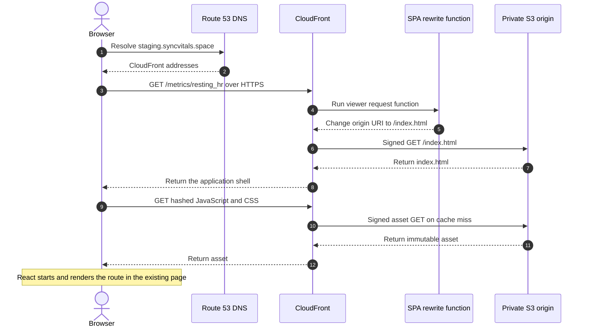
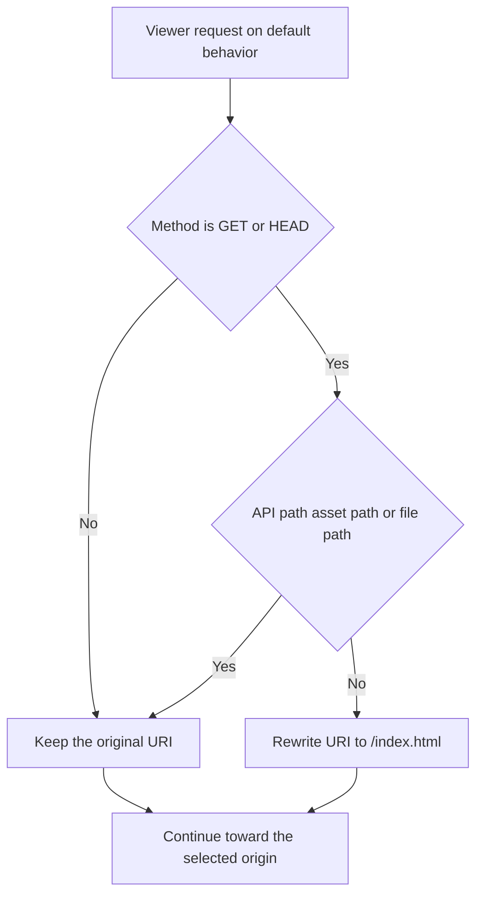
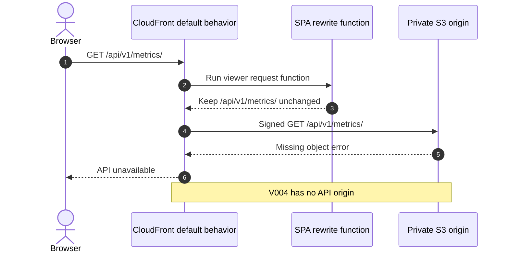
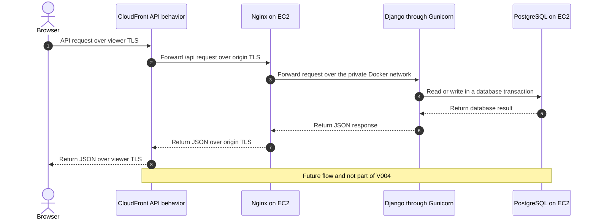

# Current AWS V004 Request Flows

## Scope

This document explains the verified V004 request behavior. The structural C4
source of truth is
[`v004-public-frontend-live.dsl`](./v004-public-frontend-live.dsl). Mermaid is
used here only for the ordered behavioral flows.

V004 has one CloudFront origin:

| CloudFront origin | Exists in V004 | Responsibility |
|---|---:|---|
| Private S3 REST origin | Yes | Stores and returns the built Vite frontend: `index.html`, hashed JavaScript and CSS, and static SVG files |
| Nginx on EC2 | No | Will become the `/api/*` origin in a later version |

The frontend is not a second origin. It is the collection of static build
objects stored inside the S3 origin. CloudFront is the public delivery layer in
front of that origin.

## DNS And Alias Terms

The browser asks DNS about only the hostname `staging.syncvitals.space`. DNS
does not receive or inspect paths such as `/metrics/resting_hr` or
`/api/v1/metrics/`.

The Route 53 public hosted zone currently contains:

| Record | Meaning |
|---|---|
| `NS` | Lists the four Route 53 authoritative nameservers responsible for answering public DNS queries for `syncvitals.space` |
| `SOA` | Start of Authority metadata for the zone, including its primary nameserver, administrative contact, serial, refresh, retry, expiry, and negative-cache timing |
| ACM validation `CNAME` | Proves control of `staging.syncvitals.space`; it remains in place so ACM can renew the certificate |
| `A` alias | Resolves `staging.syncvitals.space` through CloudFront for IPv4 clients without storing fixed CloudFront IP addresses |
| `AAAA` alias | Resolves the same hostname through CloudFront for IPv6 clients |

Two related AWS settings are often both called aliases:

1. The **Route 53 alias records** route DNS resolution to the CloudFront
   distribution.
2. The CloudFront **alternate domain name** declares that this distribution is
   allowed to serve `staging.syncvitals.space`; the attached ACM certificate
   provides TLS for that name.

CloudFront also supplies its own hostname,
`d14agywanftmtp.cloudfront.net`. It reaches the same distribution without the
custom Route 53 name. The custom hostname provides the product-facing name and
uses the `staging.syncvitals.space` certificate.

## Frontend Route Flow

An application route such as `/metrics/resting_hr` is not an S3 object. The
viewer-request CloudFront Function rewrites the origin-facing URI to
`/index.html`. The browser address bar remains `/metrics/resting_hr`, and React
Router uses that browser URL to render the requested screen.

The **application shell** is the small `index.html` document plus the references
that bootstrap the JavaScript and CSS application. It provides the root DOM
element into which React mounts. The shell is not the metric data. After React
starts, data requests are made separately through `/api/*`.

The shell is deliberately not cached at the edge. Hashed assets under
`/assets/*` use optimized long-lived caching because a content change produces
a different filename.

## SPA Rewrite Decision

SPA means **single-page application**. Browser-side routing lets multiple URLs
render inside one initially loaded HTML document. S3 knows object keys, not
React routes, so a direct S3 lookup for `/metrics/resting_hr` would fail.

The V004 function rewrites only extensionless `GET` and `HEAD` frontend paths.
It preserves query strings and does not rewrite:

- `/api` or `/api/*`;
- `/assets` or `/assets/*`;
- paths whose last segment has a file extension;
- `POST`, `PUT`, `PATCH`, `DELETE`, or `OPTIONS` requests.

The function changes the URI CloudFront uses internally. It does not redirect
the browser and does not itself choose Nginx or S3. CloudFront cache behaviors
select origins.

## Current API Flow In V004

There is no `/api/*` behavior and no Nginx origin yet. Therefore the public
frontend works, but the backend does not.

For an API `GET` or `HEAD`, the request matches the default behavior. The SPA
function correctly preserves the API URI, but the only current origin is S3.
S3 has no API object at that key, so the request fails. This is not a Django
response.

The default behavior currently allows only `GET` and `HEAD`. An API `POST`,
such as login or writing a metric, is rejected at the CloudFront boundary and
cannot reach S3 or Django.

## Future API Flow After The Compute Version

The next compute version will add a higher-priority `/api/*` behavior and an
HTTPS Nginx origin on EC2. The SPA function will remain associated only with the
default frontend behavior.

CloudFront terminates viewer TLS and creates a separate TLS connection to
Nginx. Nginx terminates that origin TLS connection. Gunicorn and PostgreSQL do
not need public TLS because their traffic remains on the EC2 host and private
Docker network.
