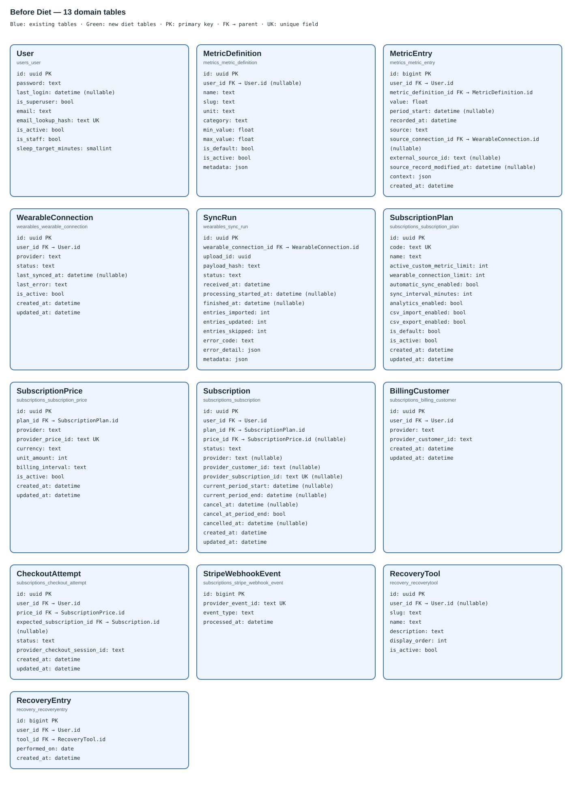
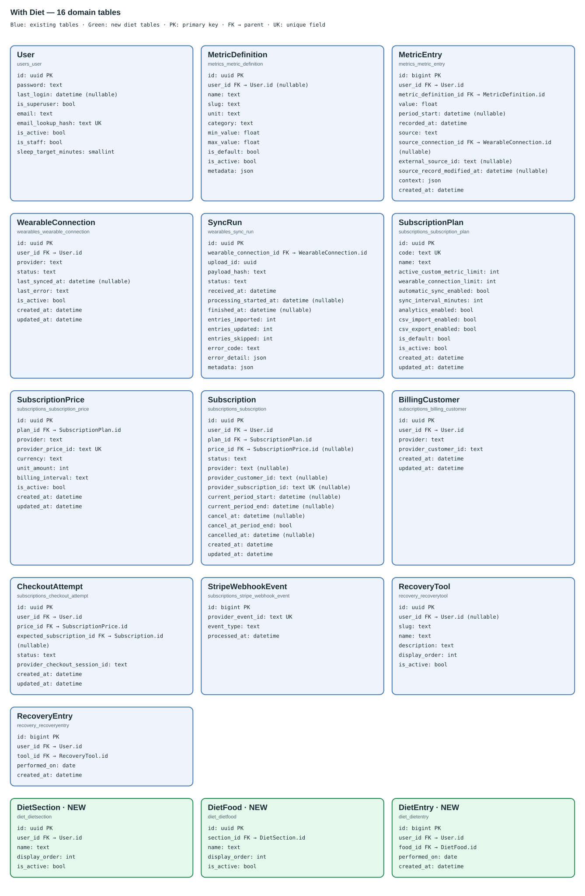

# Domain ERD — before and after Diet

## Use When

Read for the 13-table domain schema before Diet and the 16-table schema after it.
Generated from Django models on 2026-10-01. Framework/auth tables are omitted;
these are model/migration maps, not evidence of an AWS database change.

## Before — 13 tables

[Open full-size before diagram](diet-erd-before.svg).

## After — 16 tables

Existing tables stay blue; the three new Diet tables are green. No columns
are added to existing domain tables.

[Open full-size after diagram](diet-erd-after.svg).

## Added relationships

| Parent | Child FK | Cardinality | Delete rule |
|---|---|---|---|
| User.id | DietSection.user_id | One user, zero/many sections | CASCADE |
| DietSection.id | DietFood.section_id | One section, zero/many foods | CASCADE |
| User.id | DietEntry.user_id | One user, zero/many entries | CASCADE |
| DietFood.id | DietEntry.food_id | One food, zero/many entries | CASCADE |

Each child has exactly one parent for each FK above. Foods inherit ownership
through their section. Entry ownership is enforced by owner-scoped API lookups
and explicit model validation—not a cross-table SQL constraint.

One check-off per `(user, food, performed_on)`; indexed user/date history.
Section names are unique case-insensitively per user; food names per section.
Archiving retains history. Existing Recovery/subscription/metric constraints
remain unchanged. See [Diet rules](../46-diet-tracking.md).

Regenerate SVGs from `backend`: `uv run python -m scripts.generate_diet_erd`.
