# Dockerfile, Images, Compose, Containers, and the Host

## Use When

- Load this when explaining how the local backend Docker runtime is built and
  executed, what exists inside a container, or how Docker relates to the host.

## Source of Truth

The C4 deployment source is
[`docker-runtime-explainer.dsl`](docker-runtime-explainer.dsl). The SVG files
below are generated views; edit the DSL and regenerate them rather than editing
the SVG directly.

## 1. Dockerfile and Source to Docker Image

The Dockerfile is a recipe, not something that runs inside the finished
container. Docker Compose reads the local service definition and asks Docker
Engine to build the requested Dockerfile target. Docker Engine turns the base
runtime, dependencies from `uv.lock`, and copied Django source into reusable,
read-only image layers.

## 2. Docker Compose Runtime on the Local Host

Docker Compose is a client/orchestrator for Docker Engine. It describes the
desired services, commands, environment, mounts, networks, published ports,
health checks, dependencies, and restart behavior. Docker Engine owns the
actual images, containers, bridge network, writable layers, and lifecycle.

The browser remains a normal host process. Docker publishes host port `8000`
to port `8000` in the local `web` container. The containers reach one another
through Compose's private network and service-name DNS, for example `db:5432`.
The `pgdata` named volume persists independently of database-container
replacement.

## 3. What Exists Inside the Local Web Container

A running container combines:

- the image's read-only filesystem layers;
- the configured PID 1 process;
- runtime environment, network, port, command, and health configuration;
- a thin ephemeral writable layer; and
- explicitly attached bind mounts or volumes.

Locally, `backend/docker-compose.yml` bind-mounts the host backend directory at
`/app`. That mount overlays the `/app` files copied into the image, so host
source edits appear in the running development container without rebuilding.

Staging deliberately has no source bind mount. Both the one-off migration
container and long-running API container run the exact Django code packaged in
the immutable ECR backend image. The containers share an image but execute
different commands.

