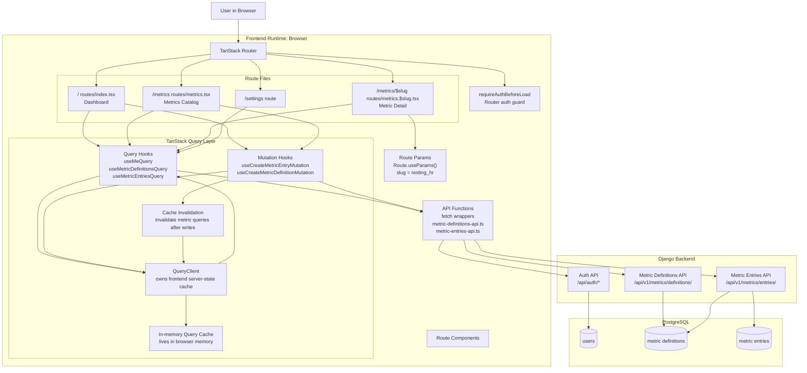

# Frontend Router and Query Data Flow

## Use When
- Load this when you need to reason about TanStack Router versus TanStack Query responsibilities in the React frontend.
- Load this when working on protected routes, dynamic route params, query hooks, mutations, cache invalidation, or frontend server-state flow.

## Current Rule
- TanStack Router owns navigation, route params, route protection, and redirect flow.
- TanStack Query owns frontend server state, cached API data, mutation state, refetching, and invalidation.
- The access token is not stored in TanStack Query; the auth/session layer owns the in-memory token.

## Diagram

## Current Implementation Notes
- Protected routes use `beforeLoad: requireAuthBeforeLoad`.
- `requireAuthBeforeLoad` uses the router context `QueryClient` to ensure the current user query can resolve before protected content renders.
- Metrics data is currently fetched inside route components through TanStack Query hooks, not through route loaders.
- The `/metrics/$slug` route reads the dynamic `slug` URL param with `Route.useParams()`.
- Route loaders are not currently used for metric data preloading. If needed later, the preferred direction is to use loaders to warm or ensure TanStack Query cache entries, not to create a second independent data cache.
