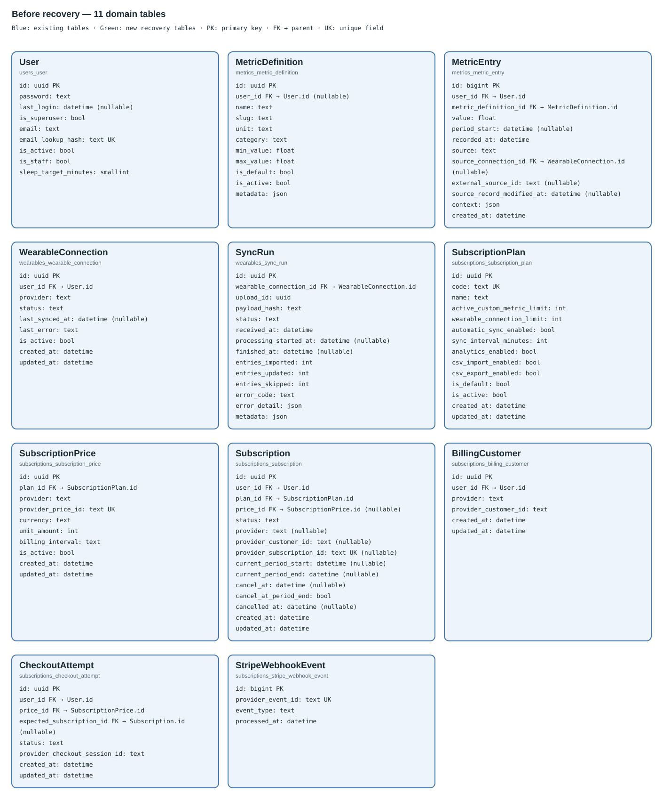
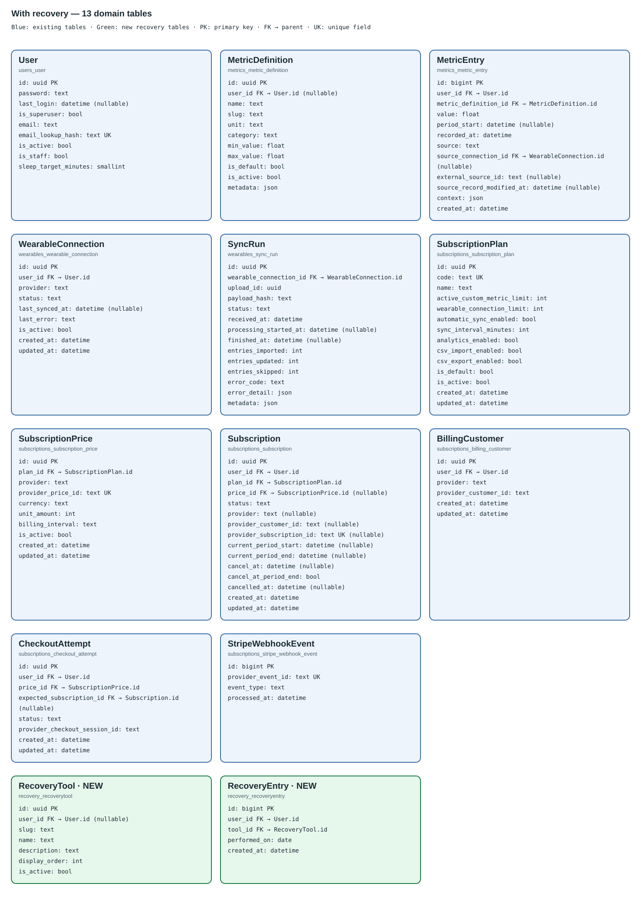

# Domain ERD — before and after recovery tracking

## Use When

Read for the domain ERD immediately before this recovery slice and the updated
schema. Generated from Django models on 2026-09-30, excluding framework/auth-M2M
tables. This is a model/migration snapshot, not proof of an AWS database change.

## 1. Before — 11 domain tables

[Open full-size before diagram](recovery-erd-before.svg).

## 2. After — 13 domain tables

Existing tables stay blue. `RecoveryTool` and `RecoveryEntry` are **green**.
No columns are added to any existing domain table in this slice.

[Open full-size updated diagram](recovery-erd-after.svg).

## Relationships

Each FK references one parent, or zero/one when nullable. Each parent can have
zero/many child rows; scoped uniqueness rules below may restrict those rows.
FK arrows are written inside entity cards rather than overlapping connector
lines. `StripeWebhookEvent` intentionally has no domain FK.

| Child FK | Parent PK | Parents per child | Delete rule | Change |
|---|---|---|---|---|
| MetricDefinition.user_id | User.id | 0..1 | CASCADE | Existing |
| MetricEntry.user_id | User.id | 1 | CASCADE | Existing |
| MetricEntry.metric_definition_id | MetricDefinition.id | 1 | PROTECT | Existing |
| MetricEntry.source_connection_id | WearableConnection.id | 0..1 | RESTRICT | Existing |
| WearableConnection.user_id | User.id | 1 | CASCADE | Existing |
| SyncRun.wearable_connection_id | WearableConnection.id | 1 | CASCADE | Existing |
| SubscriptionPrice.plan_id | SubscriptionPlan.id | 1 | PROTECT | Existing |
| Subscription.user_id | User.id | 1 | CASCADE | Existing |
| Subscription.plan_id | SubscriptionPlan.id | 1 | PROTECT | Existing |
| Subscription.price_id | SubscriptionPrice.id | 0..1 | PROTECT | Existing |
| BillingCustomer.user_id | User.id | 1 | CASCADE | Existing |
| CheckoutAttempt.user_id | User.id | 1 | CASCADE | Existing |
| CheckoutAttempt.price_id | SubscriptionPrice.id | 1 | PROTECT | Existing |
| CheckoutAttempt.expected_subscription_id | Subscription.id | 0..1 | PROTECT | Existing |
| RecoveryTool.user_id | User.id | 0..1 | CASCADE | **NEW** |
| RecoveryEntry.user_id | User.id | 1 | CASCADE | **NEW** |
| RecoveryEntry.tool_id | RecoveryTool.id | 1 | CASCADE | **NEW** |

## Recovery rules

- `RecoveryTool.user_id=NULL` means shared; otherwise the tool is private.
- Shared recovery slugs are unique; custom tools are not assigned evidence.
- `RecoveryEntry(user_id, tool_id, performed_on)` is unique: one check-off/day.
- Index `(user_id, performed_on)` supports bounded user-history reads.
- The API permits only shared tools or the user's own tools; a foreign key alone
  does not enforce matching owners across the two tables.
- Archiving changes `is_active`, not history. User deletion cascades owned data.
- Existing subscription tables decide Pro creation; no new billing table is needed.
- Existing metric/subscription/wearable uniqueness constraints remain unchanged.

See [recovery implementation and evidence](../45-recovery-tracking.md).
Regenerate from `backend`: `uv run python -m scripts.generate_recovery_erd`.
