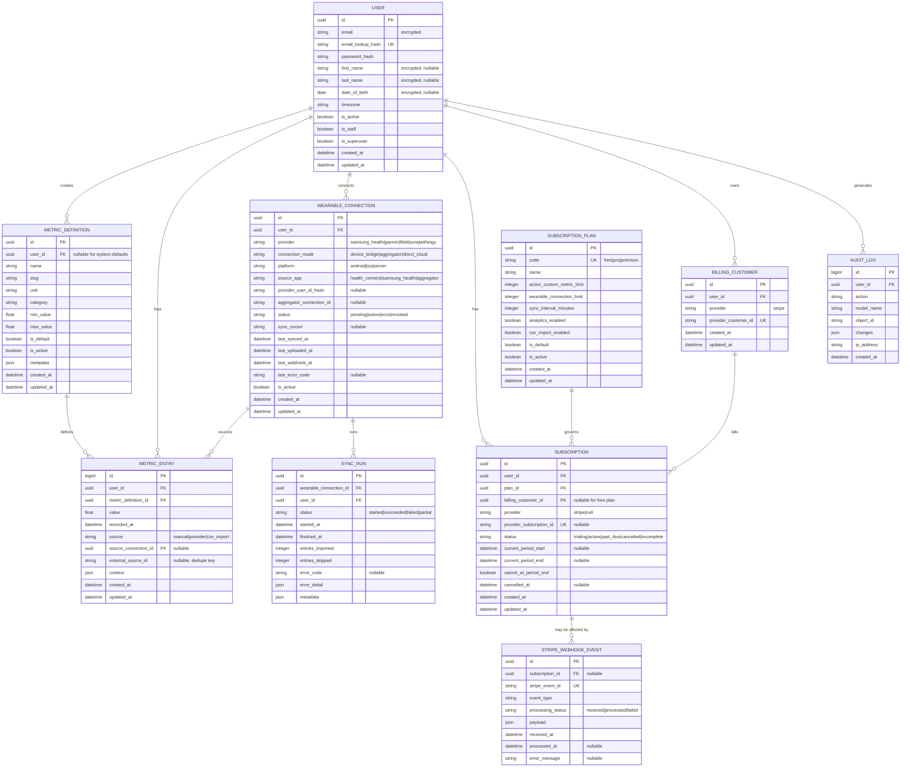

# Target-State ERD

## Use When
- Load this when you need the intended completed product data model.
- Use this for subscription, Stripe, wearable sync, audit, and long-term data model planning.

## Scope
- This is a target-state model, not a claim that every table exists today.
- Stripe-facing billing state is separated from application entitlement state.
- Django framework tables such as auth groups, permissions, sessions, admin logs, and JWT token blacklist tables are intentionally omitted.

## Design Notes
- Stripe is not the entitlement model. Stripe tells us billing state; `SubscriptionPlan` and `Subscription` decide what the app allows.
- `SubscriptionPlan` owns durable product limits such as active custom metrics, wearable connections, and sync cadence.
- `BillingCustomer` isolates provider-specific customer identifiers from user and entitlement logic.
- `StripeWebhookEvent` should be idempotent through `stripe_event_id` and can optionally link to a subscription after processing.
- `WearableConnection` supports device-bridge, aggregator, and direct-cloud modes without changing `MetricEntry`.
- `SyncRun` records import attempts separately from imported metric data, which keeps troubleshooting and retry behavior auditable.
- `AuditLog` is append-only and should store diffs or compact change summaries, not full sensitive snapshots.
