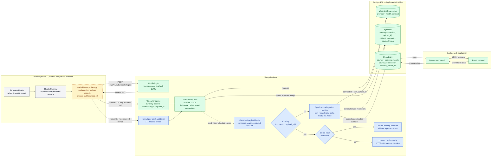
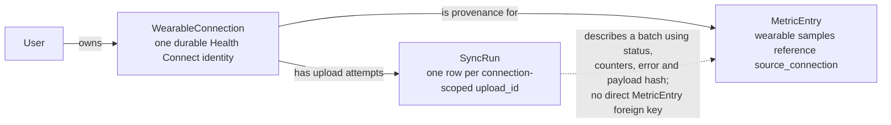

# Wearable Ingestion Data Flow

## Use When

- You need the end-to-end Samsung Health → Health Connect → Android → Django flow.
- You need to distinguish the implemented upload receipt from the next normalized-ingestion slice.
- You need to reason about `WearableConnection`, `SyncRun`, `MetricEntry`, payload hashing, or upload retries.

## Runtime Flow And Implementation State



Legend:

- Green: live behavior or an implemented durable table/API.
- Blue: implemented and tested in isolation, but not connected to the live upload endpoint.
- Amber dashed: the next end-to-end behavior or the later Android slice.
- Gray: an external on-device system.

## Intended Normalized Upload Contract

The Android client will eventually send:

```http
POST /api/v1/wearables/uploads/
Authorization: Bearer <mobile-access-token>
Content-Type: application/json
```

```json
{
  "connection_id": "7df7e4ab-7e6f-4558-b9be-17c824fbf54e",
  "upload_id": "9ea2c91d-63f-40eb-a6bb-7fbd90c12a34",
  "entries": [
    {
      "metric_definition": "body_weight",
      "value": 78.4,
      "recorded_at": "2026-07-15T08:00:00Z",
      "source": "samsung_health",
      "external_source_id": "health_connect:WeightRecord:record-123"
    }
  ]
}
```

The live endpoint still rejects `entries`. It currently creates or retrieves
only the `SyncRun` receipt from `connection_id` and `upload_id`.

## Durable Record Relationships



Important boundaries:

- The React frontend reads metric data through Django; it never reads PostgreSQL directly.
- `SyncRun` is the upload-attempt ledger, not a second metric store.
- `MetricEntry` references `WearableConnection` through `source_connection`.
  It does not currently reference the `SyncRun` that imported it.
- `provider=health_connect` identifies the device bridge. An entry's
  `source=samsung_health` identifies the application that originally produced
  the record.
- The backend stores Longevity JWT/session state, but no raw Samsung Health or
  Health Connect access tokens.
- The server computes `payload_hash`; the Android client must not provide or
  choose the trusted digest.
